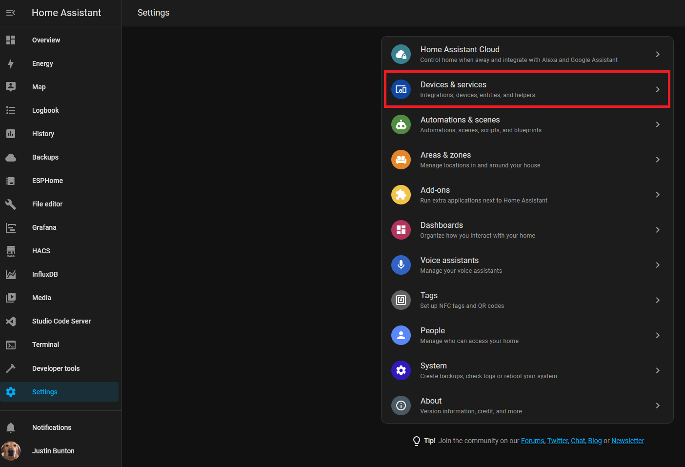
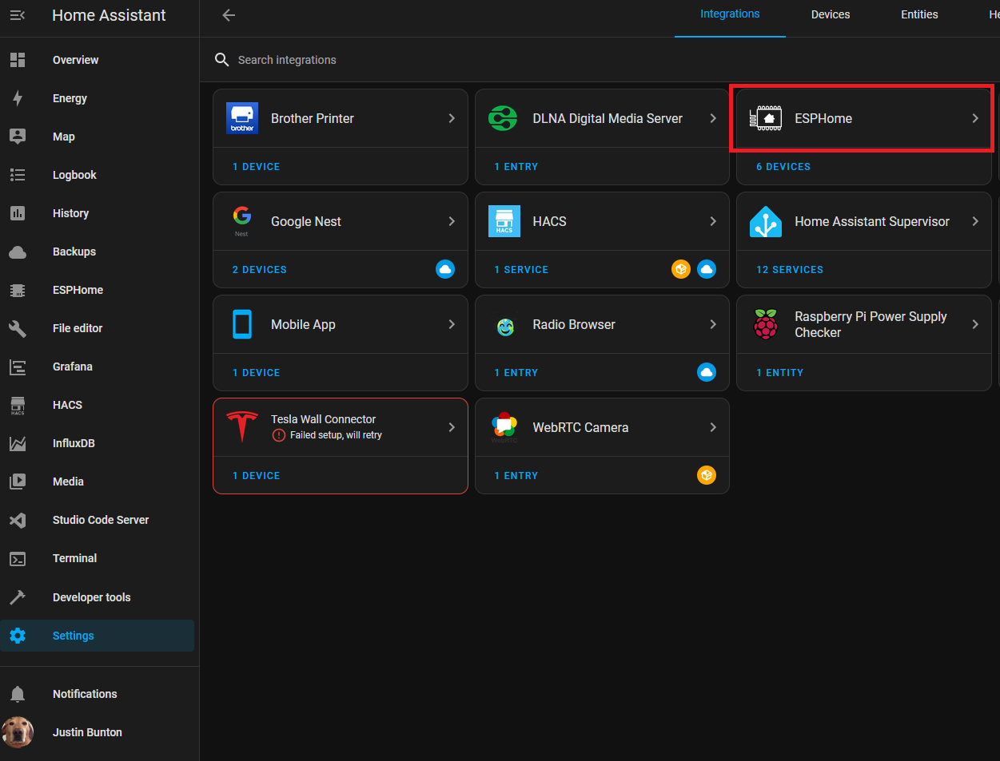
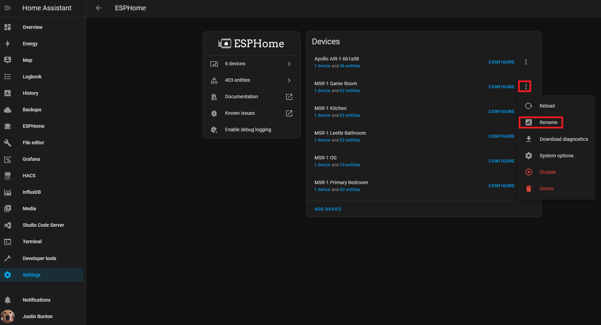
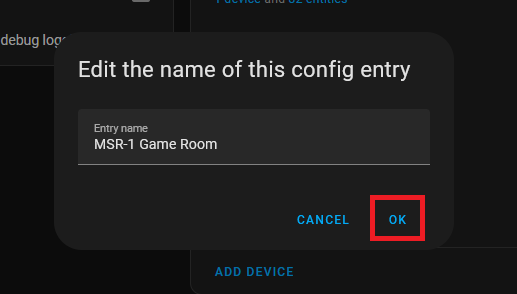
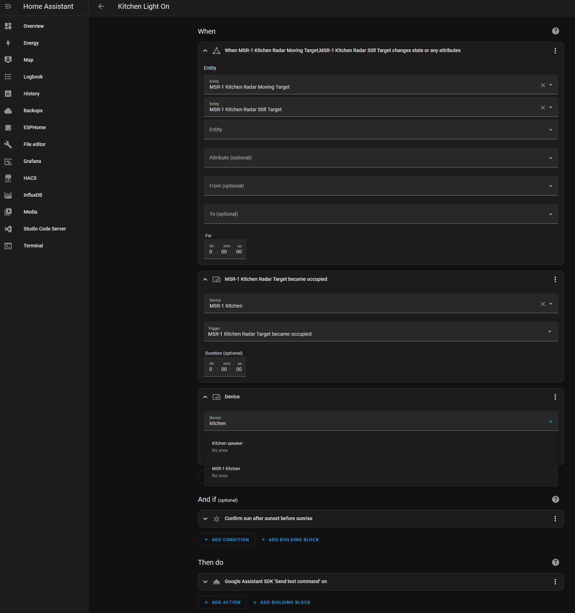
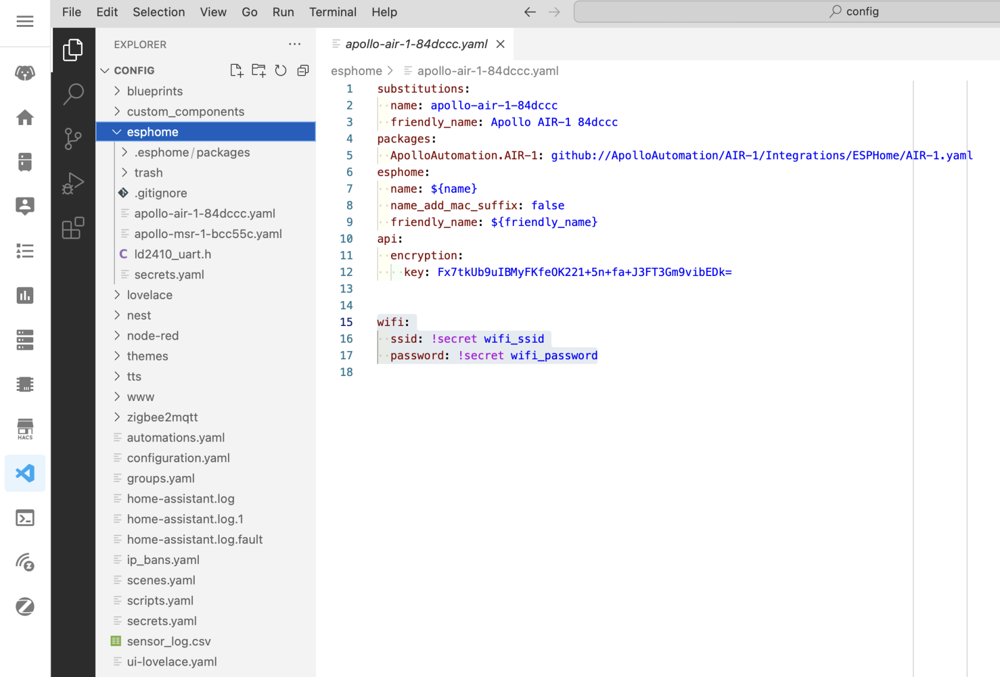
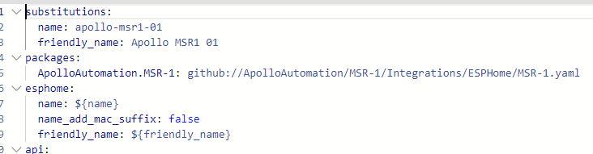
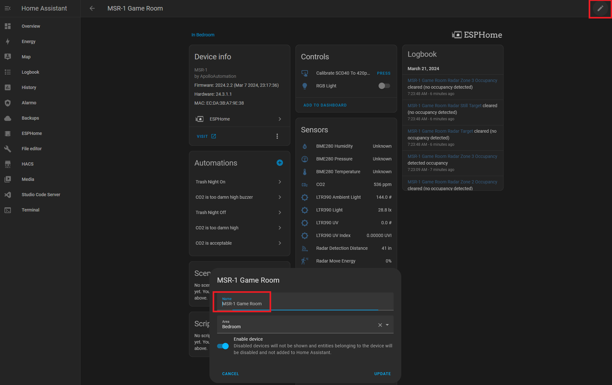

# Renaming Apollo Devices

##### **ESPHome Integration**

1\. Go to settings and select Devices & services

 2. Select ESPHome

3\. Select the three dots next to the device and select Rename

4\. Rename the device and select OK

##### **ESPHome Addon**

1\. Select the ESPHome addon in the sidebar

2\. Select Edit on the device you want to rename

3\. Chane the friendly\_name and save it

**These new names can be used in automations.**

##### **Full Renaming**

Thanks to [Panzer ](https://discord.com/channels/1126966963206361199/1126966963755819080/1184197925774053376)from our [Discord](https://discord.gg/mMNgQPyF94).

1. Install the first MSR-1 using the standard method to get a default ESPHome configuration.
2. Edit this configuration to update the "name" and "friendly name" as desired.
3. SSH into the ESPHome directory and copy this configuration six times, then modify each copy with unique names, friendly names, and API keys. (Can also use VSCode/File Editor to copy the configuration from the ESPHome folder) 
    1. 
4. Delete the initially defined sensor in ESPHome and devices (if added there), and possibly reboot.
5. Now with six distinct configs, use the 'install' option in ESPHome, select "plug into this computer", and connect the MSR-1 to your computer.
6. Download the generated "factory-image" from ESPHome on Home Assistant (HA) and flash it. This will install the sensors without MAC-based names.
7. Repeat the process for the remaining sensors.
8. Add the sensors to devices if they are discovered.
9. Can now update the sensors wirelessly again.

##### **Alternative Method** 

Thanks to [lpbaud](https://discord.com/channels/1126966963206361199/1194704940396978256/1195131472395382794) from our [Discord](https://discord.gg/mMNgQPyF94).

Instead of changing the name as your document suggests, you can go to System > Devices and Services > Devices, then click the device you want to rename. Next, click the pencil icon in the upper right corner of the screen and rename the device there. Doing it this way, after you click "Update," it will ask if you want to change the entity ID, as shown in the picture above. If you click "Update" here, it will change all the entity IDs, like in the other picture above.  
  
  
  
Here's another tip for using this naming scheme or a similar one in Node-RED: In the Entity State node dialog, if you click the empty box labeled "Entity," a small box will open beneath it displaying a list of all the available entity names, in no particular order. If you start typing in that box, it filters the list based on what you type. So, if my kitchen MSR is named msr-k and I want to trigger an event based on the value of radar target, I would type "-k target." The space between words acts as a wildcard, so the list is filtered by everything containing "-k" and "target," allowing you to select the one you need. Quite handy.