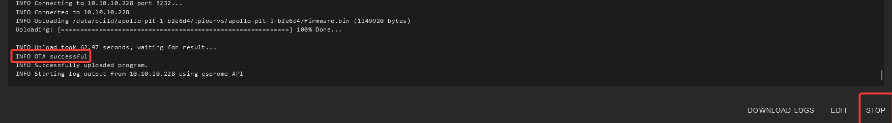

# Switching your device to beta branch with ESPHome Device Builder

1\. In Home Assistant open the <a href="https://esphome.io/guides/getting_started_hassio.html" target="_blank" rel="noopener"><strong>ESPHome Device Builder</strong></a>.

[](https://my.home-assistant.io/redirect/supervisor_addon/?addon=5c53de3b_esphome&amp;repository_url=https%3A%2F%2Fgithub.com%2Fesphome%2Fhome-assistant-addon)

!!! tip "Make sure you are running the latest version of ESPHome"

    You should be fully up to date with the ESPHome Device Builder before updating our sensors for ideal performance and ease of troubleshooting!

2\. Find the sensor you want to edit and click the "**EDIT**".


!!! danger "This is code and requires you to follow the directions carefully."

    Editing the YAML here means even a space matters. Follow the guide just as shown and ask questions if you need help!

3\. Look for the line that starts with packages and the line below it and put a \# in front of each line as shown in the second image below.


4\. Copy paste the code below and add it below the two lines you just commented out.

```yaml
packages:
  ApolloAutomation.PLT-1:
    url: https://github.com/ApolloAutomation/PLT-1
    ref: beta
    files: [Integrations/ESPHome/PLT-1_Minimal.yaml]
    refresh: 1min
```


5\. If you are using a device other than the PLT-1 please edit the names where I have pointed with an arrow in the image below. Please <a href="https://dsc.gg/apolloautomation" target="_blank" rel="noopener">ask for help</a> if you have issues with this!


6\. Click save then install in the top right.


7\. Once you see "**INFO OTA successful**" you are done. Click "**STOP**" in the bottom right to exit.

