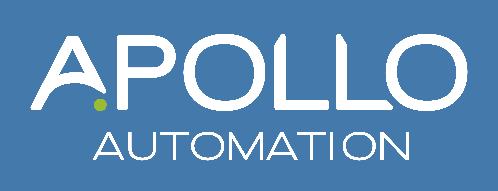

At Apollo, we are actively working on adding support for every smart home ecosystem out there. Although we are a works with Home Assistant partner and a Made for ESPHome partner, we want everyone to be able to use our sensors! Please take a look at the list of smart home ecosystems below to see the type of support we offer and the type of integration/functionality our sensors have. If you see any outdated info or have any questions/comments/concerns, please reach out to us at support@apolloautomation.com or come say hi in our [discord server](https://dsc.gg/apolloautomation)!

###### Home Assistant

* **Integration:** Fully supported via [ESPHome Integration](https://esphome.io/components/api.html) or [MQTT](https://esphome.io/components/api.html#advantages-over-mqtt).
* **Support:** Fully supported by us in our discord server or at support@apolloautomation.com.

###### Homey

* **Integration:** Fully supported via the [Official Apollo Automation Homey app](https://homey.app/en-us/app/com.apolloautomation/Apollo-Automation/test/).
* **Support:** Fully supported by us in our discord server or at support@apolloautomation.com.

###### HomeSeer

* **Integration:** Fully supported via the [AK Apollo Software Plugin](https://shop.homeseer.com/products/alexbk66-ak-apollo-software-plugin-for-hs4).
* **Support:** We do not provide support for this platform but if enough users want it that could change. We of course always support the hardware of our products though!

###### **Hubitat**

* **Integration:** Working on support - check back soon!
* **Support:** We do not provide support for this platform but if enough users want it that could change. We of course always support the hardware of our products though!

###### **openHAB**

* **Integration:** Fully supported via this [unofficial binding](https://github.com/seime/openhab-esphome).
* **Support:** We do not provide support for this platform but if enough users want it that could change. We of course always support the hardware of our products though!

###### Indigo

* **Integration:** Fully supported via this [unofficial plugin](https://www.indigodomo.com/pluginstore/293/).
* **Support:** We do not provide support for this platform but if enough users want it that could change. We of course always support the hardware of our products though!

###### ioBroker

* **Integration:** Fully supported via this [unofficial adapter](https://github.com/DrozmotiX/ioBroker.esphome).
* **Support:** We do not provide support for this platform but if enough users want it that could change. We of course always support the hardware of our products though!

###### MQTT

* **Integration:** Fully supported via a custom yaml edit for your device where you fill in the server IP/hostname, mqtt username, and mqtt password.

```yaml
mqtt:
  broker: 192.168.1.252
  username: mqtt-user
  password: mqtt-password
```

* **Support:** We do not provide support for this platform but if enough users want it that could change. We of course always support the hardware of our products though!