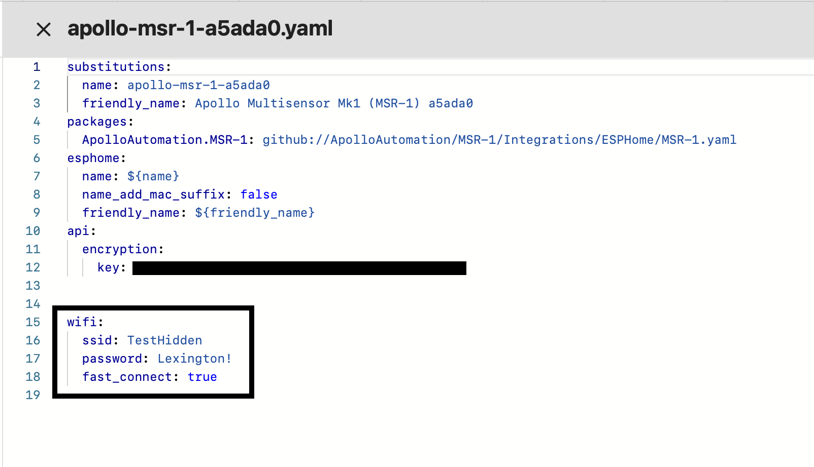

# Connecting To Hidden Wifi Network

Changing your wifi connection to fast connect can have stability problems1. [Setup your device](https://wiki.apolloautomation.cloud/books/general/page/getting-started) using a regular wifi network
2. In Home Assistant go to your ESPHome add-on
3. On your sensor click on edit
4. Change the wifi section to look like the below but with your wifi credentials

4\. Save and install to your device