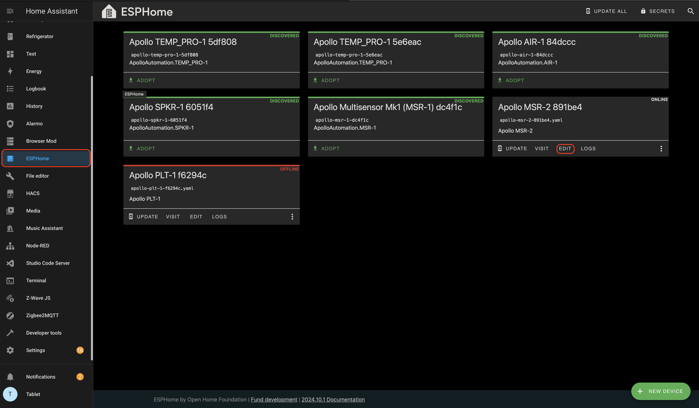
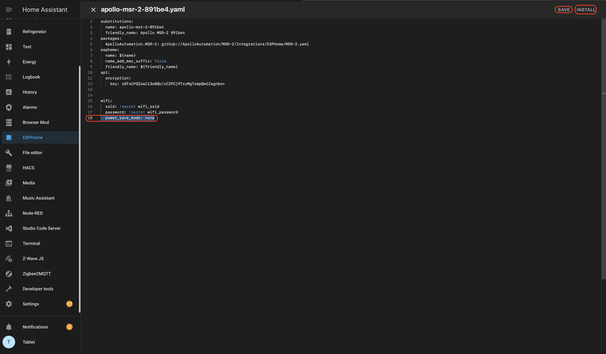

1\. Try a couple of different power cord and power brick combinations - this matters a lot more than you'd think!

2\. Check to see if the sensor's hotspot is showing up. (this means it is not connected to a network)

3\. Check the router's connected devices - the device will show up with the Apollo name and a 6 digit hex value of the end of the mac address.

4\. Disable [power save mode](https://esphome.io/components/wifi.html#power-save-mode) in ESPHome. (See directions below)

# WiFI Power Save Mode

The WiFi interface of all ESPs offer three power save modes to reduce the      amount of power spent on WiFi. While some options *can* reduce the power usage of the ESP, they generally also decrease the reliability of the WiFi connection, with frequent disconnections from the router in the highest power saving mode.

* `NONE` (least power saving, Default for ESP8266)
* `LIGHT` (Default for ESP32)
* `HIGH` (most power saving)

```yaml
wifi:
  # ...
  power_save_mode: none
```

1\. Select the ESPHome add on and then select Edit under your desired device.



2\.  Add the code below to your devices yaml file. Then select Save and press Install.

```yaml
power_save_mode: none
```



3\. Now your device should have a stronger connection. (This will cause the sensors internal temperature to increase.)