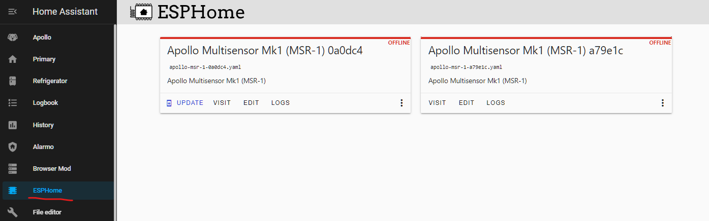
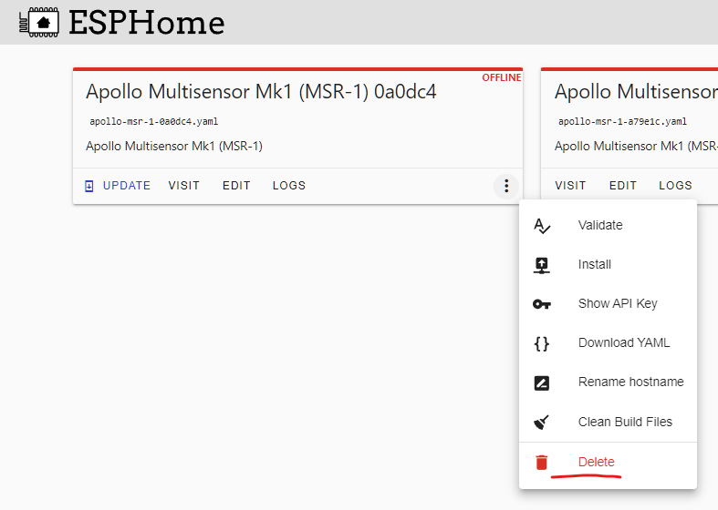
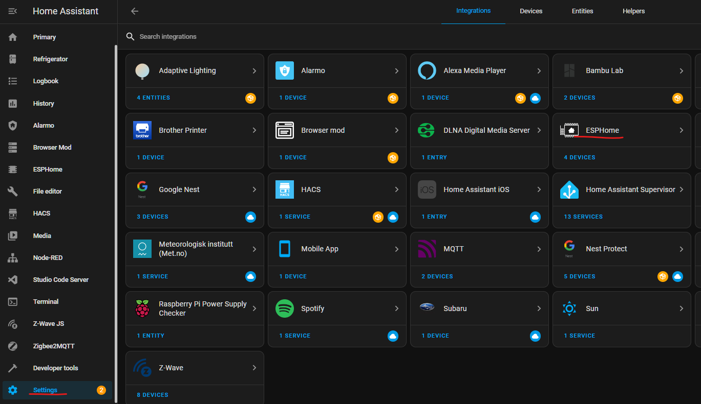
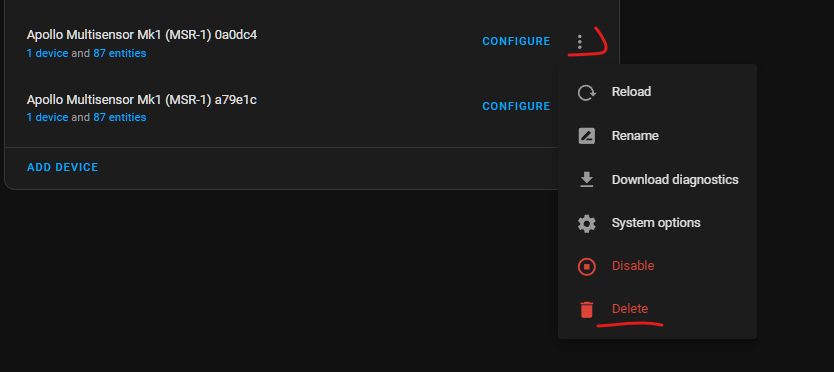
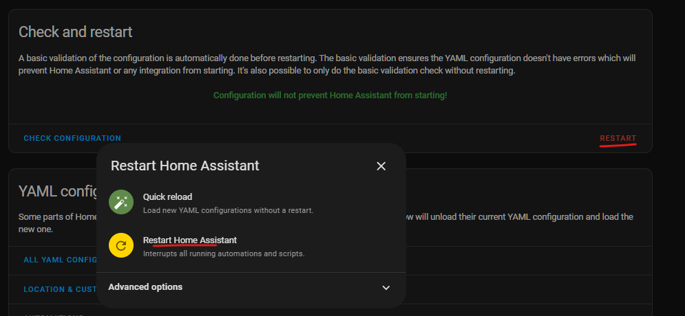

# Removing Device From Home Assistant

This will cover how to remove an Apollo device from Home Assistant

1. Navigate to Home Assistant and open your ESPHome addon

2\. On the device you would like to remove, click the three dots and select "Delete"

3\. Go to Settings --> Devices & Services --> ESPHome

4\. On the device you would like to remove, click the three dots and then "Delete"

5\. Restart your Home Assistant

It can take a few minutes for your Home Assistant instance to start back up