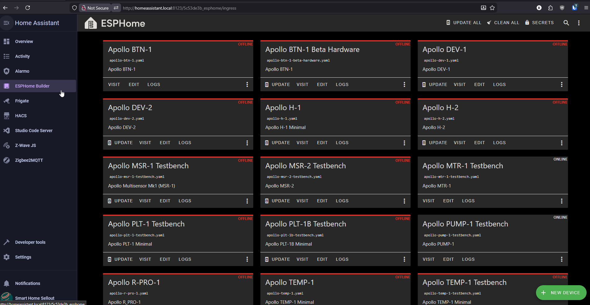
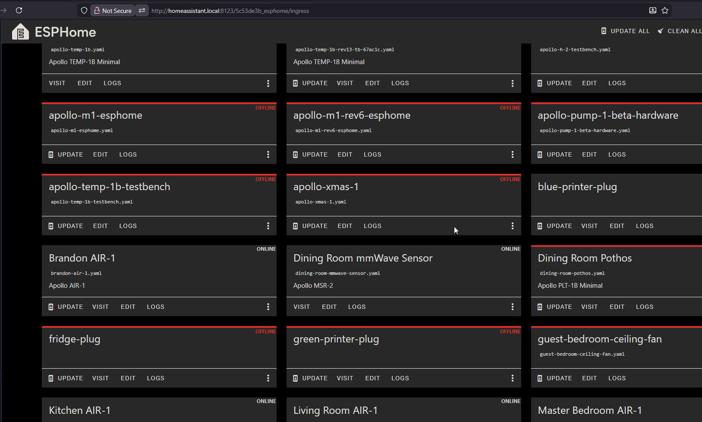

# Removing Device From Home Assistant

##### ESPHome addon

This will cover how to remove an Apollo device from Home Assistant

!!! tip "Skip this step unless you took control of your device with the ESPHome Device Builder addon!"

    This step is only necessary for advanced users who added the device to the ESPHome device builder to edit the yaml and customize the device. Please skip to the next step if you are only using the ESPHome or Apollo Automation integration!

1\. Navigate to Home Assistant and <a href="http://homeassistant.local:8123/5c53de3b_esphome/ingress" target="_blank" rel="noreferrer nofollow noopener">open your ESPHome Device Builder</a> addon.

2\. On the device you would like to remove, click the three dots and select "Delete" then click Delete to confirm.

##### ESPHome Integration

1\. Head to the <a href="http://homeassistant.local:8123/config/integrations/integration/esphome" title="Click me to go to the ESPHome integrations page" target="_blank" rel="noreferrer nofollow noopener">ESPHome Integrations page</a>. Next to the device you would like to remove, click the three dots and then "Delete".

