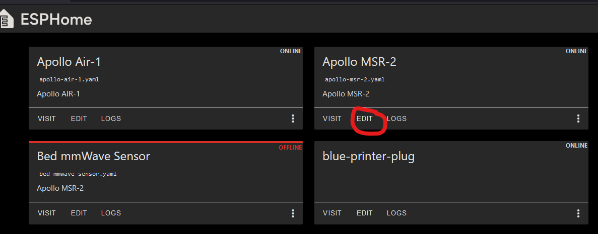

# How to edit your Sensor's LUX update interval

This guide will show you how to edit the lux updates down to 3-5 seconds.

Your sensor is defaulting to 60 seconds for updates to the state of the lux sensor. This is the default for all esphome devices using lux because it uses less Wi-Fi airtime fairness which means it is less chatty to your Wi-Fi AP or router. I would not personally go below 5 seconds.

1\. Open the Esphome dashboard and click "edit" under the device you want to edit.



2\. Copy this code and enter it just like shown in the next step. Make sure there are no extra spaces or any other characters it needs to look just like the example in the next step.

```yaml
#LUX sensor update interval
sensor:
  - platform: ltr390
    id: !extend ltr_390
    update_interval: 5s
```

3\. Paste the code you copied in step 2 below your sensor's existing yaml as shown below.


4\. Click "SAVE" and then click "INSTALL" as shown in the image above. Once that is finished your sensor should now be reporting at your new update\_interval such as 5 seconds!