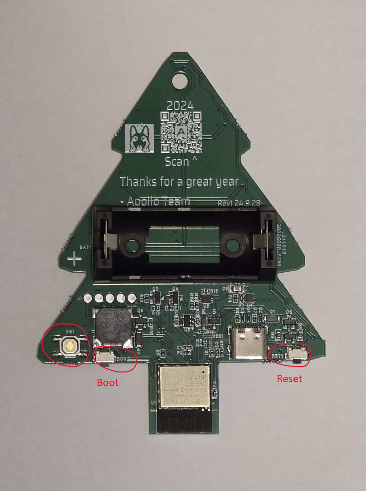

This will cover how to put the H-1 into boot mode. Sometimes, this is needed to upload new firmware if the device is struggling.

## **Boot Button Only**

1\. Make sure the device is not powered and see the photo above to help find the boot button

2\. Press and hold the boot button, while holding the boot button plug the H-1 back into your computer/power and then release the boot button

3\. Continue with [uploading the firmware](https://active-lyrebird.cloudvent.net/products/plt1/plt1-code/)

## **Boot and Reset Buttons**

1\. Plug in the device

2\. Press and hold the boot button, while holding it press and release the reset button, then release the boot button

3\. Continue with [uploading the firmware](https://active-lyrebird.cloudvent.net/products/plt1/plt1-code/)