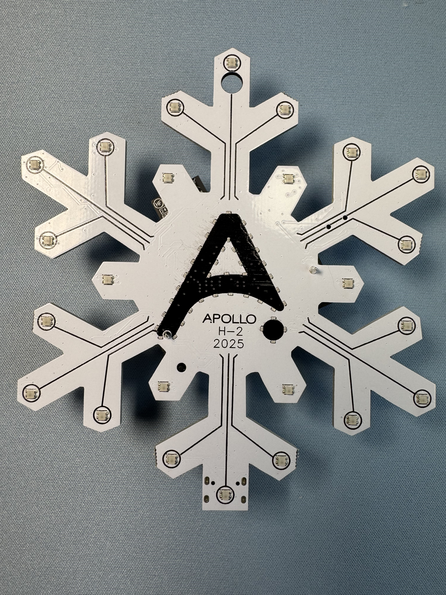

The Apollo H-2 is our special holiday ornament, designed to bring festive cheer to your home while supporting a good cause. As the second in our annual series, this ornament is crafted with both functionality and community spirit in mind. All proceeds from the H-2 go directly to <a href="https://casaoflexington.org/" target="_blank" rel="noreferrer nofollow noopener">Casa De Lexington in Lexington, KY</a> and the <a href="https://www.openhomefoundation.org/" target="_blank" rel="noreferrer nofollow noopener">Open Home Foundation</a>, reflecting our commitment to giving back and celebrating the season alongside our community.

The H-2 is pre-flashed with a playful firmware featuring four classic holiday songs. With just a press of the gold buttons on the back, you can enjoy the tunes with synchronized LED effects: one press for Sleigh Bells, two presses for Rudolph the Red-Nosed Reindeer, and long press for Let it Snow. Each song brings its own light show, making the H-1 both fun and festive right out of the box.

For those looking to personalize their experience, the H-2 can also be integrated with Home Assistant, transforming it into a “smart” ornament. Through this setup, you can customize songs, LED effects, and create unique holiday automations to suit your style.

With the Apollo H-2, we’re blending holiday joy, smart home innovation, and community spirit into a single ornament, making it a perfect addition to any festive setup.