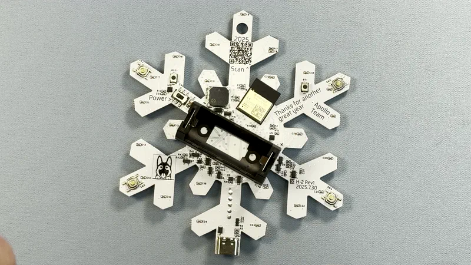

# Getting Started

**1\. Powering On the H-2**

Insert a rechargeable RC-CR123A (16340) battery, preferably an 850 mAh model like <a href="https://apolloautomation.com/products/16340-rechargeable-battery" target="_blank" rel="noreferrer nofollow noopener">the one available in our store</a>. A normal CR123A will not work!

**2\. Turning On the Ornament**

If the device is in sleep mode, press one of the gold buttons on the back to wake it.

**3\. Play Holiday Songs**

After the ornament is awake, press the gold buttons (see image below) to play a pre-loaded song:

* **Button 1:** Sleigh Bells
* **Button 2:** Rudolph the Red-Nosed Reindeer
* **Button 3:** Let It Snow
* **Button 4:** Blue Christmas

4\. **Add to Home Assistant** (Optional)

For additional customization, you will need to <a href="https://wiki.apolloautomation.com/products/h2/troubleshooting/boot-mode/" target="_blank" rel="noreferrer nofollow noopener">put the H-2 in boot mode</a> then flash the [smart H-2 firmware](https://apolloautomation.github.io/H-2/) and finally connect to Home Assistant following the [setup guide](https://wiki.apolloautomation.com/products/general/setup/getting-started/). With Home Assistant you can add new songs, change LED effects, and create custom automations.

5\. **Enjoy Your Ornament**

Hang the H-2 on your tree, place it on a mantel, or incorporate it into any holiday setup for added joy. Your Apollo H-2 is now ready to spread holiday cheer! Enjoy the festive tunes and LED effects, and feel free to share your unique setup with us in the community!

[Join our Discord if you need more help! :simple-discord:](https://dsc.gg/apolloautomation){                  .md-button }