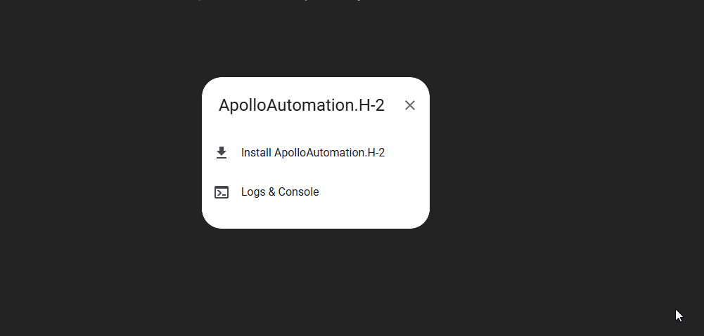

# Reflashing The H-2

!!! info "If your device becomes unresponsive and you've exhausted the other troubleshooting methods you can reflash the factory firmware by following the steps below."

    This factory re-flash needs to be done in Chrome, Edge, or another Chromium based browser.

1\. Disconnect your H-2 from power. With the device facing you, locate the boot button - it’s the small black button on the right.

2\. Plug in a USB cable that supports power and data into your computer.

3\. Push and hold the boot button (the right button). While still holding the button down, plug in a USB-C cable into the USB-C port of your H-2 then let go of the button.

4\. Navigate to our installer page using a chromium based browser such as Chrome or Edge and click **connect** under **H-2 Smart Wi-Fi Firmware** or **H-2 No Wi-Fi Firmware**. Select the open com port and click **connect**.

[Click here to reflash your H-2](https://wiki.apolloautomation.com/products/h2/troubleshooting/reflash/){ .md-button .md-button--primary }

5\. Click Install **H-2** then click **Install** again.

6\. Once you see "Installation complete!" you are finished. Click Next then close out of the browser window.

!!! warning "Power cycle your device before doing anything else!"

    Your device is still in boot mode and needs to be power cycled aka power removed to make it boot in a normal mode!

[Head to the Getting Started article to setup your H-2 as a new device!](https://wiki.apolloautomation.com/products/h2/setup/getting-started/){              .md-button .md-button--primary }