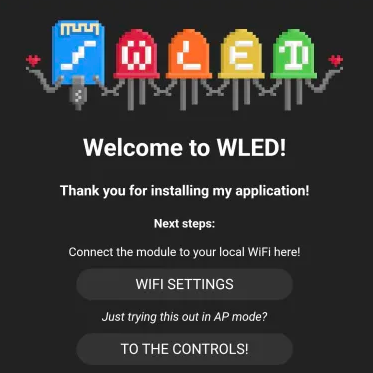

# Getting Started

Congrats on your new LED-1! Below we will go through steps to get you up and running in no time.

#### Choose how to power it

The LED-1 can be powered via USB (5V up to 3 amps) or via USB Power Delivery (5V or 12V up to 3 amps) or a dedicated power supply using either 5V, 12V, or 24V.

=== "USB Power"

    1\. Connect a USB-C cable to a 5V 3A or larger power supply and the other end into your LED-1. We suggest using a quality USB-C cable that can handle 3 amps or larger. If you are not sure if yours supports 3 amps, buy a new cable from us or off Amazon etc

=== "USB Power Delivery"

    1\. Decide if you are using 5V or 12V with USB-C PD. If you are using 12V, you will need to first flip the switch as shown below. If you are using 5V, skip to the next step!

    2\. Connect your USB-C PD wall charger to the USB-C cable and then plug in the other end into the USB-C port of the LED-1.

    3\. Your device will now output either 5V or 12V to the + and - terminals for Output 1 and Output 2 of the LED-1.

    !!! warning "Unplug the power!"

        Before proceeding to the next steps, make sure to unplug your device!

=== "External Power Supply"

    The External Power Supply is the best way to get the longest distance and power out of your device. You can get up to 10amps of power at 5V, 12V, or 24V using an external power supply!

    1\. Take your power supply and connect the output power to the input terminals of your LED-1. If you still need a power supply, check out our <a href="https://active-lyrebird.cloudvent.net/products/led1/setup/led1-general-tips/" target="_blank" rel="noreferrer nofollow noopener">suggestions here.</a> Be very careful and make sure you are connecting the positive red wire to the + sign and the negative black wire to the - sign. Most power supplies will have a barrel connector only rated for 3 amps on it, so we suggest that you cut the barrel connector off and split out the red and black wires to put directly into the LED-1.

    !!! null "Unplug the power!"

        Before proceeding to the next steps, make sure to unplug your device!

#### Connect LEDs

!!! danger "Before proceeding, consider double checking your power supply and leds use the same voltage!"

    The LED-1 will output the same voltage that is input to the device, so make sure to connect 5V led strips if you're using a 5V power supply - same with 12V and 24V!

1\. Grab a male JST-SM 3 pin connector such as the extra included with your led strips and carefully note the red wire for positive, the green for data, and the white for ground.

2\. Inspect the LED-1 and look for the two Wago connectors labeled "Output 1" and "Output 2". Insert the red power wire into the far left terminal of output 1 then the green wire into the middle terminal of Output 1 then the white wire into the third terminal for Output 1.

3\. Repeat step 2 for a second led strip using Output 2 if you have a second led strip!

#### Connect to your Wi-Fi

Your device is now ready to connect to your Wi-Fi and begin controlling via Home Assistant, the WLED app for iPhone and Android, or via a web browser!

1\. Plug your power supply or usb-c power in and the LED-1 device will boot within a couple seconds. Head to the available Wi-Fi networks on your phone and select WLED-AP. It should pop up saying "Welcome to WLED!". If this popup does not occur, please open a web browser and navigate to http://4.3.2.1/ and you should be prompted with the same image seen below.

#### Join to Home Assistant

1\. Your device should be auto-discovered by Home Assistant using the WLED Integration as shown below!

&nbsp;