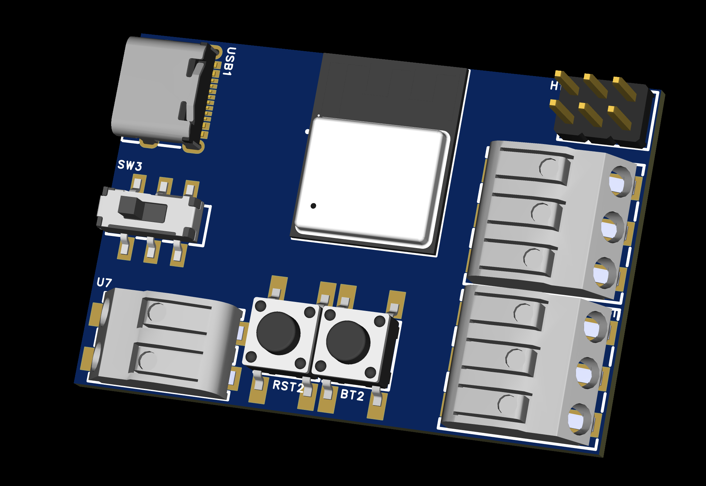

# Introduction

The Apollo LED-1 is a compact, versatile LED Controller for Home Assistant. Fully open-source and expandable, the LED-1 offers seamless integration with Home Assistant using the WLED Integration, making it ideal for automating lighting. Access to support and customization resources is available via our Discord and GitHub.

**Key Features:**

* Powered via either USB-C (5 V only), USB-C PD (5 V or 12 V) or external power supply (5 V, 12 V, or 24 V).
* Two fused outputs able to handle 10 Amps total - either from one output or both but max of 10 Amps.
* Built in MEMS digital microphone for WLED Audio Reactive functionality.
* Built in relay to kill power to LEDs for less power usage (great for battery projects).