# How to replace the 10 A Fuse

1\. Gently pry open the lid - this can be a tight fit so you will want to use a small tool not your fingernail. Remove the lid and set aside.

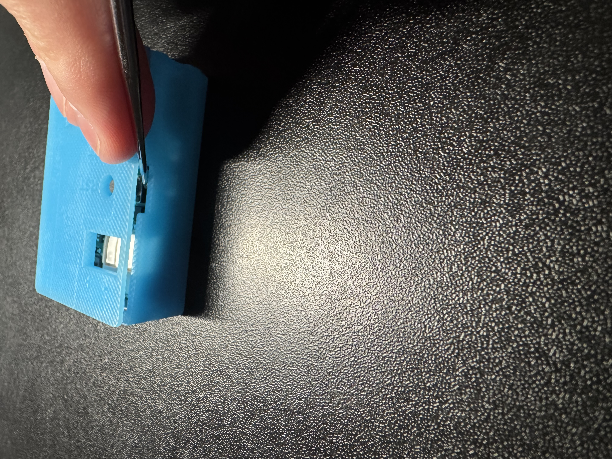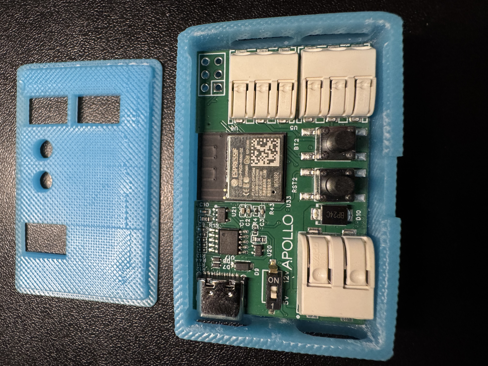

2\. Gently lift the LED-1 PCB out of the case - be careful not use a lot of force this could break components

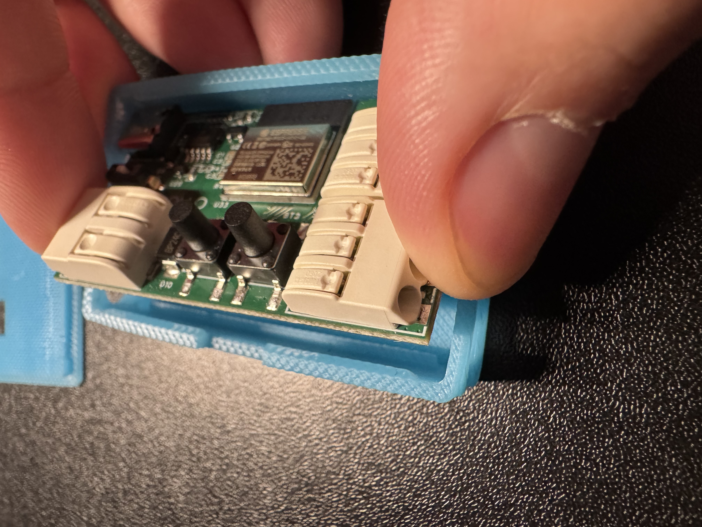

3\. Flip the LED-1 PCB over and locate the replaceable fuse.

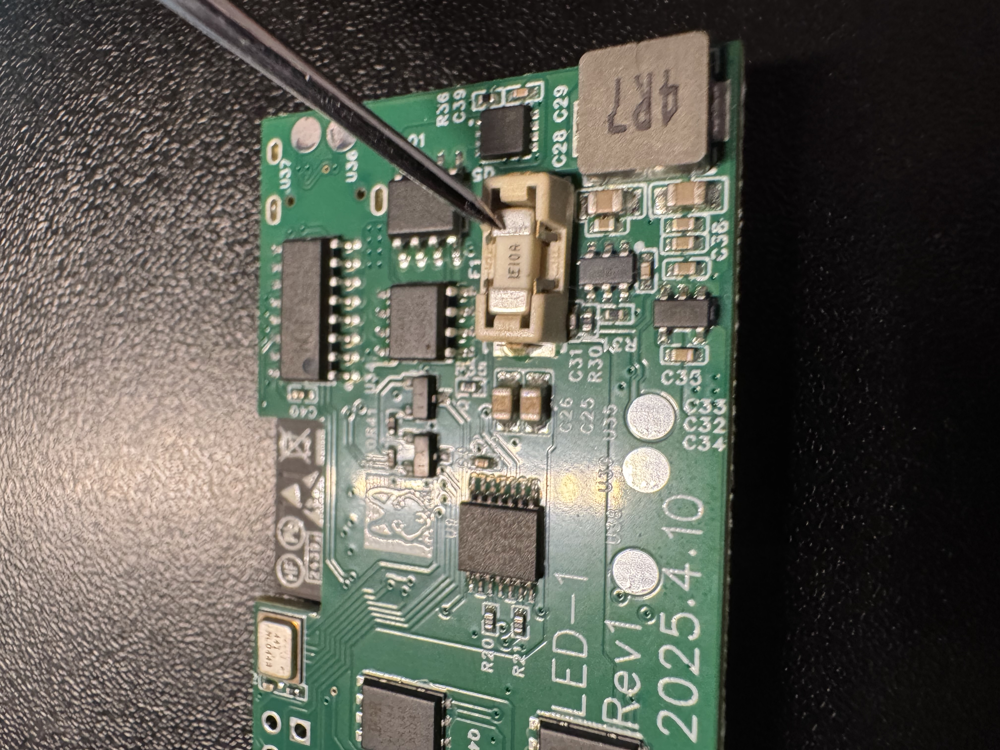

4\. Gently remove the fuse using tweezers.

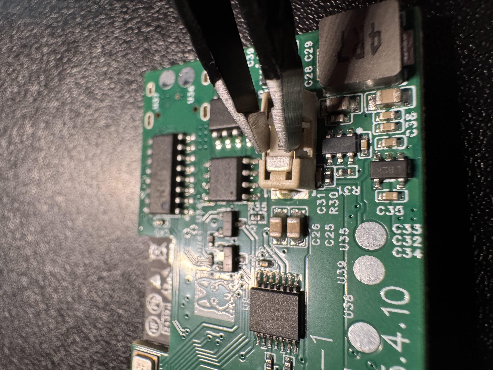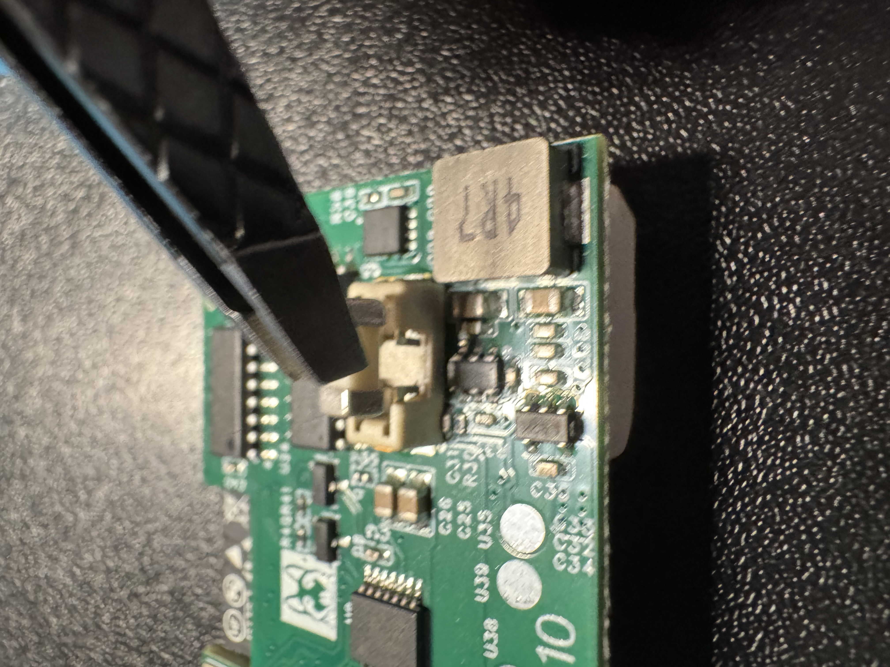

5\. Orient the new fuse with the writing facing up then place it inside the fuse bay.

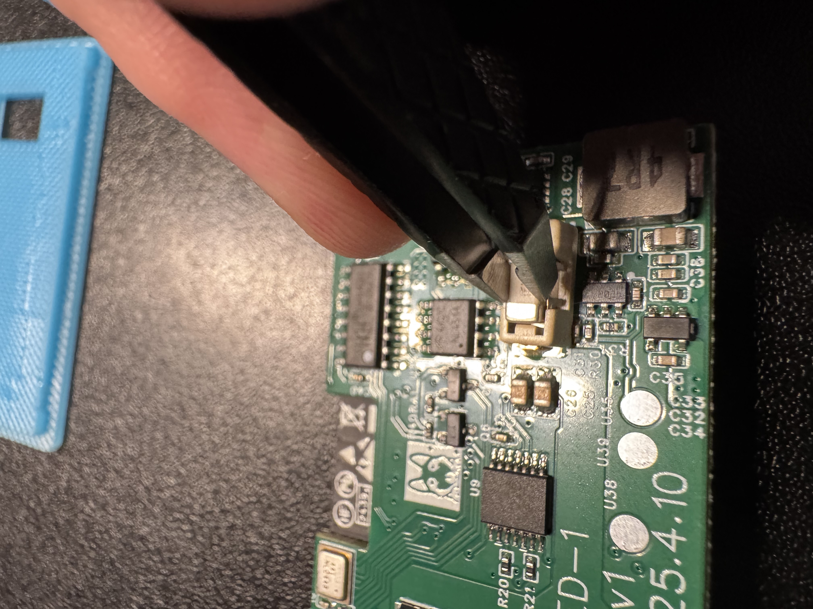

6\. Gently push down on the fuse to make sure it is fully seated.

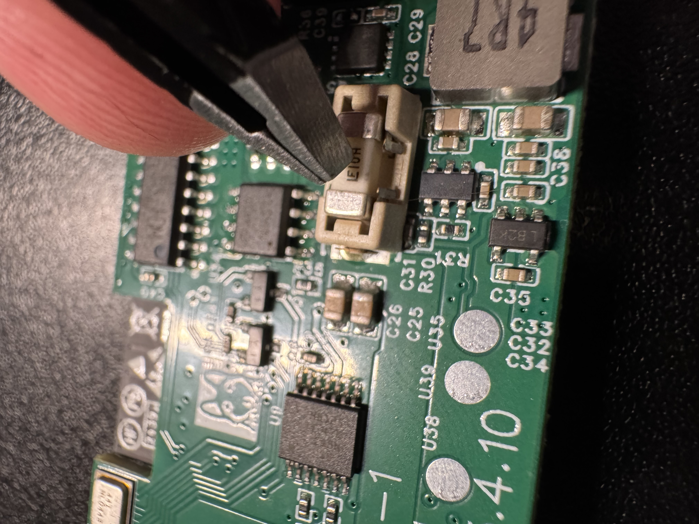

7\. Flip PCB over and angle it the same way you disassembled and rest the side of the pcb on the "shelf" as shown in the image below.

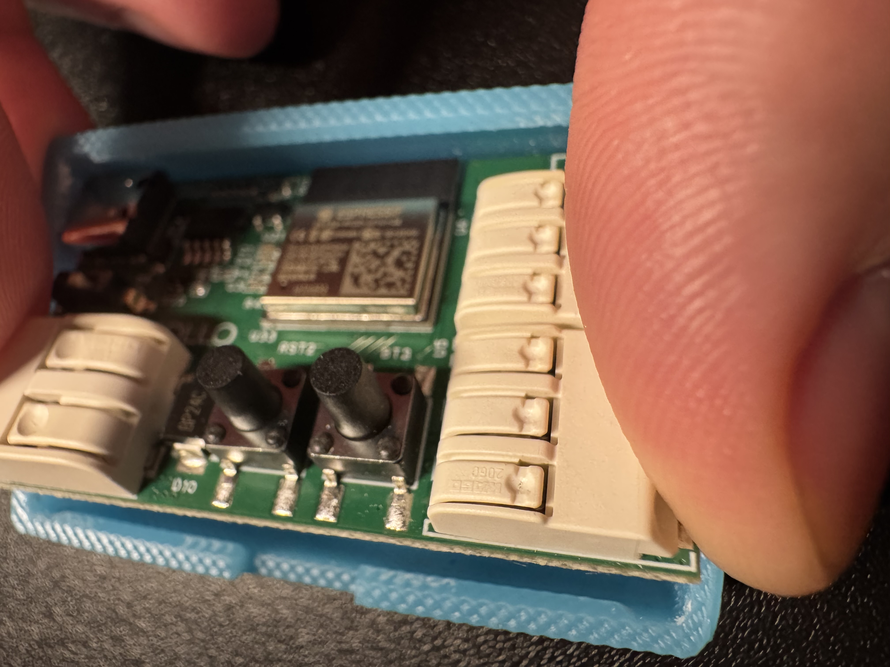

8\. Align the holes on the case so they line up with the Wago connectors.

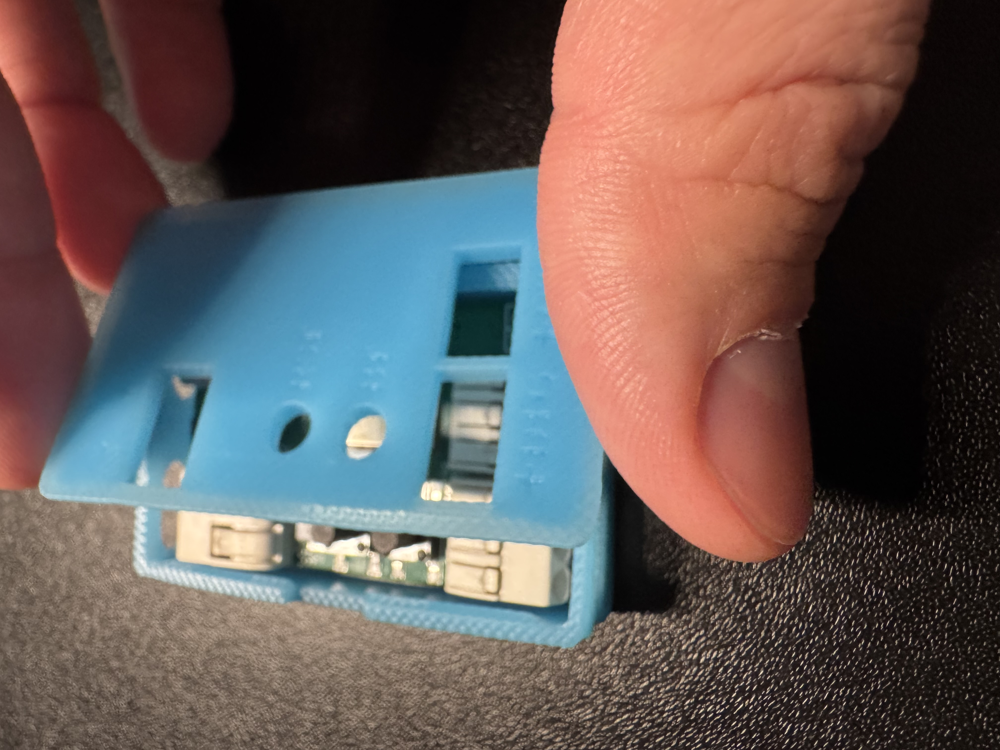

9\. Press down on the case lid to secure it to the bottom of the case.

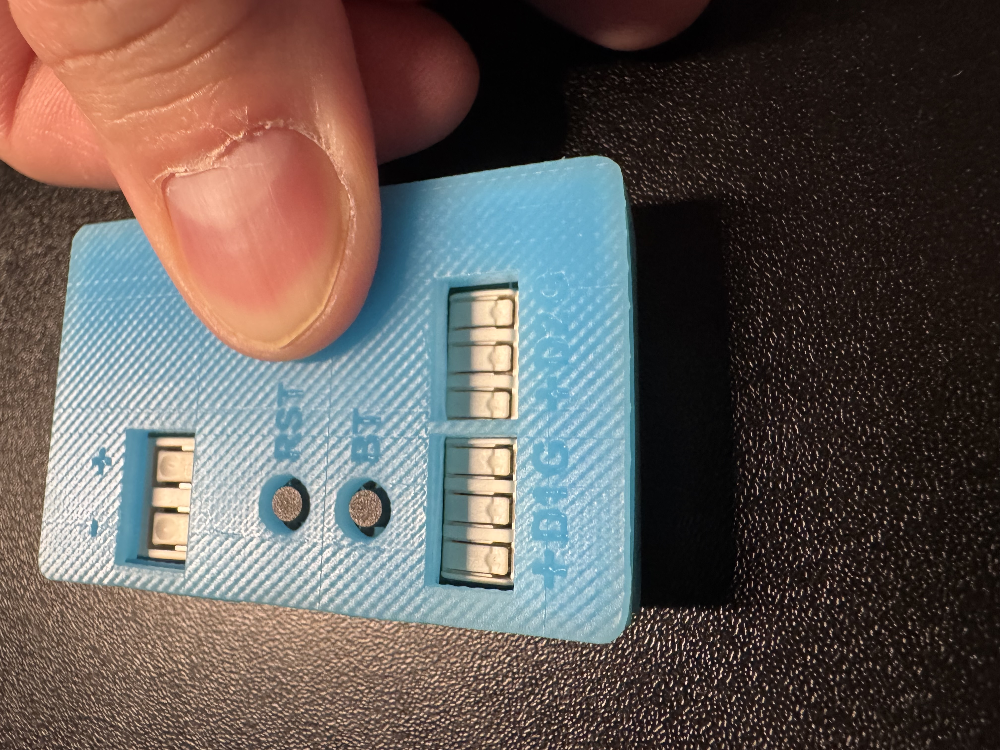

10\. You're all done - enjoy your LED-1!

[Click here to head to our general tips wiki for best practices!](https://wiki.apolloautomation.com/products/led1/setup/led1-general-tips/){ .md-button .md-button--primary }