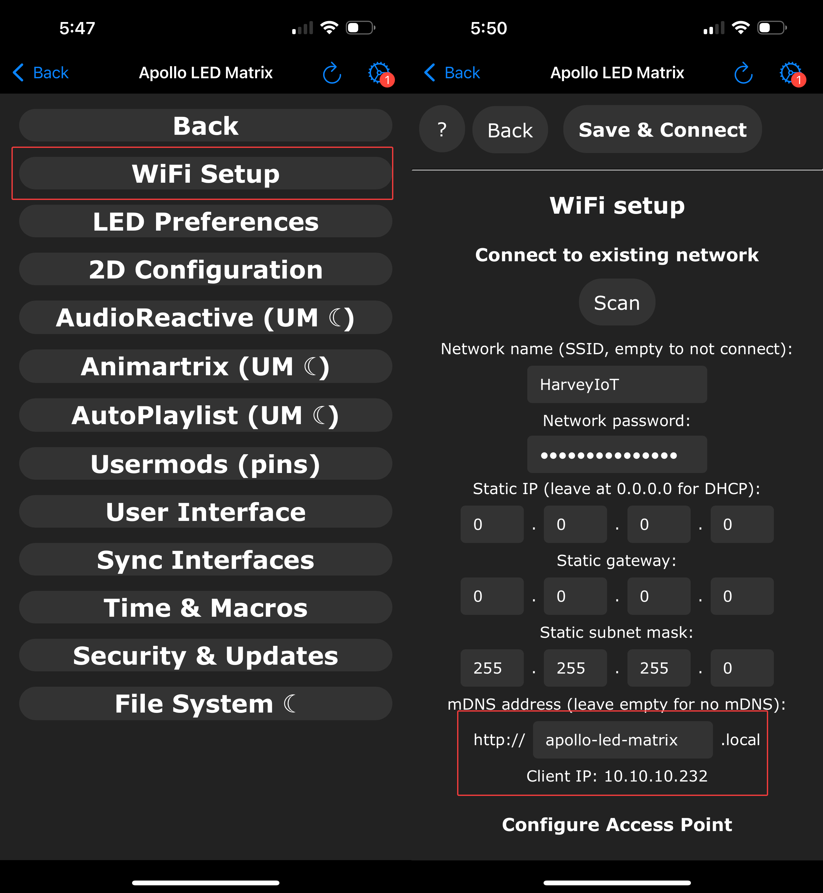
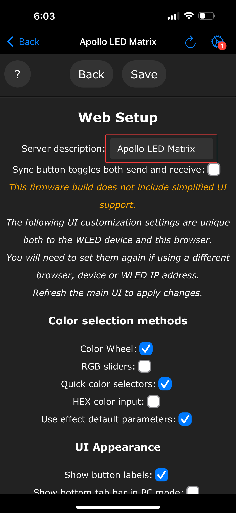

# How to Find IP address and hostname of your LED-1 device.

1\. Download the WLED Native app for iOS and Android.

=== "iOS"

    <a href="https://apps.apple.com/us/app/wled-native/id6446207239" target="_blank" rel="noreferrer nofollow noopener">Click here to download</a>

=== "Android"

    <a href="https://play.google.com/store/apps/details?id=ca.cgagnier.wlednativeandroid" target="_blank" rel="noreferrer nofollow noopener">Click here to download</a>

2\. Make sure you have already connected it to the same Wi-Fi network that your pc and phone are on <a href="https://wiki.apolloautomation.com/products/m1/setup/getting-started-m1/#connect-to-wi-fi" target="_blank" rel="noreferrer nofollow noopener">as shown here</a>.

3\. Your LED-1 should be detected automatically. Select it, then click the **Config** tab in the top right corner.

!!! danger "WARNING ~ DO NOT UPDATE IT ~ WARNING"

    There will be a red badge or circle in the top right showing you an update is available. DO NOT DO THIS, IT WILL BREAK YOUR CONFIG.

4\. Select **WiFi Setup** and at the bottom you will see a box with .local at the end. The letters inside of the box are your hostname and the IP is directly below it. You can change the hostname to whatever you like (using letters, numbers, and dashes only). Click Save and Connect when done.

5\. You can now access your device from a browser at http://the-ip-address-here or http://the-hostname-you-entered.local

6\. Edit the User Interface settings section under the **Server description** with a friendly name that is shown for your device!

