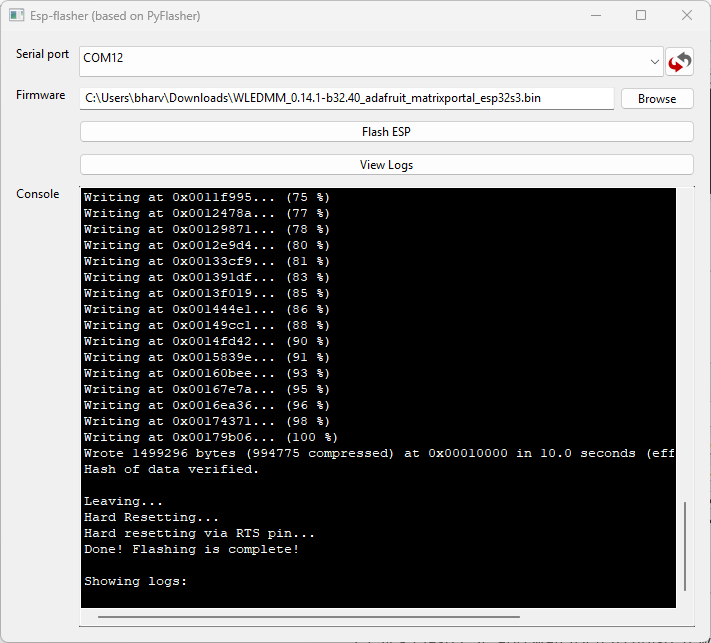

# Factory Re-Flash LED-1

1\. Plug in a USB cable that supports power and data into your computer.

2\. Push and hold the boot button (the right button). While still holding the button down, plug in a USB-C cable into the USB-C port of your LED-1 then let go of the button.

&nbsp;

3\. Download the firmware <a href="https://github.com/MoonModules/WLED/releases/download/v0.14.1-beta.32/WLEDMM_0.14.1-b32.40_adafruit_matrixportal_esp32s3.bin" target="_blank" rel="noreferrer nofollow noopener">.bin file from here</a>.

4\. Download <a href="https://wiki.apolloautomation.com/static/ESP-Flasher.exe" title="Click here to download the ESP-Flasher Tool" target="_blank" rel="noreferrer nofollow noopener">ESP Flasher (Windows EXE)</a> and open it.

5\. Click the **Serial Port** dropdown and choose the available COM port..

6\. Browse to the firmware file from Step 3 and select it.

7\. Click **Flash ESP** and wait for the process to complete. Once it's done, it will appear as shown in the image below.

8\. The device is still in **boot mode** and needs to be power cycled. To reboot it, either unplug the power cable or press the **reset button** on the back of the device (the button on the right).

[Head to the Getting Started article to setup your M-1 as a new device!](https://wiki.apolloautomation.com/products/m1/setup/getting-started-m1/){    .md-button .md-button--primary }