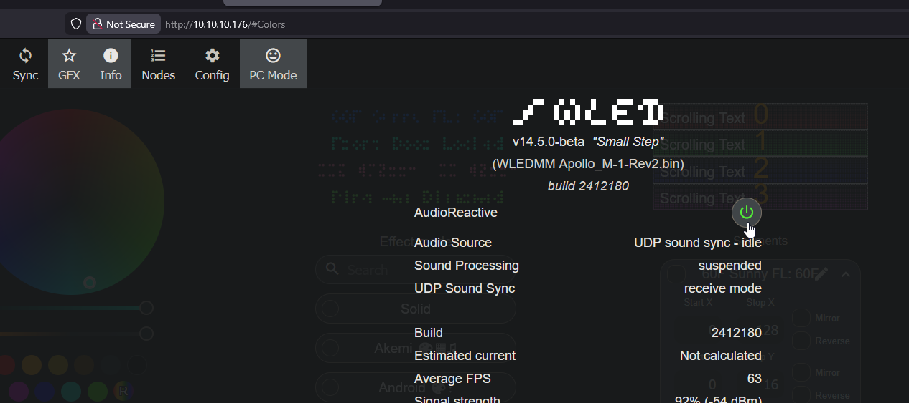

This will guide you through installing the microphone on your M-1 LED Matrix.

1\. Unplug your M-1 from power and set the matrix side face down with the M-1 Controller PCB facing you.

2\. Insert the microphone addon as shown in the image below. Make sure the Microphone image is on the left side and the GND pin is on the bottom right!

3\. You are now ready to use your microphone. Make sure to enable AudioReactive from the info tab!

