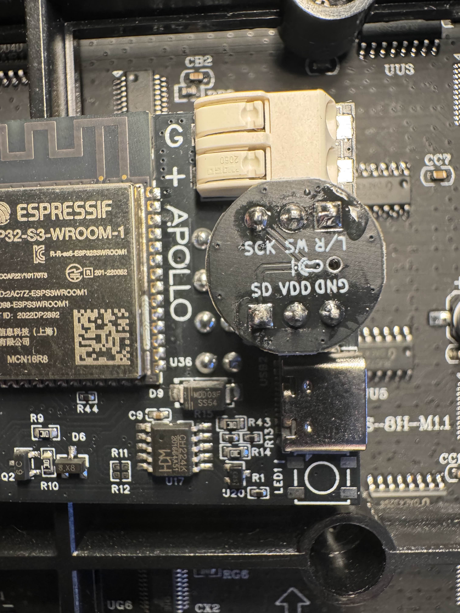

This will guide you through installing and configuring the microphone on your M-1 LED Matrix.

1\. Unplug your M-1 from power and set the matrix side face down with the M-1 Controller PCB facing you.

2\. Insert the microphone addon as shown in the image below. Make sure the Microphone image is facing to the right side and the GND pin is on the bottom right!

3\. Click on **Config**, then **AudioReactive**. Check **Enabled** then select **Generic I2S** for the Type.

4\. Select **10 digitalmic** for Pin I2s SD, select **12 digitalmic A5** for Pin I2S WS, and select **11 digitalmic** for Pin I2S SCK and click **Save**.

5\. Scroll to the bottom of the **AudioReactive** settings and set the **Mode** to **Off** and click **Save**.

