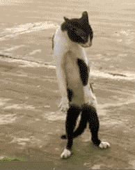
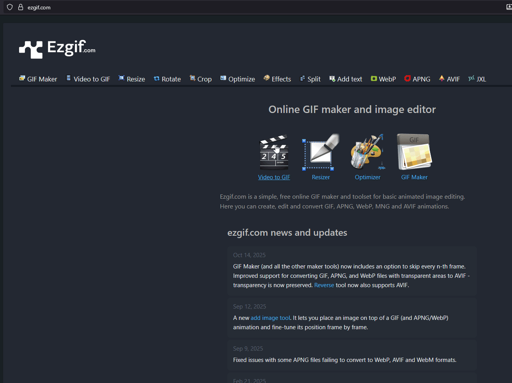
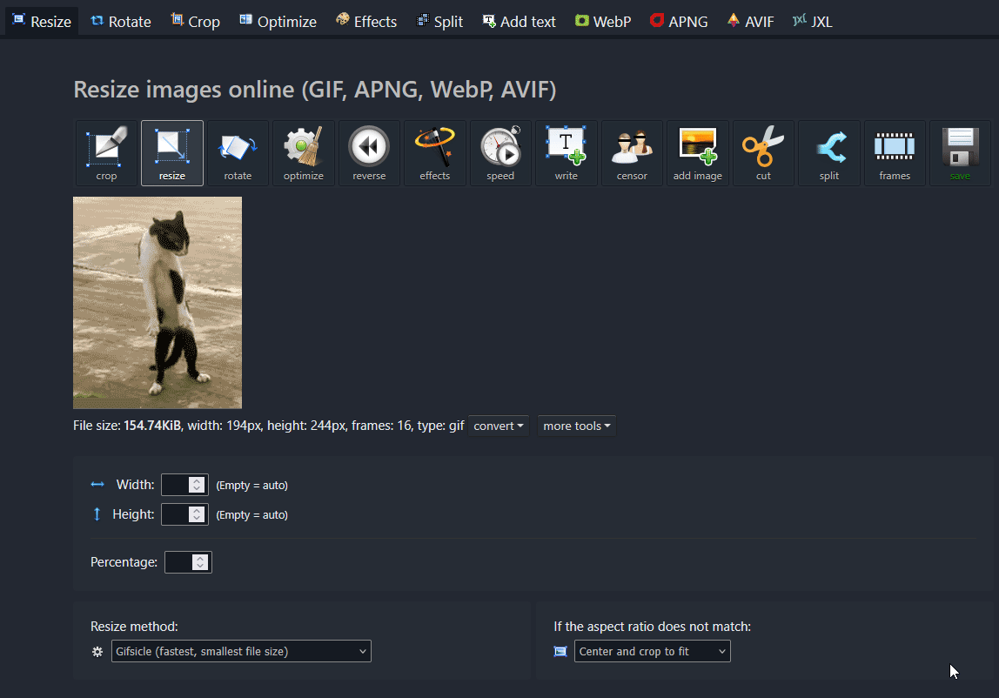
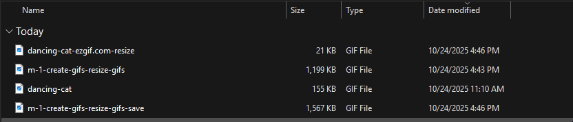
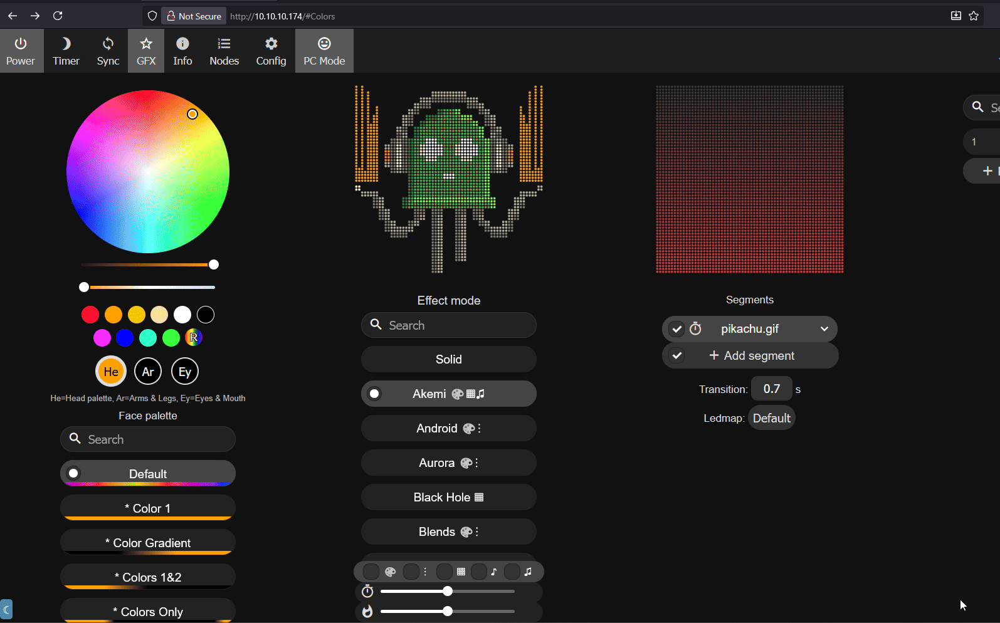
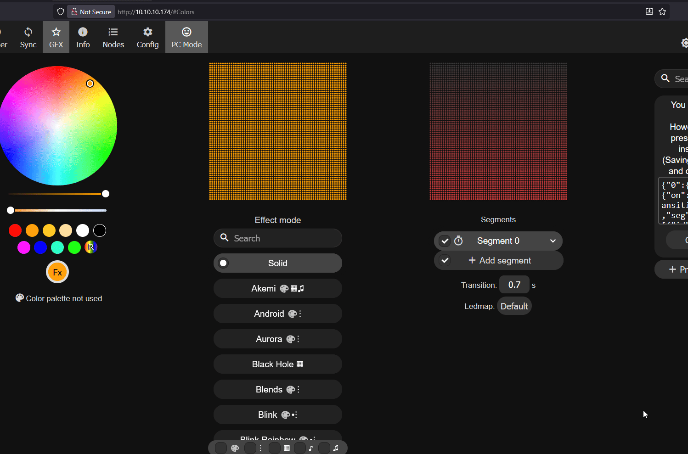
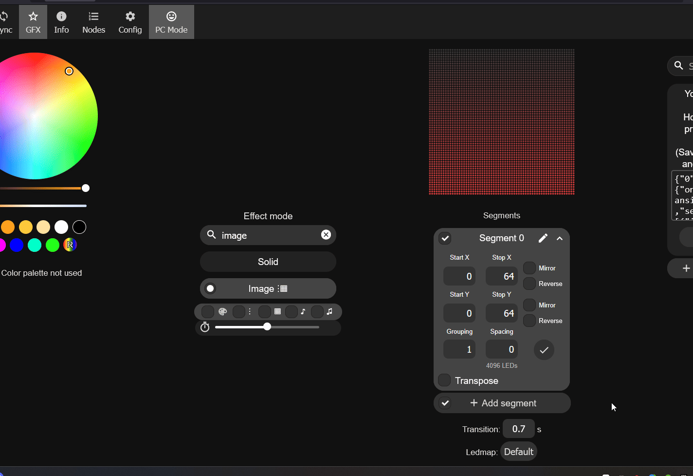
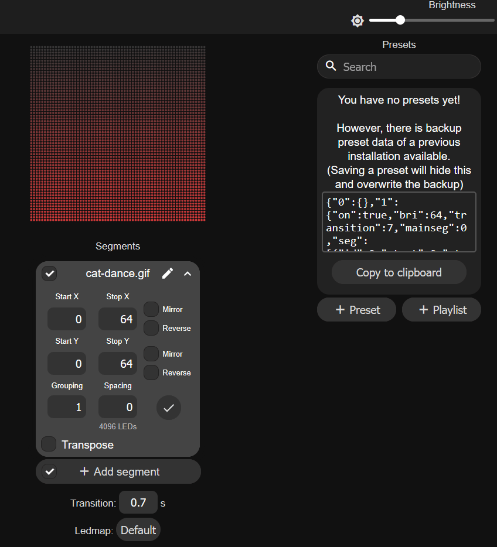
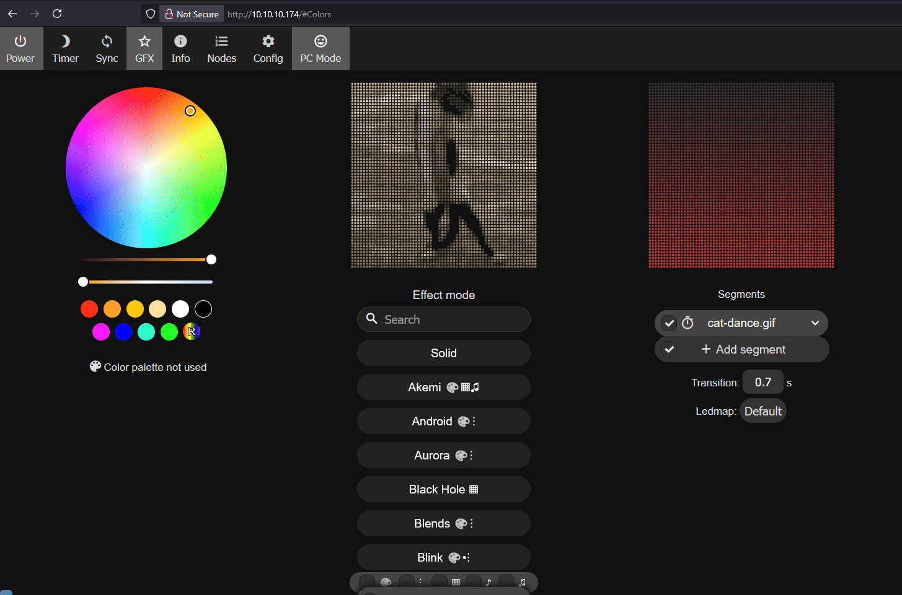

# Add GIFs to M-1 on WLED-MM Firmware

!!! null "Make sure you are on version 14.5.1 or newer!"

    WLED-MM (WLED MoonModules) firmware version 14.5.1 or higher is required for this! If you need to re-flash your device follow our<a href="https://wiki.apolloautomation.com/products/m1/troubleshooting/m1-reflash/" target="_blank" rel="noreferrer nofollow noopener"> step by step guide here</a>!

1\. Download a gif you found online such as one found on <a href="https://giphy.com/" target="_blank" rel="noreferrer nofollow noopener">giphy.com</a> - if it is already using a 64x64 width and height then you can skip to step 5. Click on the gif you want and then click **Download**. You can use the dancing-cat.gif below as a test!

2\. Head to <a href="https://ezgif.com/" target="_blank" rel="noreferrer nofollow noopener">ezgif.com</a> and click **Resize** then click Browse and choose your gif then click Upload!

3\. Set the **Width** to **64** and he **Height** to **64** then click **Resize image** then scroll down to the **Resized Image:** section and click the **Save** icon.

4\. Rename the gif to something simple such as cat-dance. We will need to input the name as-is in a future step so renaming it to a simple name is best!

5\. Open a web browser and navigate to `http://<your-m1-ip-address>` or `http://<your-device-name>.local`.

!!! null "If you need help figuring out your hostname you can edit it from the wled wifi settings"

    You can use an app like "wled-native" on iOS to auto-discover your WLED devices and then go into wifi settings to see your IP and hostname! <a href="https://wiki.apolloautomation.com/products/m1/troubleshooting/m1-find-ip-address-and-hostname/" target="_blank" rel="noreferrer nofollow noopener">Here's a step-by-step guide</a>.

6\. Click **Config**, then scroll down and click **File System** then click **Browse** and select the resized and renamed gif we just created then click **Save**.

7\. Click the back button on your browser and navigate back to the main page of the M-1 WLED interface. Click in the search bar and type in **image** and select it.

8\. Click the **arrow** next to Segment 0 and then click the pencil icon to edit the name. Type in the name exactly as you did in step 4 above such as cat-dance.gif

9\. Click on **\+ Preset** and write in any name you want such as Cat Dance then click **Save**.

10\. You are now finished but if you want your M-1 to boot to this gif then head to **Config** then **LED Preferences** and scroll down until you see **Apply Preset** and put in your preset number for the effect you just made. If this is your first one then put in 1 and then click **Save**.

