1. &nbsp;Select Config

   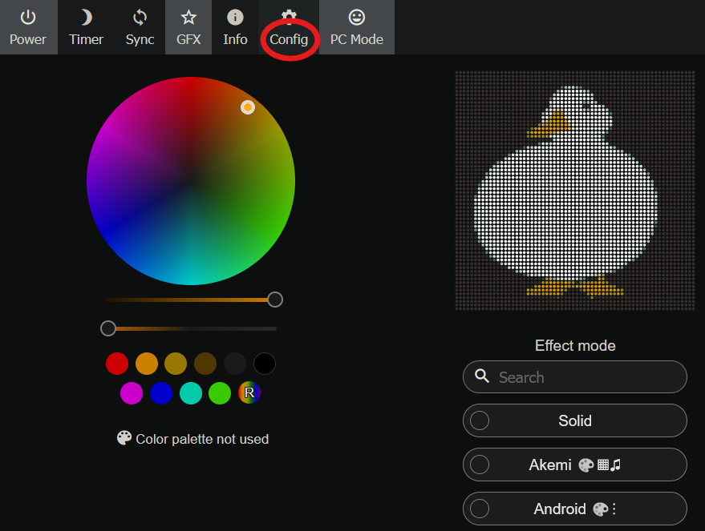

2. Select Wi-Fi Setup

   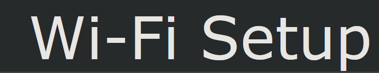

3. Add your M-1 to your Wi-Fi network by selecting Scan and adding your Wi-Fi credentials

   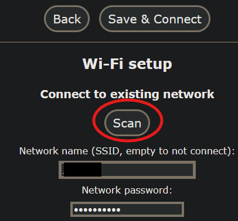

4. Now you can grab the IP address of the M-1 from your router which should be labeled esp32s3

   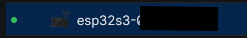

5. Copy the IP address and paste it into the URL bar of your browser

   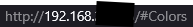

6. Now find your GIFof choice

   

7. Now we need to go to [https://ezgif.com/](https://ezgif.com/) and select Resize

   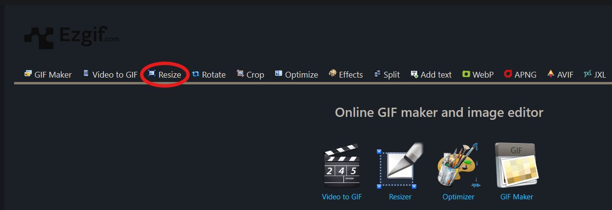

8. Select Browse and Upload your GIF

   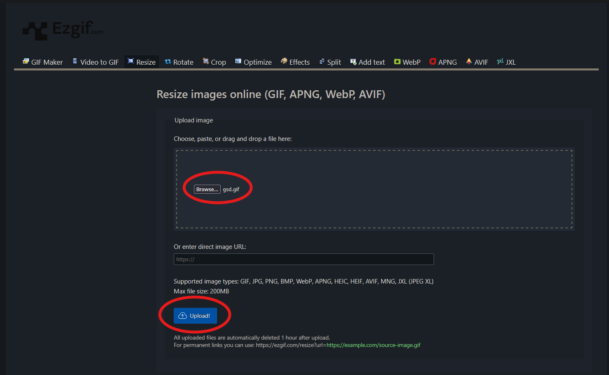

9. Change the Width and Height to 64x64, select resize and save the GIF (use an easy name since we will be using it later)

   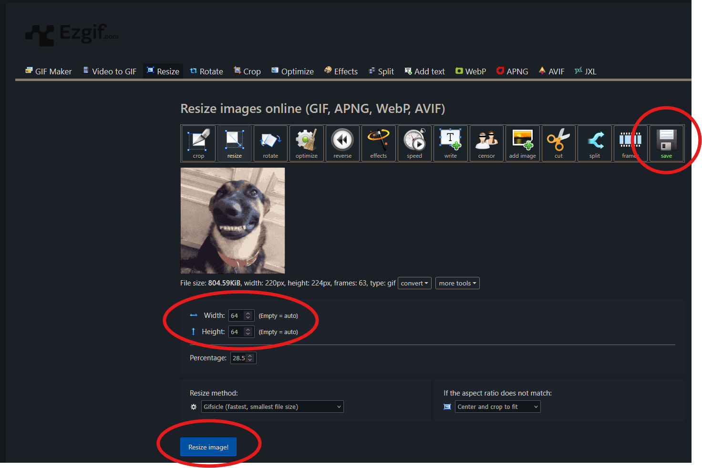

10. Now go back to the Apollo M-1 IP address and select config

    

11. Select File System

    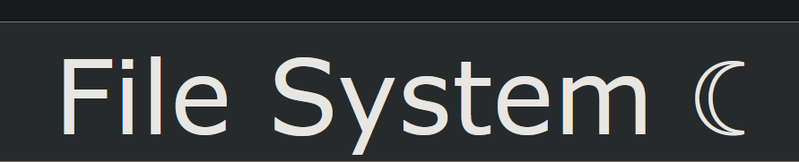

12. Select Browse, choose your GIF and then select Upload

    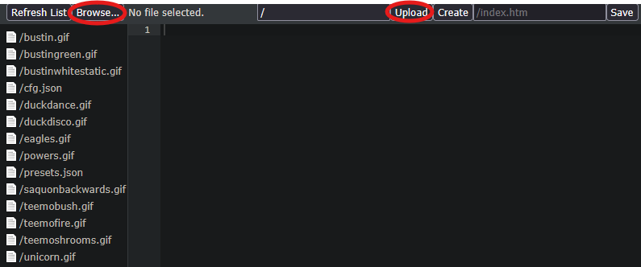

13. Now go back to your Apollo M-1 IP address, select the Image effect, use the pencil to rename the effect EXACTLY the same as your GIF (example: gsd.gif) and select the check mark to save it

    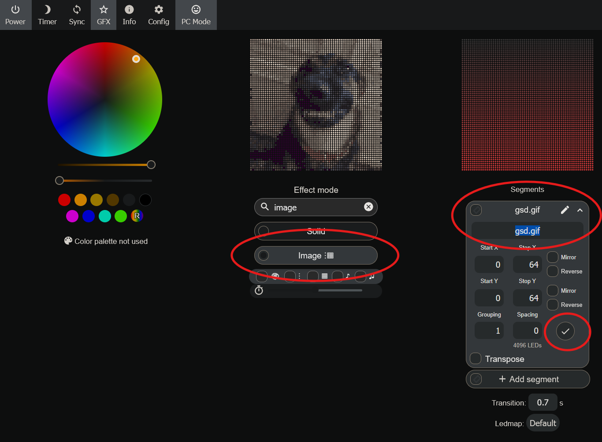

14. Now you should see your GIF playing on the Apollo M-1!

    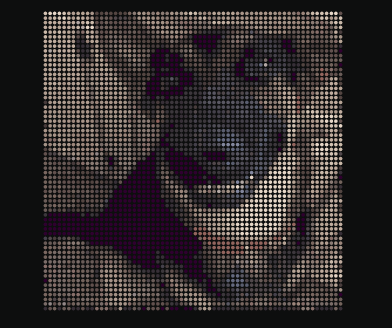

15. Not finished yet though! Select Preset, type in a name and save it to the device

    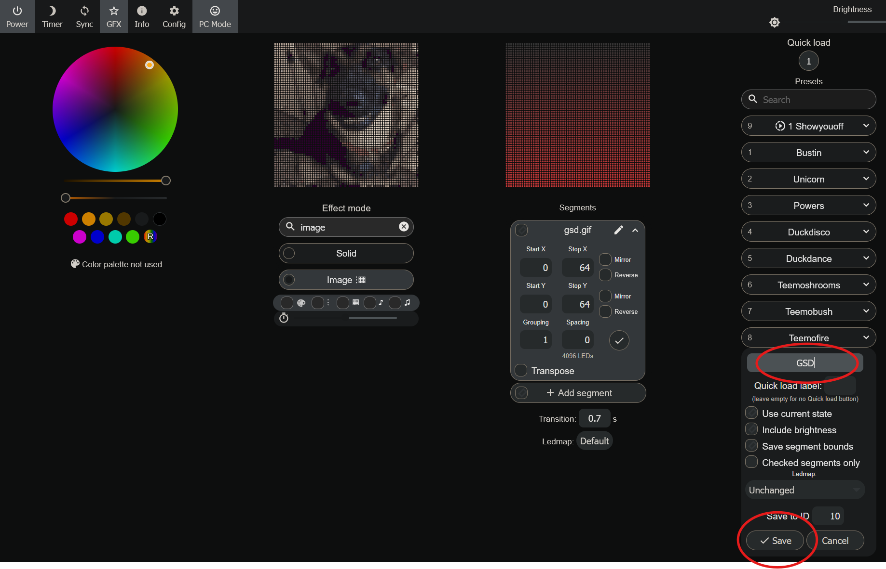

16. Now you can play it whenever you would like and you can even set it as the boot effect (Config &gt; LED Preferences &gt; Change Apply Preset to the preset number you just made)

    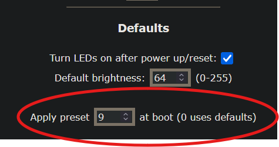

    &nbsp;

    &nbsp;