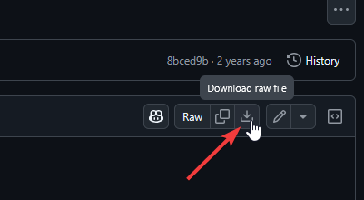
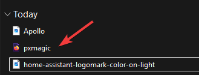
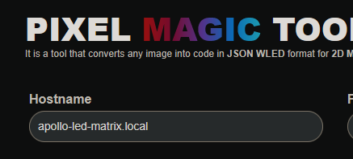
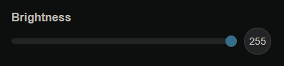
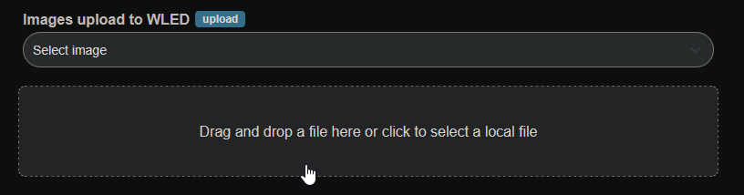
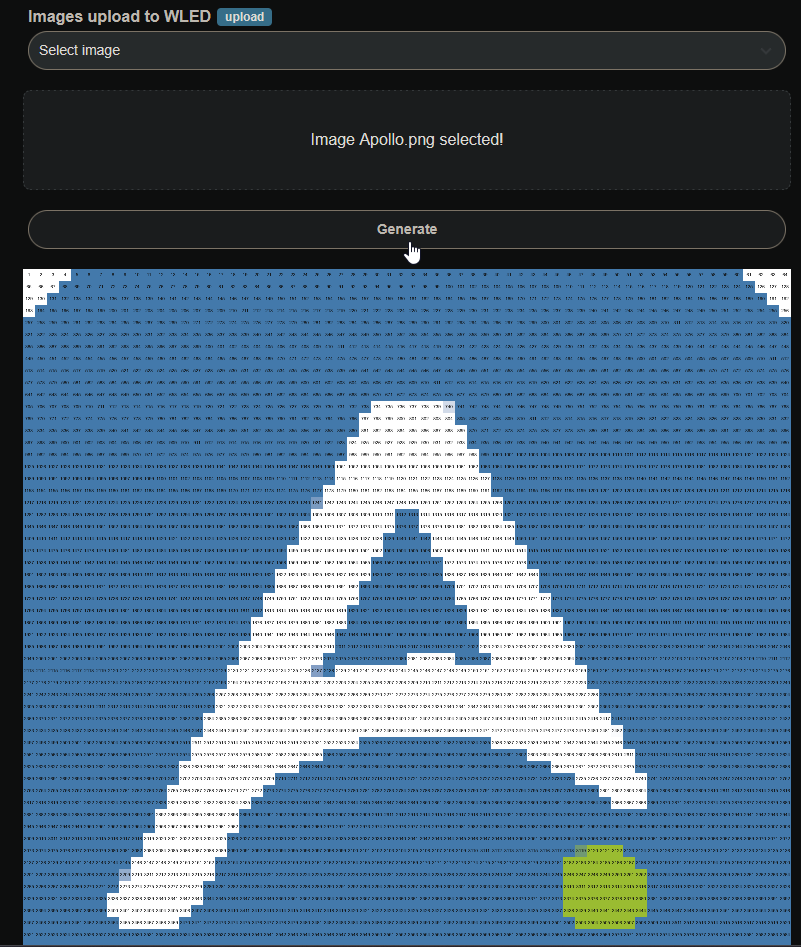
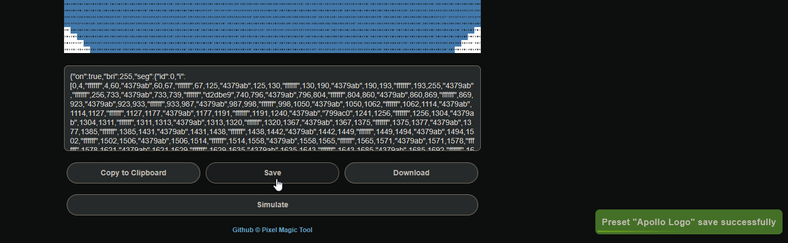
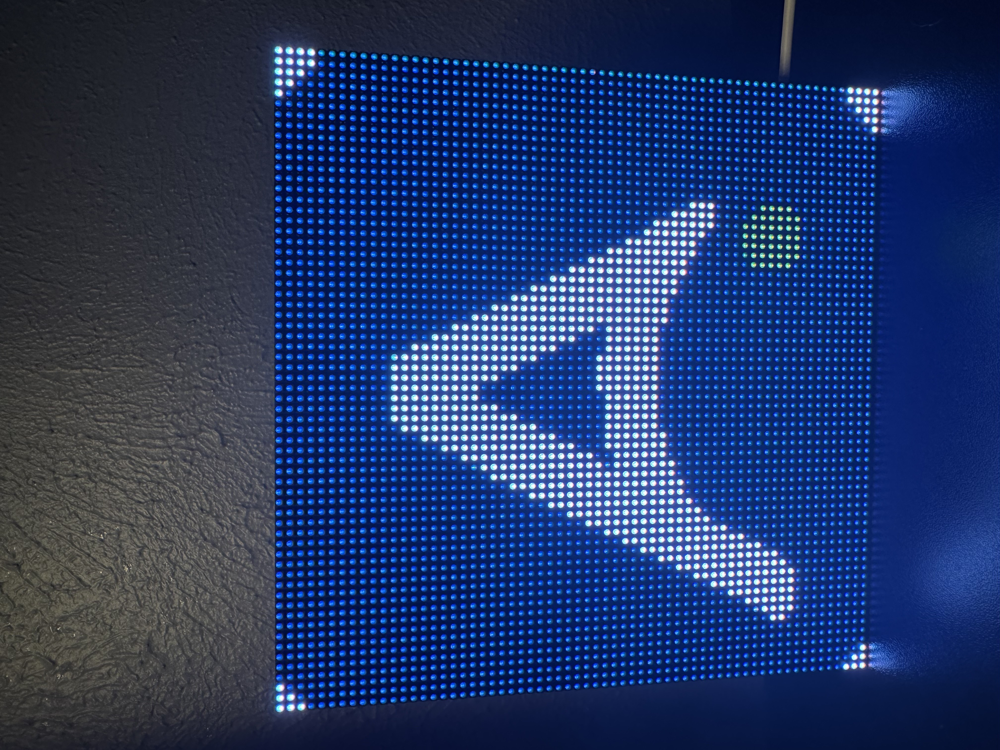

# Create your own image for the M-1

#### Create New Image

1\. <a href="https://github.com/ApolloAutomation/PixelMagicTool/blob/main/pxmagic.htm" target="_blank" rel="noreferrer nofollow noopener">Click this link</a> and then click "Download raw file" as shown below.



2\. Double click the pxmagic.htm file you just downloaded and it will launch in a browser such as Firefox.



3\. Fill in the IP address or the hostname.local such as apollo-led-matrix.local



!!! tip "If you need help figuring out your hostname you can edit it from the wled wifi settings"

    You can use an app like "wled-native" on iOS to auto-discover your WLED devices and then go into wifi settings to see your IP and hostname!

4\. Fill in a Preset Name such as "Apollo Logo".


5\. Slide the brightness slider to 255 if you want it to be full brightness!



6\. Click Select image and navigate to the image or logo you want and select it.



7\. Click Generate and you should now see a preview of your image.



8\. Click Save and you should see a notification in the bottom right confirming that your preset was saved successfully!



9\. Your preset is now live on your device. You might need to refresh the browser to see it. You also will need to "reload" the WLED integration in Home Assistant for your device for new presets to show up!



#### Popular Images

!!! tip "The long scary code below can be used to save to a preset!"

    You can use the JSON code below to copy and paste into a WLED preset instead of making the image yourself using the guide above.

**Apollo Logo**

```json
{"on":true,"bri":128,"seg":{"id":0,"i":[0,4,"ffffff",4,60,"4379ab",60,67,"ffffff",67,125,"4379ab",125,130,"ffffff",130,190,"4379ab",190,193,"ffffff",193,255,"4379ab","ffffff",256,733,"4379ab",733,739,"ffffff","d2dbe9",740,796,"4379ab",796,804,"ffffff",804,860,"4379ab",860,869,"ffffff",869,923,"4379ab",923,933,"ffffff",933,987,"4379ab",987,998,"ffffff",998,1050,"4379ab",1050,1062,"ffffff",1062,1114,"4379ab",1114,1127,"ffffff",1127,1177,"4379ab",1177,1191,"ffffff",1191,1240,"4379ab","799ac0",1241,1256,"ffffff",1256,1304,"4379ab",1304,1311,"ffffff",1311,1313,"4379ab",1313,1320,"ffffff",1320,1367,"4379ab",1367,1375,"ffffff",1375,1377,"4379ab",1377,1385,"ffffff",1385,1431,"4379ab",1431,1438,"ffffff",1438,1442,"4379ab",1442,1449,"ffffff",1449,1494,"4379ab",1494,1502,"ffffff",1502,1506,"4379ab",1506,1514,"ffffff",1514,1558,"4379ab",1558,1565,"ffffff",1565,1571,"4379ab",1571,1578,"ffffff",1578,1621,"4379ab",1621,1629,"ffffff",1629,1635,"4379ab",1635,1643,"ffffff",1643,1685,"4379ab",1685,1692,"ffffff",1692,1700,"4379ab",1700,1707,"ffffff",1707,1748,"4379ab",1748,1756,"ffffff",1756,1764,"4379ab",1764,1772,"ffffff",1772,1812,"4379ab",1812,1819,"ffffff",1819,1829,"4379ab",1829,1836,"ffffff",1836,1875,"4379ab",1875,1883,"ffffff",1883,1893,"4379ab",1893,1901,"ffffff",1901,1939,"4379ab",1939,1946,"ffffff",1946,1958,"4379ab",1958,1965,"ffffff",1965,2002,"4379ab",2002,2010,"ffffff",2010,2022,"4379ab",2022,2030,"ffffff",2030,2066,"4379ab",2066,2073,"ffffff",2073,2080,"4379ab",2080,2084,"ffffff",2084,2087,"4379ab",2087,2094,"ffffff",2094,2129,"4379ab",2129,2136,"ffffff","839ec4","4379ab",2138,2159,"ffffff",2159,2193,"4379ab",2193,2223,"ffffff",2223,2256,"4379ab",2256,2288,"ffffff",2288,2320,"4379ab",2320,2352,"ffffff",2352,2383,"4379ab",2383,2417,"ffffff",2417,2447,"4379ab",2447,2481,"ffffff","fafbfd",2482,2510,"4379ab",2510,2524,"ffffff",2524,2535,"4379ab",2535,2546,"ffffff",2546,2574,"4379ab",2574,2585,"ffffff",2585,2602,"4379ab",2602,2611,"ffffff",2611,2637,"4379ab",2637,2647,"ffffff",2647,2668,"4379ab",2668,2675,"ffffff",2675,2701,"4379ab",2701,2709,"ffffff",2709,2734,"4379ab",2734,2740,"ffffff",2740,2764,"4379ab",2764,2772,"ffffff",2772,2800,"4379ab",2800,2804,"ffffff",2804,2828,"4379ab",2828,2835,"ffffff",2835,2865,"4379ab",2865,2868,"ffffff",2868,2891,"4379ab",2891,2898,"ffffff",2898,2955,"4379ab",2955,2962,"ffffff",2962,3018,"4379ab",3018,3025,"ffffff",3025,3082,"4379ab",3082,3089,"ffffff",3089,3118,"4379ab","709974",3119,3122,"9abc31",3122,3145,"4379ab",3145,3152,"ffffff",3152,3181,"4379ab",3181,3187,"9abc31",3187,3208,"4379ab","94accc",3209,3216,"ffffff",3216,3245,"4379ab",3245,3252,"9abc31",3252,3272,"4379ab",3272,3279,"ffffff",3279,3309,"4379ab",3309,3316,"9abc31",3316,3335,"4379ab","fdfefe",3336,3343,"ffffff",3343,3373,"4379ab",3373,3380,"9abc31",3380,3399,"4379ab",3399,3406,"ffffff",3406,3437,"4379ab",3437,3444,"9abc31",3444,3464,"4379ab",3464,3469,"ffffff",3469,3502,"4379ab",3502,3507,"9abc31",3507,3840,"4379ab","ffffff",3841,3903,"4379ab",3903,3906,"ffffff",3906,3966,"4379ab",3966,3971,"ffffff",3971,4029,"4379ab",4029,4036,"ffffff",4036,4092,"4379ab",4092,4096,"ffffff"]}}
```

Home Assistant Logo

```json
{"on":true,"bri":128,"seg":{"id":0,"i":[0,157,"ffffff","18bbf1",158,162,"18bcf2","17bcf1",163,220,"ffffff","18bbf2",221,227,"18bcf2","17bcf1",228,283,"ffffff","18bbf2",284,292,"18bcf2","17bcf2",293,346,"ffffff","18bbf2",347,357,"18bcf2","17bcf1",358,409,"ffffff","18bbf2",410,422,"18bcf2","17bcf2",423,472,"ffffff","18bbf2",473,487,"18bcf2","17bcf1",488,535,"ffffff","18bbf2",536,552,"18bcf2","17bcf2",553,598,"ffffff","18bbf2",599,617,"18bcf2","17bcf1",618,661,"ffffff","18bbf2",662,682,"18bcf2","17bcf2",683,724,"ffffff","18bbf2",725,747,"18bcf2","17bcf1",748,787,"ffffff","18bbf2",788,812,"18bcf2","17bcf2",813,850,"ffffff","18bbf2",851,877,"18bcf2","17bcf1",878,913,"ffffff","18bbf2",914,942,"18bcf2","17bcf2",943,976,"ffffff","18bbf2",977,1007,"18bcf2","17bcf1",1008,1039,"ffffff","18bbf2",1040,1072,"18bcf2","17bcf2",1073,1102,"ffffff","18bbf2",1103,1117,"18bcf2","92dbf5",1118,1122,"f2f4f9","9edef5",1123,1137,"18bcf2","17bcf1",1138,1165,"ffffff","18bbf2",1166,1180,"18bcf2",1180,1188,"f2f4f9",1188,1202,"18bcf2","17bcf2",1203,1228,"ffffff","18bbf2",1229,1243,"18bcf2","e7f1f8",1244,1252,"f2f4f9","ecf2f8",1253,1267,"18bcf2","17bcf1",1268,1291,"ffffff","18bbf2",1292,1307,"18bcf2",1307,1317,"f2f4f9",1317,1332,"18bcf2","17bcf2",1333,1354,"ffffff","18bbf2",1355,1370,"18bcf2","2dc1f2",1371,1381,"f2f4f9","3ac4f3",1382,1397,"18bcf2","17bcf1",1398,1417,"ffffff","18bbf2",1418,1434,"18bcf2","40c6f3",1435,1445,"f2f4f9","5ccdf4",1446,1462,"18bcf2","17bcf2",1463,1480,"ffffff","18bbf2",1481,1498,"18bcf2","1cbdf2",1499,1509,"f2f4f9","1dbdf2",1510,1527,"18bcf2","17bcf1",1528,1543,"ffffff","18bbf2",1544,1563,"18bcf2",1563,1573,"f2f4f9",1573,1592,"18bcf2","17bcf2",1593,1606,"ffffff","18bbf2",1607,1627,"18bcf2","5bcdf4",1628,1636,"f2f4f9","60cef4",1637,1657,"18bcf2","17bcf1",1658,1669,"ffffff","18bbf2",1670,1692,"18bcf2","a8e1f6",1693,1699,"f2f4f9","b2e3f6",1700,1722,"18bcf2","17bcf2",1723,1732,"ffffff","18bbf2",1733,1758,"18bcf2",1758,1762,"f2f4f9",1762,1787,"18bcf2","17bcf1",1788,1795,"ffffff","18bbf2",1796,1822,"18bcf2",1822,1826,"f2f4f9",1826,1852,"18bcf2","17bcf2",1853,1858,"ffffff",1858,1886,"18bcf2",1886,1890,"f2f4f9",1890,1917,"18bcf2","17bcf1",1918,1922,"ffffff",1922,1950,"18bcf2",1950,1954,"f2f4f9",1954,1982,"18bcf2",1982,1985,"ffffff",1985,2014,"18bcf2",2014,2018,"f2f4f9",2018,2047,"18bcf2",2047,2049,"ffffff",2049,2078,"18bcf2",2078,2082,"f2f4f9",2082,2111,"18bcf2","ffffff","17bcf2",2113,2142,"18bcf2",2142,2146,"f2f4f9",2146,2158,"18bcf2","19bcf2","c0e7f7","bee6f7","1dbdf2",2162,2175,"18bcf2","17bbf2",2176,2206,"18bcf2",2206,2210,"f2f4f9",2210,2220,"18bcf2","1bbcf2",2221,2227,"f2f4f9","1ebdf2",2228,2270,"18bcf2",2270,2274,"f2f4f9",2274,2284,"18bcf2",2284,2292,"f2f4f9",2292,2334,"18bcf2",2334,2338,"f2f4f9",2338,2347,"18bcf2",2347,2357,"f2f4f9",2357,2398,"18bcf2",2398,2402,"f2f4f9",2402,2411,"18bcf2",2411,2421,"f2f4f9",2421,2462,"18bcf2",2462,2466,"f2f4f9",2466,2474,"18bcf2","3cc5f3",2475,2485,"f2f4f9","54cbf3",2486,2526,"18bcf2",2526,2530,"f2f4f9",2530,2538,"18bcf2","35c3f2",2539,2549,"f2f4f9","4cc9f3",2550,2590,"18bcf2",2590,2594,"f2f4f9",2594,2603,"18bcf2",2603,2613,"f2f4f9",2613,2654,"18bcf2",2654,2658,"f2f4f9",2658,2666,"18bcf2",2666,2677,"f2f4f9",2677,2703,"18bcf2","78d4f4","75d4f4","19bcf2",2706,2718,"18bcf2",2718,2722,"f2f4f9",2722,2729,"18bcf2",2729,2740,"f2f4f9",2740,2765,"18bcf2",2765,2771,"f2f4f9",2771,2782,"18bcf2",2782,2786,"f2f4f9",2786,2792,"18bcf2",2792,2803,"f2f4f9",2803,2828,"18bcf2",2828,2836,"f2f4f9",2836,2846,"18bcf2",2846,2850,"f2f4f9",2850,2855,"18bcf2",2855,2861,"f2f4f9","e0eff8",2862,2891,"18bcf2",2891,2901,"f2f4f9",2901,2910,"18bcf2",2910,2914,"f2f4f9",2914,2918,"18bcf2",2918,2924,"f2f4f9","e0eff8",2925,2955,"18bcf2",2955,2965,"f2f4f9",2965,2974,"18bcf2",2974,2978,"f2f4f9",2978,2981,"18bcf2",2981,2987,"f2f4f9","e0eff8",2988,3018,"18bcf2","3ac4f3",3019,3029,"f2f4f9","52caf3",3030,3038,"18bcf2",3038,3042,"f2f4f9",3042,3044,"18bcf2",3044,3050,"f2f4f9","e0eff8",3051,3082,"18bcf2","38c4f3",3083,3093,"f2f4f9","4ac8f3",3094,3102,"18bcf2",3102,3106,"f2f4f9","18bcf2",3107,3113,"f2f4f9","e0eff8",3114,3147,"18bcf2",3147,3157,"f2f4f9",3157,3166,"18bcf2",3166,3176,"f2f4f9","e0eff8",3177,3211,"18bcf2",3211,3222,"f2f4f9",3222,3230,"18bcf2",3230,3239,"f2f4f9","e0eff8",3240,3276,"18bcf2",3276,3287,"f2f4f9",3287,3294,"18bcf2",3294,3302,"f2f4f9","e0eff8",3303,3341,"18bcf2",3341,3352,"f2f4f9",3352,3358,"18bcf2",3358,3365,"f2f4f9","e0eff8",3366,3407,"18bcf2","2ec1f2","30c2f2","18bcf2",3410,3417,"f2f4f9",3417,3422,"18bcf2",3422,3428,"f2f4f9","e0eff8",3429,3475,"18bcf2",3475,3482,"f2f4f9",3482,3486,"18bcf2",3486,3491,"f2f4f9","e0eff8",3492,3540,"18bcf2",3540,3547,"f2f4f9",3547,3550,"18bcf2",3550,3554,"f2f4f9","e0eff8",3555,3605,"18bcf2",3605,3612,"f2f4f9",3612,3614,"18bcf2",3614,3618,"f2f4f9",3618,3670,"18bcf2",3670,3677,"f2f4f9","18bcf2",3678,3682,"f2f4f9",3682,3735,"18bcf2",3735,3746,"f2f4f9",3746,3800,"18bcf2",3800,3810,"f2f4f9",3810,3865,"18bcf2",3865,3874,"f2f4f9",3874,3930,"18bcf2",3930,3938,"f2f4f9",3938,3968,"18bcf2","ffffff",3969,3995,"18bcf2",3995,4002,"f2f4f9",4002,4031,"18bcf2",4031,4034,"ffffff",4034,4060,"18bcf2",4060,4066,"f2f4f9",4066,4094,"18bcf2",4094,4096,"ffffff"]}}
```

&nbsp;

&nbsp;

&nbsp;