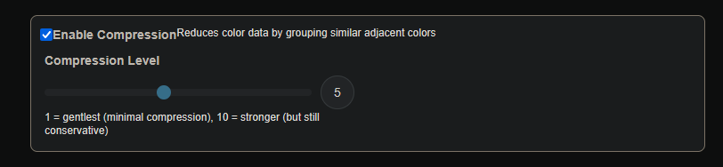
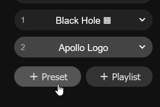
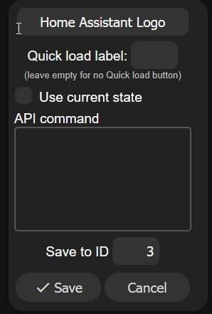
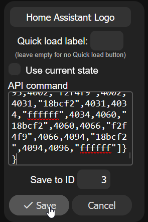

# Create your own image for the M-1

!!! success "You can upload multiple new images as presets in WLED."

    The WLED firmware on your device will allow you to call these presets in automations or make buttons to control them on your Home Assistant dashboard!

#### Create New Image

1\. <a href="https://github.com/ApolloAutomation/PixelMagicTool/blob/main/pxmagic.htm" target="_blank" rel="noreferrer nofollow noopener">Click this link</a> and then click "Download raw file" as shown below.


2\. Double click the pxmagic.htm file you just downloaded and it will launch in a browser such as Firefox.


3\. Fill in the IP address or the hostname.local of your M-1 device such as apollo-led-matrix.local


!!! tip "If you need help figuring out your hostname you can edit it from the wled wifi settings"

    You can use an app like "wled-native" on iOS to auto-discover your WLED devices and then go into wifi settings to see your IP and hostname! <a href="https://wiki.apolloautomation.com/products/m1/troubleshooting/m1-find-ip-address-and-hostname/" target="_blank" rel="noreferrer nofollow noopener">Here's a step-by-step guide</a>.

4\. Fill in a Preset Name such as "Apollo Logo".


5\. Slide the brightness slider to 255 if you want it to be full brightness!


6\. Click Select image and navigate to the image or logo you want and select it.

!!! note "Very large images will need compression gone over in Step 8 below."

    Not all images are created equal! Some large images dont seem to work properly with the PixelMagicTool. We are still looking for ways to improve it!


7\. Click Generate and you should now see a preview of your image.


!!! failure "If you see a warning about large data size then you need to enable compression as shown below."

    This is not a perfect solution but some images are too large for WLED presets to support properly.


8\. Enable Compression and move the slider to the left for less compression and to the right for more compression. This step is not necessary unless you get the warning image above. If the warning is ignored, the image will likely fail to save to your m-1 led matrix with various http 400 errors.



8\. Click Save and you should see a notification in the bottom right confirming that your preset was saved successfully!


9\. Your preset is now live on your device. You might need to refresh the browser to see it. You also will need to "reload" the WLED integration in Home Assistant for your device for new presets to show up!


#### Popular Images

!!! tip "The long scary code below can be used to save to a preset!"

    You can use the JSON code below to copy and paste into a WLED preset instead of making the image yourself using the guide above.

1\. Click "+ Preset" on the right side of your WLED instance.



2\. Uncheck the **Use current state** box.



3\. Hover over the right side of one of the code blocks below, click **Copy**, then paste it into the API command box and click **Save**.



**Apollo Logo**

```json
{"on":true,"bri":128,"seg":{"id":0,"i":[0,4,"ffffff",4,60,"4379ab",60,67,"ffffff",67,125,"4379ab",125,130,"ffffff",130,190,"4379ab",190,193,"ffffff",193,255,"4379ab","ffffff",256,733,"4379ab",733,739,"ffffff","d2dbe9",740,796,"4379ab",796,804,"ffffff",804,860,"4379ab",860,869,"ffffff",869,923,"4379ab",923,933,"ffffff",933,987,"4379ab",987,998,"ffffff",998,1050,"4379ab",1050,1062,"ffffff",1062,1114,"4379ab",1114,1127,"ffffff",1127,1177,"4379ab",1177,1191,"ffffff",1191,1240,"4379ab","799ac0",1241,1256,"ffffff",1256,1304,"4379ab",1304,1311,"ffffff",1311,1313,"4379ab",1313,1320,"ffffff",1320,1367,"4379ab",1367,1375,"ffffff",1375,1377,"4379ab",1377,1385,"ffffff",1385,1431,"4379ab",1431,1438,"ffffff",1438,1442,"4379ab",1442,1449,"ffffff",1449,1494,"4379ab",1494,1502,"ffffff",1502,1506,"4379ab",1506,1514,"ffffff",1514,1558,"4379ab",1558,1565,"ffffff",1565,1571,"4379ab",1571,1578,"ffffff",1578,1621,"4379ab",1621,1629,"ffffff",1629,1635,"4379ab",1635,1643,"ffffff",1643,1685,"4379ab",1685,1692,"ffffff",1692,1700,"4379ab",1700,1707,"ffffff",1707,1748,"4379ab",1748,1756,"ffffff",1756,1764,"4379ab",1764,1772,"ffffff",1772,1812,"4379ab",1812,1819,"ffffff",1819,1829,"4379ab",1829,1836,"ffffff",1836,1875,"4379ab",1875,1883,"ffffff",1883,1893,"4379ab",1893,1901,"ffffff",1901,1939,"4379ab",1939,1946,"ffffff",1946,1958,"4379ab",1958,1965,"ffffff",1965,2002,"4379ab",2002,2010,"ffffff",2010,2022,"4379ab",2022,2030,"ffffff",2030,2066,"4379ab",2066,2073,"ffffff",2073,2080,"4379ab",2080,2084,"ffffff",2084,2087,"4379ab",2087,2094,"ffffff",2094,2129,"4379ab",2129,2136,"ffffff","839ec4","4379ab",2138,2159,"ffffff",2159,2193,"4379ab",2193,2223,"ffffff",2223,2256,"4379ab",2256,2288,"ffffff",2288,2320,"4379ab",2320,2352,"ffffff",2352,2383,"4379ab",2383,2417,"ffffff",2417,2447,"4379ab",2447,2481,"ffffff","fafbfd",2482,2510,"4379ab",2510,2524,"ffffff",2524,2535,"4379ab",2535,2546,"ffffff",2546,2574,"4379ab",2574,2585,"ffffff",2585,2602,"4379ab",2602,2611,"ffffff",2611,2637,"4379ab",2637,2647,"ffffff",2647,2668,"4379ab",2668,2675,"ffffff",2675,2701,"4379ab",2701,2709,"ffffff",2709,2734,"4379ab",2734,2740,"ffffff",2740,2764,"4379ab",2764,2772,"ffffff",2772,2800,"4379ab",2800,2804,"ffffff",2804,2828,"4379ab",2828,2835,"ffffff",2835,2865,"4379ab",2865,2868,"ffffff",2868,2891,"4379ab",2891,2898,"ffffff",2898,2955,"4379ab",2955,2962,"ffffff",2962,3018,"4379ab",3018,3025,"ffffff",3025,3082,"4379ab",3082,3089,"ffffff",3089,3118,"4379ab","709974",3119,3122,"9abc31",3122,3145,"4379ab",3145,3152,"ffffff",3152,3181,"4379ab",3181,3187,"9abc31",3187,3208,"4379ab","94accc",3209,3216,"ffffff",3216,3245,"4379ab",3245,3252,"9abc31",3252,3272,"4379ab",3272,3279,"ffffff",3279,3309,"4379ab",3309,3316,"9abc31",3316,3335,"4379ab","fdfefe",3336,3343,"ffffff",3343,3373,"4379ab",3373,3380,"9abc31",3380,3399,"4379ab",3399,3406,"ffffff",3406,3437,"4379ab",3437,3444,"9abc31",3444,3464,"4379ab",3464,3469,"ffffff",3469,3502,"4379ab",3502,3507,"9abc31",3507,3840,"4379ab","ffffff",3841,3903,"4379ab",3903,3906,"ffffff",3906,3966,"4379ab",3966,3971,"ffffff",3971,4029,"4379ab",4029,4036,"ffffff",4036,4092,"4379ab",4092,4096,"ffffff"]}}
```

**Home Assistant Logo**

```json
{"on":true,"bri":128,"seg":{"id":0,"i":[0,157,"ffffff","18bbf1",158,162,"18bcf2","17bcf1",163,220,"ffffff","18bbf2",221,227,"18bcf2","17bcf1",228,283,"ffffff","18bbf2",284,292,"18bcf2","17bcf2",293,346,"ffffff","18bbf2",347,357,"18bcf2","17bcf1",358,409,"ffffff","18bbf2",410,422,"18bcf2","17bcf2",423,472,"ffffff","18bbf2",473,487,"18bcf2","17bcf1",488,535,"ffffff","18bbf2",536,552,"18bcf2","17bcf2",553,598,"ffffff","18bbf2",599,617,"18bcf2","17bcf1",618,661,"ffffff","18bbf2",662,682,"18bcf2","17bcf2",683,724,"ffffff","18bbf2",725,747,"18bcf2","17bcf1",748,787,"ffffff","18bbf2",788,812,"18bcf2","17bcf2",813,850,"ffffff","18bbf2",851,877,"18bcf2","17bcf1",878,913,"ffffff","18bbf2",914,942,"18bcf2","17bcf2",943,976,"ffffff","18bbf2",977,1007,"18bcf2","17bcf1",1008,1039,"ffffff","18bbf2",1040,1072,"18bcf2","17bcf2",1073,1102,"ffffff","18bbf2",1103,1117,"18bcf2","92dbf5",1118,1122,"f2f4f9","9edef5",1123,1137,"18bcf2","17bcf1",1138,1165,"ffffff","18bbf2",1166,1180,"18bcf2",1180,1188,"f2f4f9",1188,1202,"18bcf2","17bcf2",1203,1228,"ffffff","18bbf2",1229,1243,"18bcf2","e7f1f8",1244,1252,"f2f4f9","ecf2f8",1253,1267,"18bcf2","17bcf1",1268,1291,"ffffff","18bbf2",1292,1307,"18bcf2",1307,1317,"f2f4f9",1317,1332,"18bcf2","17bcf2",1333,1354,"ffffff","18bbf2",1355,1370,"18bcf2","2dc1f2",1371,1381,"f2f4f9","3ac4f3",1382,1397,"18bcf2","17bcf1",1398,1417,"ffffff","18bbf2",1418,1434,"18bcf2","40c6f3",1435,1445,"f2f4f9","5ccdf4",1446,1462,"18bcf2","17bcf2",1463,1480,"ffffff","18bbf2",1481,1498,"18bcf2","1cbdf2",1499,1509,"f2f4f9","1dbdf2",1510,1527,"18bcf2","17bcf1",1528,1543,"ffffff","18bbf2",1544,1563,"18bcf2",1563,1573,"f2f4f9",1573,1592,"18bcf2","17bcf2",1593,1606,"ffffff","18bbf2",1607,1627,"18bcf2","5bcdf4",1628,1636,"f2f4f9","60cef4",1637,1657,"18bcf2","17bcf1",1658,1669,"ffffff","18bbf2",1670,1692,"18bcf2","a8e1f6",1693,1699,"f2f4f9","b2e3f6",1700,1722,"18bcf2","17bcf2",1723,1732,"ffffff","18bbf2",1733,1758,"18bcf2",1758,1762,"f2f4f9",1762,1787,"18bcf2","17bcf1",1788,1795,"ffffff","18bbf2",1796,1822,"18bcf2",1822,1826,"f2f4f9",1826,1852,"18bcf2","17bcf2",1853,1858,"ffffff",1858,1886,"18bcf2",1886,1890,"f2f4f9",1890,1917,"18bcf2","17bcf1",1918,1922,"ffffff",1922,1950,"18bcf2",1950,1954,"f2f4f9",1954,1982,"18bcf2",1982,1985,"ffffff",1985,2014,"18bcf2",2014,2018,"f2f4f9",2018,2047,"18bcf2",2047,2049,"ffffff",2049,2078,"18bcf2",2078,2082,"f2f4f9",2082,2111,"18bcf2","ffffff","17bcf2",2113,2142,"18bcf2",2142,2146,"f2f4f9",2146,2158,"18bcf2","19bcf2","c0e7f7","bee6f7","1dbdf2",2162,2175,"18bcf2","17bbf2",2176,2206,"18bcf2",2206,2210,"f2f4f9",2210,2220,"18bcf2","1bbcf2",2221,2227,"f2f4f9","1ebdf2",2228,2270,"18bcf2",2270,2274,"f2f4f9",2274,2284,"18bcf2",2284,2292,"f2f4f9",2292,2334,"18bcf2",2334,2338,"f2f4f9",2338,2347,"18bcf2",2347,2357,"f2f4f9",2357,2398,"18bcf2",2398,2402,"f2f4f9",2402,2411,"18bcf2",2411,2421,"f2f4f9",2421,2462,"18bcf2",2462,2466,"f2f4f9",2466,2474,"18bcf2","3cc5f3",2475,2485,"f2f4f9","54cbf3",2486,2526,"18bcf2",2526,2530,"f2f4f9",2530,2538,"18bcf2","35c3f2",2539,2549,"f2f4f9","4cc9f3",2550,2590,"18bcf2",2590,2594,"f2f4f9",2594,2603,"18bcf2",2603,2613,"f2f4f9",2613,2654,"18bcf2",2654,2658,"f2f4f9",2658,2666,"18bcf2",2666,2677,"f2f4f9",2677,2703,"18bcf2","78d4f4","75d4f4","19bcf2",2706,2718,"18bcf2",2718,2722,"f2f4f9",2722,2729,"18bcf2",2729,2740,"f2f4f9",2740,2765,"18bcf2",2765,2771,"f2f4f9",2771,2782,"18bcf2",2782,2786,"f2f4f9",2786,2792,"18bcf2",2792,2803,"f2f4f9",2803,2828,"18bcf2",2828,2836,"f2f4f9",2836,2846,"18bcf2",2846,2850,"f2f4f9",2850,2855,"18bcf2",2855,2861,"f2f4f9","e0eff8",2862,2891,"18bcf2",2891,2901,"f2f4f9",2901,2910,"18bcf2",2910,2914,"f2f4f9",2914,2918,"18bcf2",2918,2924,"f2f4f9","e0eff8",2925,2955,"18bcf2",2955,2965,"f2f4f9",2965,2974,"18bcf2",2974,2978,"f2f4f9",2978,2981,"18bcf2",2981,2987,"f2f4f9","e0eff8",2988,3018,"18bcf2","3ac4f3",3019,3029,"f2f4f9","52caf3",3030,3038,"18bcf2",3038,3042,"f2f4f9",3042,3044,"18bcf2",3044,3050,"f2f4f9","e0eff8",3051,3082,"18bcf2","38c4f3",3083,3093,"f2f4f9","4ac8f3",3094,3102,"18bcf2",3102,3106,"f2f4f9","18bcf2",3107,3113,"f2f4f9","e0eff8",3114,3147,"18bcf2",3147,3157,"f2f4f9",3157,3166,"18bcf2",3166,3176,"f2f4f9","e0eff8",3177,3211,"18bcf2",3211,3222,"f2f4f9",3222,3230,"18bcf2",3230,3239,"f2f4f9","e0eff8",3240,3276,"18bcf2",3276,3287,"f2f4f9",3287,3294,"18bcf2",3294,3302,"f2f4f9","e0eff8",3303,3341,"18bcf2",3341,3352,"f2f4f9",3352,3358,"18bcf2",3358,3365,"f2f4f9","e0eff8",3366,3407,"18bcf2","2ec1f2","30c2f2","18bcf2",3410,3417,"f2f4f9",3417,3422,"18bcf2",3422,3428,"f2f4f9","e0eff8",3429,3475,"18bcf2",3475,3482,"f2f4f9",3482,3486,"18bcf2",3486,3491,"f2f4f9","e0eff8",3492,3540,"18bcf2",3540,3547,"f2f4f9",3547,3550,"18bcf2",3550,3554,"f2f4f9","e0eff8",3555,3605,"18bcf2",3605,3612,"f2f4f9",3612,3614,"18bcf2",3614,3618,"f2f4f9",3618,3670,"18bcf2",3670,3677,"f2f4f9","18bcf2",3678,3682,"f2f4f9",3682,3735,"18bcf2",3735,3746,"f2f4f9",3746,3800,"18bcf2",3800,3810,"f2f4f9",3810,3865,"18bcf2",3865,3874,"f2f4f9",3874,3930,"18bcf2",3930,3938,"f2f4f9",3938,3968,"18bcf2","ffffff",3969,3995,"18bcf2",3995,4002,"f2f4f9",4002,4031,"18bcf2",4031,4034,"ffffff",4034,4060,"18bcf2",4060,4066,"f2f4f9",4066,4094,"18bcf2",4094,4096,"ffffff"]}}
```

**Dallas Cowboys Logo**

```json
{"on":true,"bri":255,"seg":{"id":0,"i":[0,31,"ffffff","f5f6f7","f4f5f6",33,95,"ffffff","c5c8ce","bec2c8",97,159,"ffffff","3f4562","383e5d",161,223,"ffffff","001338","001539",225,286,"ffffff","d3d5d9",287,289,"002144","ccced2",290,350,"ffffff","6c7083",351,353,"002244","62677c",354,414,"ffffff","00173d","233351","283754","00183e",418,477,"ffffff","eaebed","002144","77798a","818393","002144","e7e8ea",483,541,"ffffff","81828f","002143","e9eaec","ebedee","002143","747583",547,605,"ffffff","000c2b","001533",607,609,"ffffff","001330","000e2d",611,668,"ffffff","f0f1f2","002042","4e4f6a",671,673,"ffffff","5b5c75","002042","edeef0",676,732,"ffffff","a6a8b2","002244","d1d3d7","e7e8eb","e4e5e8","d5d7db","002244","9d9faa",740,796,"ffffff","2a3754","001d41","ffffff","7b7d8b","6e7180","ffffff","001c40","263552",804,859,"ffffff","f8f8f9","001840","354461","ffffff","000e31","001033","ffffff","3e4c67","001940","f6f7f8",869,923,"ffffff","c3c4cc","002244","b9bac2","f3f4f5",927,929,"002143","f2f2f4","c0c1c8","002244","b6b7c1",933,987,"ffffff","262f4c","00193d","ffffff","9ea0ab",991,993,"002244","9597a3","ffffff","00183c","232d4b",997,1050,"ffffff","fdfdfd","00183e","292e4f","ffffff","2e3956",1055,1057,"002244","293553","ffffff","323656","00193e","fcfcfc",1062,1114,"ffffff","dddde1","002244","a1a5ae","f4f5f6","00163e",1119,1121,"002244","00173f","f3f3f4","a8abb4","002244","d5d6d9",1126,1178,"ffffff","686b7e","001d41","f9f9fa","afb2bc",1182,1186,"002244","a4a7b3","f9fafb","001c41","606378",1190,1241,"ffffff","fefefe","000833","142648","ffffff","1e2d4a",1246,1250,"002244","1b2b48","ffffff","1a2a4a","000a35","fefefe",1255,1305,"ffffff","e7e7e9","002244","576078","fefefe","001b40",1310,1314,"002244","001c40","fefefe","656d83","002244","dfdfe2",1319,1369,"ffffff","6a7083","002043","fdfdfd","d2d3d8",1373,1379,"002244","c9cbd0","fdfdfd","002043","62677d",1383,1433,"ffffff","031a40","091e42","ffffff","616277",1437,1443,"002244","585971","ffffff","0c2043","031b40",1447,1496,"ffffff","f3f4f5","002043","5a5c74","fcfdfd","000a35",1501,1507,"002244","000c37","fcfcfd","64667c","002043","eeeef0",1512,1536,"ffffff","babec4",1537,1560,"9595a0","666c7c","002043","d9dbde","e4e6e8",1564,1572,"002244","dee0e3","dcdde0","001f42","606778",1576,1599,"9595a0","b7bac1","ffffff","a2a2ab","001c40",1603,1625,"002244","072143","ffffff","76798a",1628,1636,"002244","6c6f82","ffffff","092143",1639,1661,"002244","001c41","9b9ca6",1663,1666,"ffffff","e3e5e7","001135","002244","1c2e4e",1670,1689,"d9d9dc","dcdcdf","ffffff","00133c",1692,1700,"002244","00143c","ffffff","dddde0",1703,1722,"d9d9dc","243452","002244","001236","dfe1e4",1726,1732,"ffffff","31425e","002244","0c1739","ecedef","ffffff","fbfbfb",1738,1754,"e3e3e5","d8dadd","002043",1756,1764,"002244","002043","d3d5d9",1766,1782,"e3e3e5","fafbfb","ffffff","edeef0","0f193b","002244","30405d",1788,1797,"ffffff","8d8d97","001b41","001d41","b0b3bb","ffffff","c7c9cf","001a3a",1804,1844,"002244","001b3b","c2c5cb","ffffff","b4b7bf",1848,1850,"001c41","868690",1851,1862,"ffffff","e0e0e3","081f43","002244","46536f","fcfcfc","fafafb","13294b",1869,1907,"002244","12274a","f9fafb","fcfdfd","525d77","002244","071f43","dadbde",1914,1927,"ffffff","fbfcfc","1c2947","002244","171b41","f6f6f7","ffffff","494b69","002043",1935,1969,"002244","002043","414261","ffffff","f7f7f8","1a1e43","002244","1a2746","fbfbfc",1977,1993,"ffffff","6e727e","002144","00193f","d1d4d9","ffffff","b9bbc1","001c40",2000,2032,"002244","001d41","b2b4bb","ffffff","d6d8dd","00183e","002144","686c79",2039,2058,"ffffff","dbdde1","00153e","002043","6b7183","ffffff","f1f2f4","00123a",2065,2095,"002244","00133b","f0f1f3","ffffff","727888","002042","00173f","d3d6db",2102,2123,"ffffff","f5f5f6","1d2347","002244","17203b","f9f9fa","ffffff","414d64","002144",2131,2157,"002244","002144","3a455e","ffffff","fafafb","19213b","002244","191f45","f4f4f5",2165,2188,"ffffff","fdfdfd","5f6579","002144","082043","dfe1e4","ffffff","abacb7","001e41",2196,2220,"002244","001f42","a6a7b2","ffffff","e7e8eb","0b2144","002144","585f74","fdfdfd",2228,2254,"ffffff","b7b8c0","00163e","002042","8b8e9c","ffffff","e1e3e6","041038",2261,2283,"002244","000c36","dfe1e4","ffffff","9195a1","001f42","00173f","b3b4bd",2290,2319,"ffffff","edeef0","0c1837","002244","303a59","fcfcfc","ffffff","252b4e",2326,2346,"002244","232a4c","ffffff","fdfdfd","343f5b","002244","091634","ecedef",2353,2385,"ffffff","4c576e","002143","00112f","e0e2e5","ffffff","8b929f","001f42",2392,2408,"002244","001f42","868c9b","ffffff","e6e7ea","00102e","002143","465169",2415,2450,"ffffff","a0a2ae","001c40","001d41","8a8ca1","ffffff","545b6e",2456,2472,"002244","4f576b","ffffff","9797ab",2475,2477,"001d41","9a9ca9",2478,2515,"ffffff","f0f1f2","002143","1b1c43","ffffff","000f39",2520,2536,"002244","00103a","fefefe","28294e","002244","eff0f1",2541,2579,"ffffff","a8acb5","002244","e2e3e6","fafbfb",2583,2601,"002244","f4f4f5","e3e5e8","002244","a2a7b0",2605,2643,"ffffff","162c4e","00173e","ffffff","a0a5af",2647,2665,"002244","969ba6","ffffff","00163d","0b2246",2669,2707,"ffffff","001d41","2d3853","ffffff","000029",2711,2729,"002244","00022a","ffffff","303a55","001f42",2733,2770,"ffffff","dbdde0","002143","c3c5cc","ffffff",2774,2794,"002244","f9fafa","cfd1d5","002143","d8dbde",2798,2834,"ffffff","292a41","002244","fcfcfc","a9acb3",2838,2847,"002244","001b40","001b3f",2849,2858,"002244","9fa3ab","ffffff","002244","1b1c35",2862,2898,"ffffff","041f42","00042b","ffffff","112446",2902,2910,"002244","111c41","e9eaec","ebecee","141f43",2914,2922,"002244","102446","ffffff","000229","021f42",2926,2961,"ffffff","dee0e4","002043","9b9eaa","ffffff","001d41",2966,2972,"002244","002143","4b516b","ffffff","f5f6f7","f4f5f6","ffffff","525770","002143",2980,2986,"002244","001e41","ffffff","a6a9b3","002143","dcdee2",2991,3025,"ffffff","606679","002043","f3f3f4","d4d7db",3029,3035,"002244","001c40","9ea4af","ffffff","ced1d6","001538","001639","cacdd2","ffffff","a3a8b2","001b40",3045,3051,"002244","d2d4d9","f9f9f9","002043","575e72",3055,3089,"ffffff","0c1c44","08173f","ffffff","0e0e36",3093,3098,"002244","091e41","ebecee","ffffff","707188","001e41","041f43","052043","001e42","6b6c83","ffffff","ecedef","0c2043",3110,3115,"002244","00002a","ffffff","09163f","081841",3119,3152,"ffffff","f4f4f6","001f42","6c7183","ffffff","001d41",3157,3160,"002244","002143","3c3c55","ffffff","f9f9f9","37405f","002244","101e43","ecedef","eeeff1","131f44","002244","323c5c","f7f7f8","ffffff","42425a","002143",3176,3179,"002244","001f42","ffffff","747989","002043","f3f4f5",3184,3216,"ffffff","646b7a","002244","e4e5e8","e7e8eb","002143",3221,3223,"002244","001d41","8d8f99","ffffff","e0e0e3","000e3b","002043","484b6a",3230,3234,"ffffff","4e516e","002043","000f3c","dcdce0","ffffff","93959f","001d41",3241,3244,"002244","e5e6e9","edeef0","002244","585e6f",3248,3280,"ffffff","142647","000636","ffffff","696b7b",3284,3286,"002244","021b3f","e3e5e8","fefefe","9ea2ad","002144","001f41","a9aeb6",3293,3299,"ffffff","afb4bb","001e41","002144","989ca7","fefefe","e5e7e9","051b40",3306,3308,"002244","606374","ffffff","000435","0f2345",3312,3343,"ffffff","fdfdfd","001c41","676d81","ffffff","0a1740","002144","0b1b42","ffffff","fdfefe","000c39","002144","051a3f",3355,3365,"ffffff","051a3f","002144","000b38","fdfdfd","ffffff","112046","002144","05123d","ffffff","6f7687","001e41","fdfdfd",3377,3407,"ffffff","afafb5","002244","d9dbe0","f6f7f8","001f42","888b98",3413,3415,"ffffff","05083a","002244","1f2143","fdfdfd",3419,3429,"ffffff","fdfdfd","2a2b4f","002244","05093b","fafafa","ffffff","91959f","002043","f5f6f8","e1e3e7","002244","a7a7ae",3441,3471,"ffffff","2f3053","001a3f","fdfdfe","576177","dedfe2","ffffff","a7aab1","001f42","002143","9c9fab",3481,3495,"ffffff","a1a5b0","002042","001f42","9ea1a9","ffffff","e4e5e7","4a556c","fefefe","00193f","25264c",3505,3535,"ffffff","00173d","25324e","ffffff","f6f6f7","ffffff","454f68","002144","000837","e4e5e7",3544,3560,"ffffff","e6e7e9","020b38","002144","404a64","ffffff","f6f6f7","ffffff","28344f","00193e",3569,3598,"ffffff","babdc4","002244","bac0c7","ffffff","f2f3f4","112244","002144","29314d",3606,3626,"ffffff","303752","002244","0a2043","f1f2f3","ffffff","c9ced4","002244","b4b7be",3634,3662,"ffffff","3a4464","001b40","f9fafa","babcc4","02183f","002244","848c9c",3669,3691,"ffffff","8b92a1","002244","01173f","b5b8bf","fbfbfb","001a3f","303b5c",3698,3726,"ffffff","061f43","212b50","5d5e72","002143","001a3f","d1d4d8",3732,3756,"ffffff","d7d9dd","00193f","002143","57586c","202a4f","051f43",3762,3789,"ffffff","d1d3d7","002043","001d41","002244","232949","f7f7f8",3795,3821,"ffffff","f9fafa","262b4a","002244","001e42","002043","ccced3",3827,3853,"ffffff","48546e","002244","001e41","6a6e81",3857,3887,"ffffff","707485","001e41","002244","3c4864",3891,3917,"ffffff","001438","001d3d","c0c3ca",3920,3952,"ffffff","c6c9cf","001c3d","00163a",3955,3980,"ffffff","f3f4f5","1a2846","fbfbfc",3983,4017,"ffffff","fbfcfc","1c2947","f1f2f4",4020,4044,"ffffff","acafb6",4045,4083,"ffffff","a8abb2",4084,4096,"ffffff"]}}
```