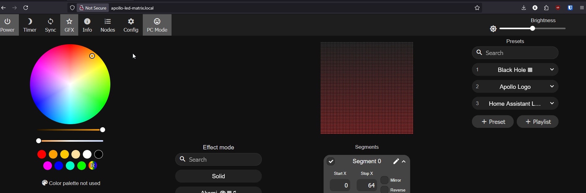

# Setup Scrolling Text for the M-1

!!! tip "You can set multiple different custom scrolling text as presets in WLED."

    The WLED firmware on your device will allow you to call these presets in automations or make buttons to control them on your Home Assistant dashboard!

1\. Open a web browser and navigate to `http://<your-ip-address>` or `http://<your-device-name>.local`.

2\. Click the search box under **Effect mode**, type **"Scrolling Text"**, and select it from the list.

3\. Once selected, your matrix will show the current date in orange text.

4\. Look on the right side of the screen and click the pencil icon beside "Segment 0".

5\. Type in anything you want to scroll on the M-1 such as "Apollo Rocks!". Click on the Check button when you're done and it will update the M-1 LED Matrix with your new text.

!!! example "Edit settings to fully customize your M-1 with Scrolling Text!"

    There are four slider bars under the Scrolling Text effect. Here is what each one does: 1\. **Effect speed**: how slow or fast the text goes across the matrix.

    2\. **Y Offset**: Moves the words higher or lower on the matrix. Defaults to the middle.

    3\. **Trail**: Trail length or Fade (sometimes called *Decay* or *Trail* depending on firmware version) to control how long the trail behind the text lasts.

    4\. **Font size**: Size of the font. 222 looks good!

6\. To customize the text’s Color, Background Color, and Gradient, just click the Fx, Bg, and Gr circles and choose your colors using the color picker!

7\. Click on + Preset and write in a name for your new preset such as Apollo Rocks! then click Save.

8\. Here's what your finished product looks like!

[Click here to setup your M-1 LED Matrix with a custom logo or image!](https://wiki.apolloautomation.com/products/m1/examples/create-logo-image/){      .md-button .md-button--primary }