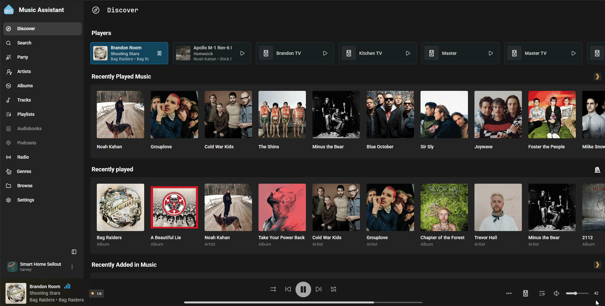

# SendSpin

[SendSpin](https://www.sendspin-audio.com/) is an open standard for syncing music across multiple devices. Although this is primarily used by music players like homepods or the <a href="https://www.home-assistant.io/voice-pe/" target="_blank" rel="noreferrer nofollow noopener">HA Voice PE</a>, the Apollo M-1 LED Matrix can display your album art automagically. Pairs well with the M-1 running the [hub75-studio](https://github.com/pavlov-net/hub75-studio) ESPHome firmware. Further, when paired with a <a href="https://www.amazon.com/WiZ-Remote-Compatible-Lights-Assistant/dp/B091TGDS6F" target="_blank" rel="noreferrer nofollow noopener">Wizmote</a>, you're able to do things like turn the panel on/off, control the volume (buttons 1 and 2), pause/play, previous/next track (buttons 3 and 4), and brightness. This remote support requires editing the yaml at this time but will be getting easier soon!

!!! success "Your device needs to be running the ESPHome firmware to use Sendspin."

    If you have a stock M-1 LED Matrix you will be on the WLED-MM firmware. You will need to <a href="https://wiki.apolloautomation.com/products/m1/setup/getting-started-m1-esphome/" target="_blank" rel="noreferrer nofollow noopener">follow this tutorial</a> to switch to the ESPHome firmware!

1\. You will need to be running <a href="https://www.music-assistant.io/" target="_blank" rel="noreferrer nofollow noopener">Music Assistant</a> which has Sendspin baked in! Click the button below to install it on your Home Assistant OS setup.

!!! success "This tutorial expects you to already have music providers and players setup."

    Make sure you have already followed the Music Assistant onboarding and setup a music provider or multiple and added some players to play music on. Your M-1 will already be shown as a sendspin player if you are running the ESPHome firmware. <a href="https://wiki.apolloautomation.com/products/m1/setup/getting-started-m1-esphome/" target="_blank" rel="noreferrer nofollow noopener">Click here</a> to get your M-1 running ESPHome firmware first!

2\. Head to the <a href="http://homeassistant.local:8123/d5369777_music_assistant" target="_blank" rel="noreferrer nofollow noopener">Music Assistant dashboard</a> and select one of your media players. Then click the players icon then click the players icon again and check off your Apollo M-1 LED Matrix.

