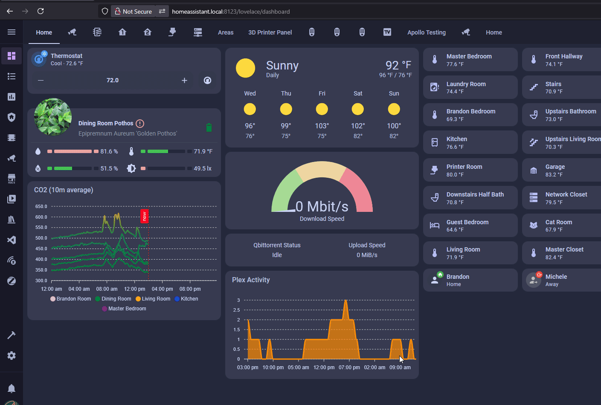

# Share Data from Home Assistant on your M-1 LED Matrix

!!! tip "This tutorial expects you to already have 4 segments created!"

    Please follow <a href="https://wiki.apolloautomation.com/products/m1/setup/m1-segments/" target="_blank" rel="noreferrer nofollow noopener">this wiki article</a> to setup your M-1 LED Matrix with segments. If you are using multiple panels, <a href="https://wiki.apolloautomation.com/products/m1/setup/m1-multiple-panels/#segment-setup" target="_blank" rel="noreferrer nofollow noopener">follow this article</a> instead then come back!

The <a href="https://www.home-assistant.io/integrations/wled/" target="_blank" rel="noreferrer nofollow noopener">WLED integration for Home Assistant</a> does not support sending data from our devices directly to the M-1 LED Matrix, however, we are still able to do so using the <a href="https://mm.kno.wled.ge/interfaces/json-api/" target="_blank" rel="noreferrer nofollow noopener">WLED JSON API</a>. This is an advanced tutorial but if you follow each step closely you should be able to follow along!

1\. Install "Studio Code Server" <a href="https://github.com/hassio-addons/addon-vscode" target="_blank" rel="noreferrer nofollow noopener">from the addon store</a> in Home Assistant OS. Click Open Webui and navigate to your configuration.yaml file.

!!! danger "This file is used by Home Assistant and must be carefully edited."

    Home Assistant depends on this file to function correctly. Only make the changes exactly as outlined below. Do not add extra spaces or modify anything beyond what is specified in the instructions.

2\. Fill in the YAML generator below with your own entity IDs. When you are done, click **Copy to Clipboard** at the bottom then move to step 3.

<iframe src="/snippets/matrix-yaml-generator.htm" width="100%" height="700" style="border: 1px solid #ccc; border-radius: 6px;"></iframe>

3\. Head back to the configuration.yaml file you opened in step 1 and paste your yaml generated on to a new line at the bottom of the YAML file.

&nbsp;