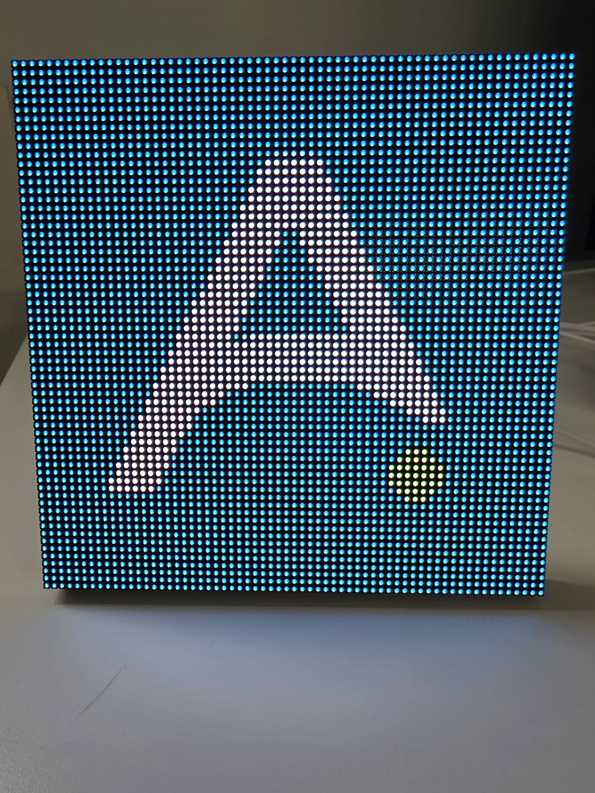

# Introduction

The Apollo Automation M-1 LED Matrix is a vibrant, high-performance display featuring 4096 pixels in a HUB75 format. Powered entirely by our new 5V 3Amp controller, it requires no additional power sources, keeping your setup clean and simple. The compact controller hides discreetly behind the matrix for a sleek installation.

Pre-flashed with WLED firmware, the M-1 offers an easy and fun user experience right out of the box. Customize your display with animations, effects, and colors, or use the Pixel Magic tool to create your own unique images and designs. You can also connect up to four of these panels horizontally, though extra power injection will be needed for full the effect.

**Use Cases:**

* Dynamic indoor or outdoor digital signage for advertising or information displays.
* Interactive art installations and digital murals.
* Real-time data visualization like weather, stock prices, or social media feeds.
* Custom notifications and alerts in smart homes or workplaces.
* Scoreboards and event displays at sports venues or conferences.
* Ambient lighting with customizable patterns and colors for mood setting.
* DIY projects for gaming or retro pixel art displays.