# Getting Started (ESPHome)

!!! tip "Running WLED-MM instead?"

    If you're using the stock WLED-MoonModules firmware that ships pre-flashed, head to the [WLED-MM Getting Started page](getting-started-m1.md) instead.

This guide walks you through replacing the stock WLED-MM firmware with [hub75-studio](https://github.com/pavlov-net/hub75-studio), an ESPHome firmware tailored for the M-1, and getting it onto your home network and into Home Assistant.

#### Attach M-1 LED Controller

Your M-1 LED Matrix and M-1 controller were shipped separately to minimize damage in shipping. Gently attach the controller to the back of the M-1 LED Matrix panel as shown in the GIF below.


#### Flash the firmware

!!! success "Use the Rev6 build unless you have an older M-1 Controller!"

    All M-1 units currently being sold are Rev6. On the <a href="https://pavlov-net.github.io/hub75-studio/" target="_blank" rel="noreferrer nofollow noopener">hub75-studio installer</a>, select the **Rev6** firmware before clicking **Connect**.

1\. Open <a href="https://pavlov-net.github.io/hub75-studio/" target="_blank" rel="noreferrer nofollow noopener">https://pavlov-net.github.io/hub75-studio/</a> in Chrome, Edge, or another Chromium-based browser.

2\. Pick the **Rev6** firmware, click **Connect**, select the M-1's COM port, and follow the installer prompts to flash.

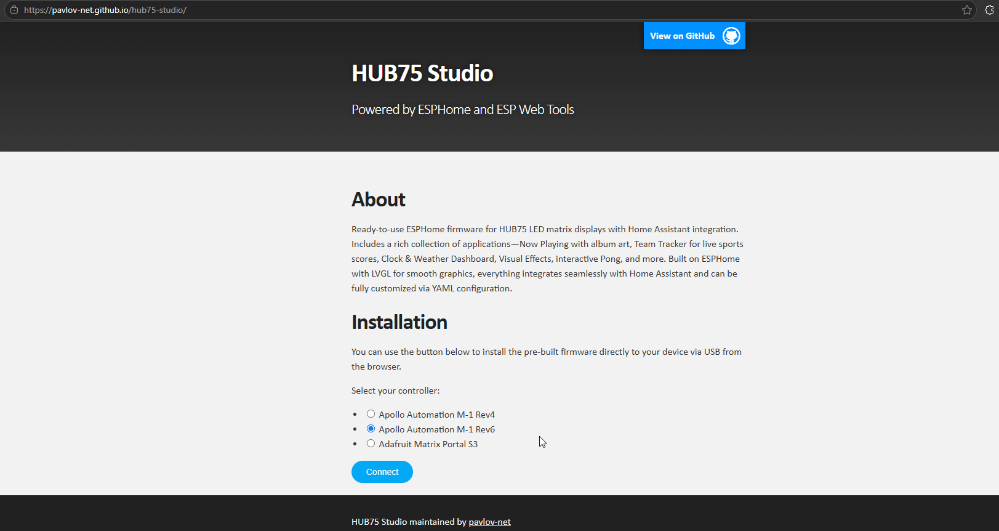

3\. Confirm the M-1 BIOS screen

Once the firmware finishes installing, the panel displays the **M-1 BIOS** splash showing the CPU, RAM, and the last 6 characters of the controller's MAC address. Seeing this screen confirms the firmware installed successfully.

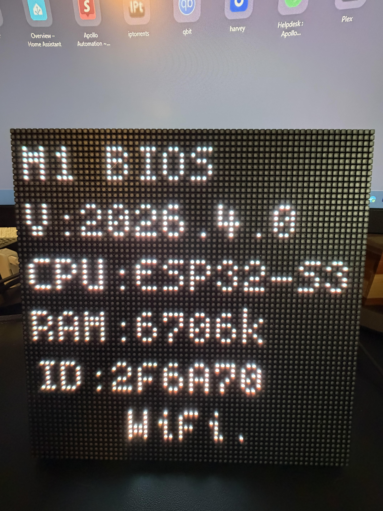

#### Connect to Wi-Fi

1\. On your phone, open Wi-Fi settings and join the network **apollo-m1-r6-XXXXXX**, where the last 6 characters match the MAC suffix shown on the BIOS screen.

2\. The captive portal opens automatically. Either pick your home network from the scanned list and enter the password, or scroll down and type your SSID and password manually.


3\. Tap **Save**. The M-1 reboots and joins your home network. Once you see the screen with the clock move on to the next section to join to Home Assistant via the ESPHome integration!


#### Join to Home Assistant

!!! tip "Your device should be auto-discovered by Home Assistant using the ESPHome Integration as shown below!"

    Head to the <a href="http://homeassistant.local:8123/config/integrations" target="_blank" rel="noreferrer nofollow noopener">Integrations page in Home Assistant</a> and accept the discovery prompt for your M-1.

Your device should be auto-discovered by Home Assistant using the ESPHome Integration as shown below!

Head to the <a href="http://homeassistant.local:8123/config/integrations" target="_blank" rel="noreferrer nofollow noopener">Integrations page in Home Assistant</a> and accept the discovery prompt for your M-1.

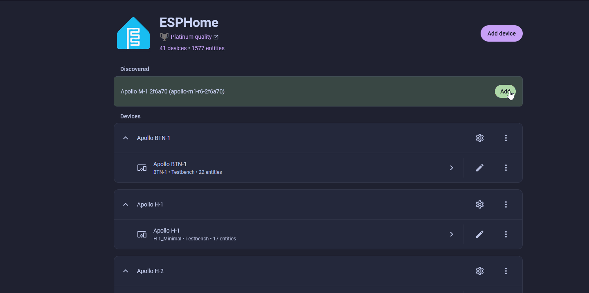

#### Optional Features

###### Adopt into ESPHome Device Builder

!!! tip "Required for advanced customization"

    Adopting the M-1 into the <a href="https://esphome.io/guides/getting_started_hassio.html" target="_blank" rel="noreferrer nofollow noopener">ESPHome Device Builder</a> app lets you edit its YAML configuration. This is needed if you want to enable optional pages (Team Tracker, QR Codes, MSR-2 Radar, additional Now Playing instances), drive multiple chained panels, or change which pages the WizMote scene buttons map to. See the <a href="https://github.com/pavlov-net/hub75-studio/wiki/Customization" target="_blank" rel="noreferrer nofollow noopener">hub75-studio Customization wiki</a> for the full list. **Skip this section if the default firmware already does everything you need.**

1\. Install the ESPHome Device Builder inside Home Assistant OS by clicking the button below. Make sure to toggle on Start on Boot, Watchdog, and Show in sidebar.

[](https://my.home-assistant.io/redirect/supervisor_addon/?addon=5c53de3b_esphome&repository_url=https%3A%2F%2Fgithub.com%2Fesphome%2Fhome-assistant-addon)

2\. Navigate to the ESPHome Device Builder app by clicking the Open Web UI button on the far right.

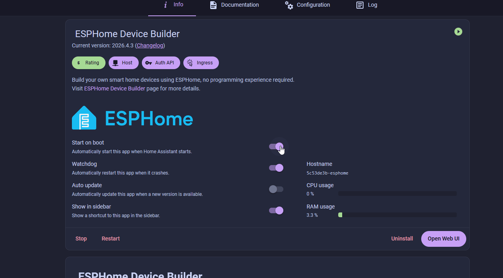

3\. Click the Secrets button in the top right and confirm your Wi-Fi SSID and password are configured as shown below. Click Save in the top right once finished.


```yaml
# Your Wi-Fi SSID and password
wifi_ssid: "your-wifi-ssid-here"
wifi_password: "your-wifi-password-here"
```

3\. Notice the Discovered 1 device banner at the top and click the SHOW button in the far top right to show your newly discovered device.

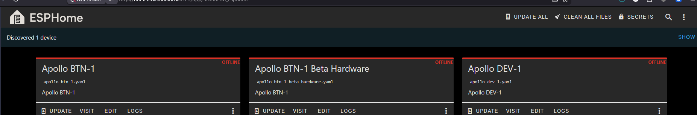

4\. Click Take Control and leave the name as is and click Take Control again. Finally, click Install to begin the installation process. This will take some time depending on how fast your device running Home Assistant is. Raspberry pi, HA Green, etc will take much longer than a mini pc.

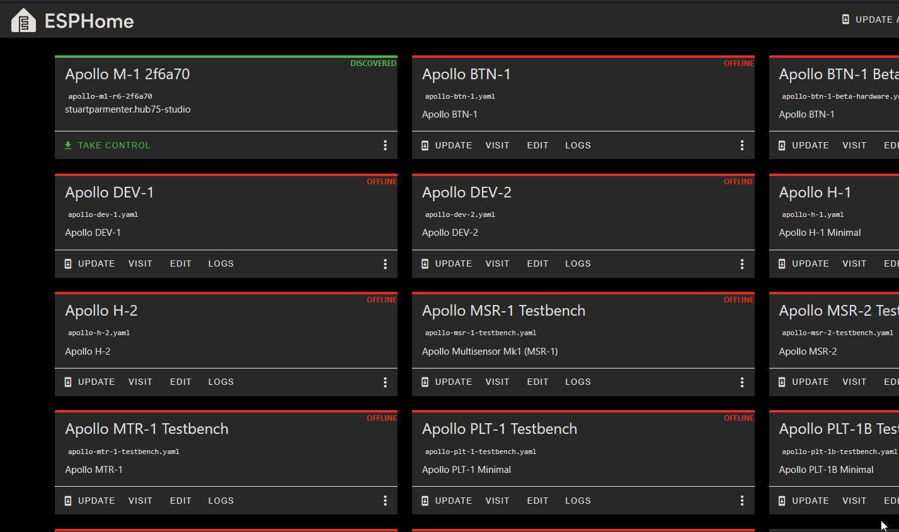

5\. Once you see INFO OTA successful you can click stop in the bottom right and you're finished!

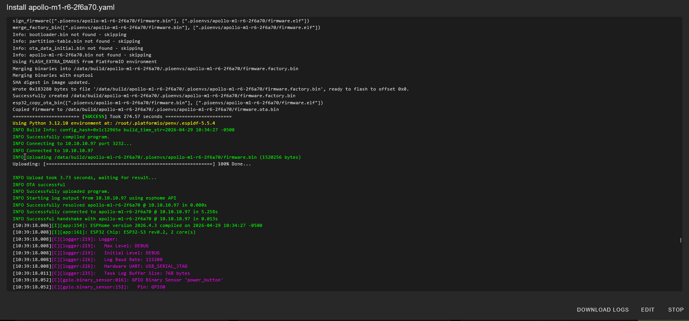

###### Media Proxy

The <a href="https://github.com/pavlov-net/media-proxy" target="_blank" rel="noreferrer nofollow noopener">Media Proxy app</a> allows you to view gifs, still images, youtube videos, and even use <a href="https://wiki.apolloautomation.com/products/m1/examples/sendspin/" target="_blank" rel="noreferrer nofollow noopener">Sendspin</a> with album art when using <a href="https://www.music-assistant.io/" target="_blank" rel="noreferrer nofollow noopener">Music Assistant</a>!

1\. Head to <a href="http://homeassistant.local:8123/config/apps/repositories" target="_blank" rel="noreferrer nofollow noopener">settings -&gt; Apps -&gt; Click Install App -&gt; 3 dots -&gt; click repositories</a> -&gt; click Add -&gt; paste in https://github.com/stuartparmenter/homeassistant-addons

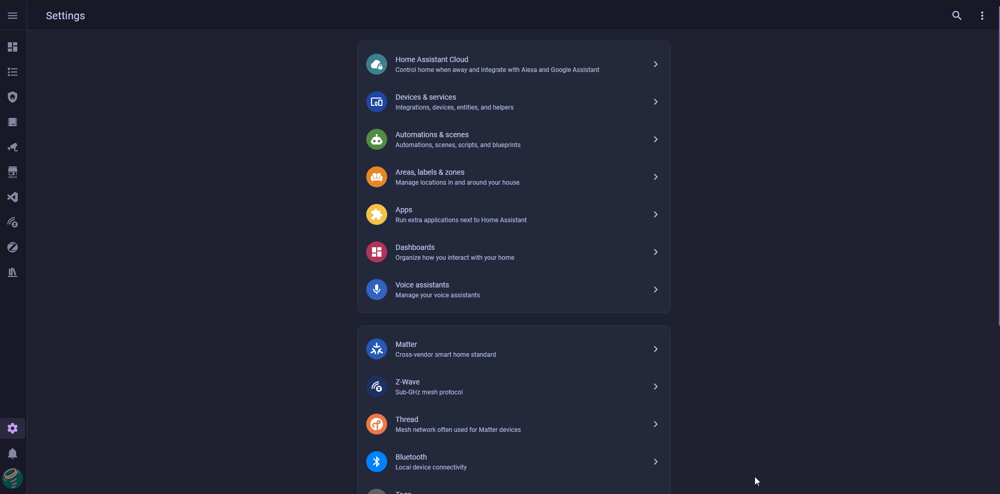

2\. Click the back button then search Media Proxy and click on it. Click Install and let it install.

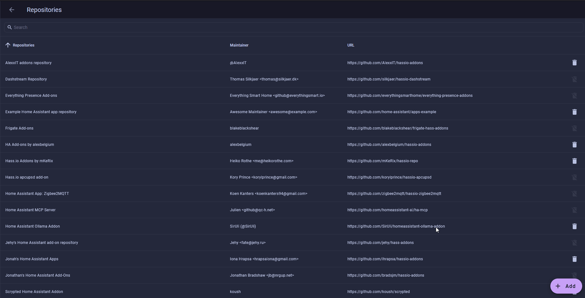

3\. Check off Watchdog and Auto Update then click Start

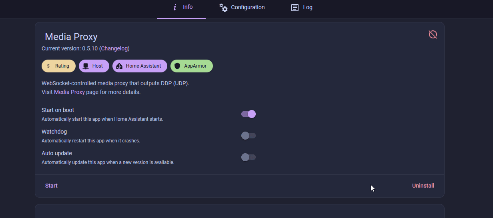

4\. To test that it's working, head to the <a href="http://homeassistant.local:8123/config/integrations/integration/esphome" target="_blank" rel="noreferrer nofollow noopener">ESPHome integration page</a> then select your M-1 device from the list. <a href="https://media1.tenor.com/m/cOxR1hF63Y0AAAAd/matrix-film.gif" target="_blank" rel="noreferrer nofollow noopener">Copy this url</a> and paste it into the Media Source box. It should automatically start playing the gif!

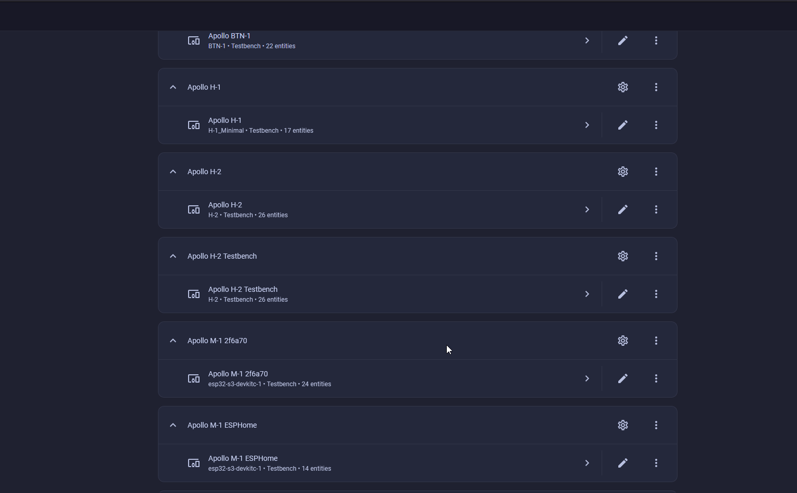


[Click here to learn what all you can do with the Media Proxy!](https://wiki.apolloautomation.com/products/m1/examples/media-proxy/){    .md-button .md-button--primary }

###### WizMote Remote

The M-1 ESPHome firmware has built-in support for the <a href="https://www.amazon.com/WiZ-Remote-Compatible-Lights-Assistant/dp/B091TGDS6F" target="_blank" rel="noreferrer nofollow noopener">WiZ WizMote</a> remote, so you can change pages, dim the panel, and toggle it on/off without your phone.

1\. In Home Assistant, open the M-1 device on the <a href="http://homeassistant.local:8123/config/integrations/integration/esphome" target="_blank" rel="noreferrer nofollow noopener">ESPHome integration page</a>.

2\. Find the **WizMote Auto-Discovery** switch and turn it on.

3\. Press any button on your WizMote. The M-1 picks up the WizMote's MAC and pairs automatically.

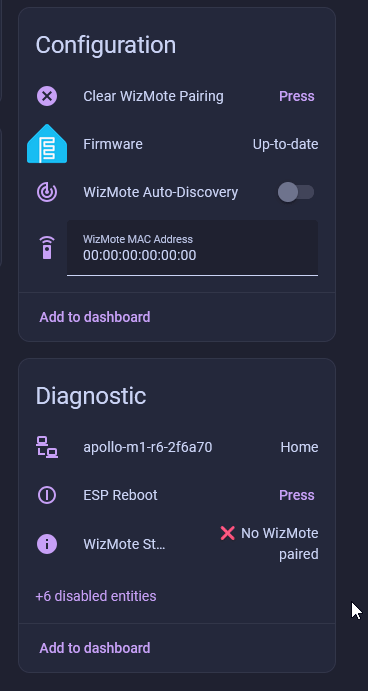

4\. Confirm pairing by checking the **WizMote Status** entity. It should read **Paired** along with the WizMote's MAC address.

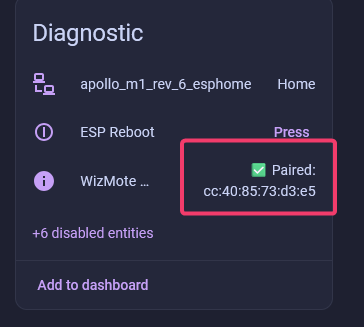

!!! tip "Default button mapping"

    * **On / Off / Night**: turn the panel on, off, or drop to a minimum night-mode brightness.
    * **Brightness Up / Down**: adjust panel brightness in steps.
    * **Scene buttons 1-4**: jump to **Clock**, **Visual Effects**, **Pong**, and **Media Stream**, in that order.

    <a href="https://github.com/pavlov-net/hub75-studio/wiki/Customization#configuring-page-navigation" target="_blank" rel="noreferrer nofollow noopener">Visit the documentation page</a> to learn how to configure the buttons to do anything you want!

[Click here to learn how to use your new remote with SendSpin!](https://wiki.apolloautomation.com/products/m1/examples/sendspin/){ .md-button .md-button--primary }