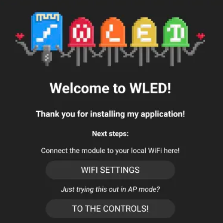
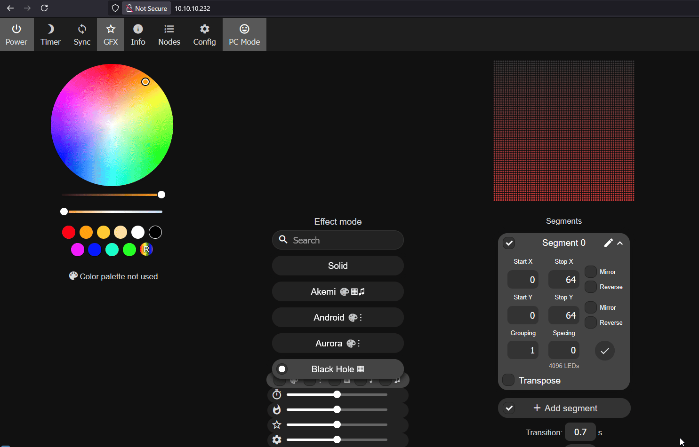
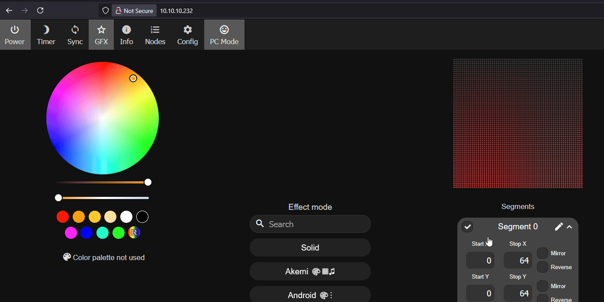
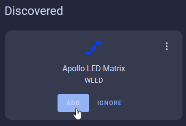
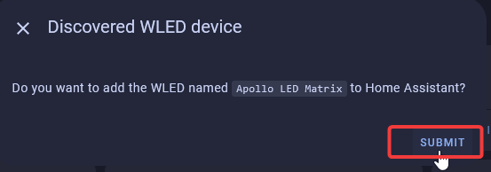
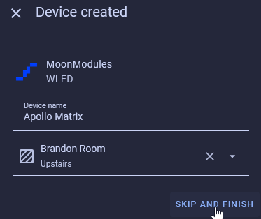
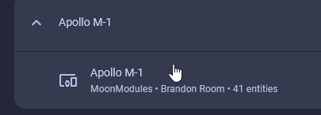
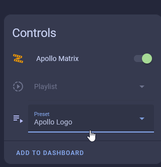

# Getting Started

Congrats on your new M-1! Below we will go through steps to get you up and running in no time.

#### Attach M-1 LED Controller

Your M-1 LED Matrix and M-1 controller were shipped separately to minimize damage in shipping. Gently attach the controller to the back of the M-1 LED Matrix panel as shown in the GIF below.

#### Connect to Wi-Fi

Your device is ready to connect to your Wi-Fi and begin controlling via Home Assistant, the WLED app for iPhone and Android, or via a web browser!

1\. Plug in the USB-C power in and the M-1 device will boot within a couple seconds. Head to the available Wi-Fi networks on your phone and select Apollo M-1. It should pop up saying "Welcome to WLED!". If this popup does not occur, please open a web browser and navigate to <a href="http://4.3.2.1/" target="_blank" rel="noopener">http://4.3.2.1/</a> or <a href="http://wled.me" target="_blank" rel="noreferrer nofollow noopener">http://wled.me</a> and you should be prompted with the same image seen below.

2\. Tap on **WI-FI Settings** then input your Wi-Fi SSID where it shows **Your\_Network** and input your Wi-Fi password directly below it and then click **Save and Connect**.

!!! tip "You can also set your hostname here such as apollo-led-matrix"

    Later, you can use this to access your device at http://apollo-led-matrix.local in a browser instead of using the IP address!

#### Post-Connect Setup

!!! success "Please complete setup by changing a few settings!"

    The firmware we use currently does not support us pre-configuring a few settings but they are required to be set for you to use the M-1 LED Matrix successfully. Please follow the two steps below to finish setting up your device!

1\. Click on **Config**, then **LED Preferences**. set **Chain Length** to **1** then uncheck the "enable automatic brightness limiter and click **Save**. Make sure to select **Hub75Matrix** is set to **64x64**.

2\. Click on **Config**, then **2D Configuration**. Select **2D Matrix**, click the circle next to **Basic**, change the **Panel Dimensions** to **64 x 64** and click **Save**.

#### Join to Home Assistant

!!! tip "Your device should be auto-discovered by Home Assistant using the WLED Integration as shown below!"

    Please follow the steps below to get your device added to Home Assistant!

1\. Head to the <a href="http://homeassistant.local:8123/config/integrations" target="_blank" rel="noreferrer nofollow noopener">Integrations page in Home Assistant</a> and it will automatically be discovered.

2\. Click Add and then Click Submit.

3\. Give it a name and a location and then click Skip and Finish.

4\. Head to the <a href="http://homeassistant.local:8123/config/integrations/integration/wled" target="_blank" rel="noreferrer nofollow noopener">WLED Integrations page</a> and click on Apollo M-1 below your M-1 LED Matrix.

5\. From here you can control your M-1 LED Matrix by changing the color, selecting presets, and more!

[Click here to learn how to create your own presets!](https://wiki.apolloautomation.com/products/m1/examples/create-logo-image/){                .md-button .md-button--primary }