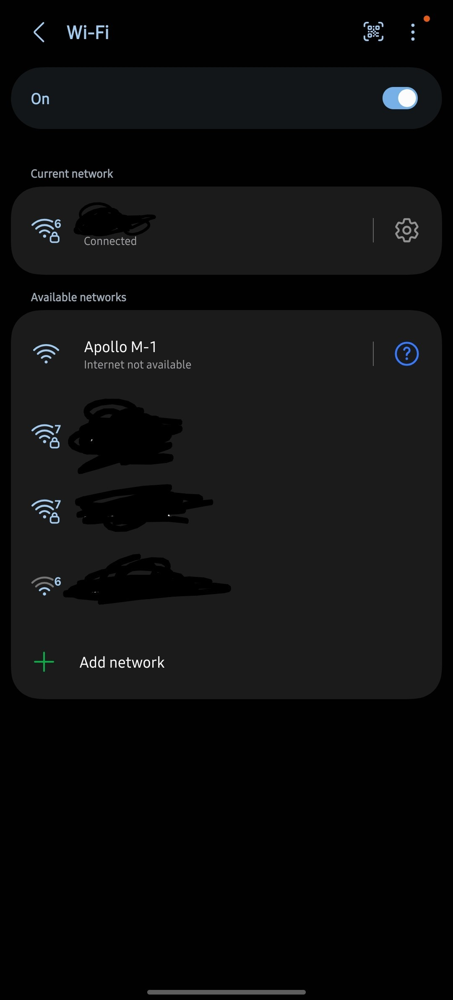
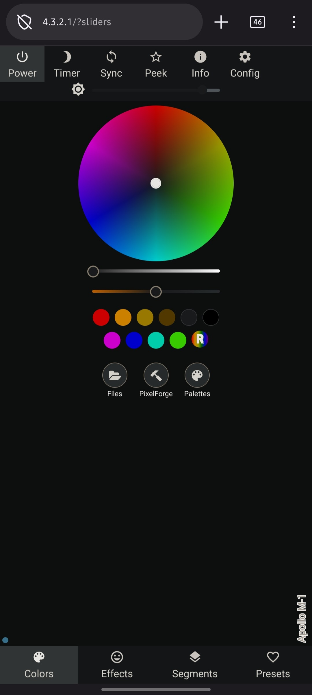
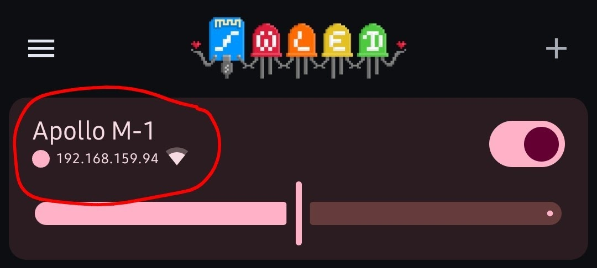

# Getting Started

Congrats on your new M-1! Pick your firmware below and the rest of the M-1 wiki follows your choice.

New units ship with **WLED**. Units shipped earlier came with **WLED-MM**. Open your M-1 in a browser and tap **Info** to see which you have: 16.0.1 or newer is WLED, 14.5.1 is WLED-MM. Running ESPHome instead? Head to [Set Up ESPHome](/products/m1/setup/getting-started-m1-esphome.md).

### Attach M-1 LED Controller

Your M-1 LED Matrix and M-1 controller were shipped separately to minimize damage in shipping. Gently attach the M-1 controller by lining up its power and data headers to the back of the LED Matrix panel as shown below.

### Connect to Wi-Fi

=== "WLED"

    1\. Plug in USB-C power. The M-1 boots to a picture of Apollo, our mascot, then displays a setup card on the panel.

    

    2\. On your phone or computer, join the new Wi-Fi hotspot called **Apollo M-1**.

    

    !!! warning "If a WLED window opens on its own, close it"

        Some phones and computers pop open a small window right after you join the hotspot. That window does not have full functionality. Close it and carry on with Step 3.

    3\. Once you are connected to the Apollo M-1 hotspot, scan the QR code on the LED matrix or open <a href="http://4.3.2.1/" target="_blank" rel="noopener">http://4.3.2.1/</a> in a browser such as Firefox, Chrome, or Safari.

    4\. You should now see the **Welcome to WLED** page. Select **To The Controls** and your M-1 LED Matrix is ready to use.

    

    ## Connecting the Apollo M-1 to your Wi-Fi network

    Prefer to run the M-1 on your home network instead of its own hotspot? From the controls page, tap **WIFI SETTINGS** and:

    * Select **Scan**. Nearby networks are found automatically.
    * Select your network and enter your password. Passwords are case sensitive, so take your time here.
    * Tap **Save & Connect**, wait a few seconds, then unplug the device from power and plug it back in.

    On the next boot the M-1 joins your Wi-Fi network. If it cannot connect, it goes back to broadcasting its own **Apollo M-1** hotspot. Run through the steps again and double-check the network name and password.

    !!! tip "Set your mDNS address here too"

        Enter something like **apollo-led-matrix** and you can reach the device at http://apollo-led-matrix.local instead of hunting for its IP.

    

    !!! warning "Your M-1 gets a new address once it joins your network"

        After it joins your Wi-Fi, the M-1 has a new IP address and http://4.3.2.1/ no longer works.

        The quickest way to find the new address is the WLED app ([Android](https://play.google.com/store/apps/details?id=ca.cgagnier.wlednativeandroid&amp;hl=en_US) or [Apple](https://apps.apple.com/us/app/wled-official-app/id6446207239)). Install it, open it, and the Apollo M-1 is listed with its IP address. Type that address into a browser on any device on your network to get back to the controls. The image below shows where to find it.

        Advanced users can also find the address in their router.

    

    &nbsp;

=== "WLED-MM"

    Your device is ready to connect to your Wi-Fi and begin controlling via Home Assistant, the WLED app for iPhone and Android, or via a web browser!

    1\. Plug in the USB-C power in and the M-1 device will boot within a couple seconds. Head to the available Wi-Fi networks on your phone and select Apollo M-1. It should pop up saying "Welcome to WLED!". If this popup does not occur, please open a web browser and navigate to <a href="http://4.3.2.1/" target="_blank" rel="noopener">http://4.3.2.1/</a> or <a href="http://wled.me" target="_blank" rel="noreferrer nofollow noopener">http://wled.me</a> and you should be prompted with the same image seen below.

    

    2\. Tap on **WI-FI Settings** then input your Wi-Fi SSID where it shows **Your\_Network** and input your Wi-Fi password directly below it and then click **Save and Connect**.

    !!! tip "You can also set your hostname here such as apollo-led-matrix"

        Later, you can use this to access your device at http://apollo-led-matrix.local in a browser instead of using the IP address!

    #### Post-Connect Setup

    !!! warning "Please complete setup by changing a few settings!"

        The firmware we use currently does not support us pre-configuring a few settings but they are required to be set for you to use the M-1 LED Matrix successfully. Please follow the two steps below to finish setting up your device!

    1\. Click on **Config**, then **LED Preferences**. set **Chain Length** to **1** then uncheck the "enable automatic brightness limiter and click **Save**. Make sure to select **Hub75Matrix** is set to **64x64**.

    

    2\. Click on **Config**, then **2D Configuration**. Select **2D Matrix**, click the circle next to **Basic**, change the **Panel dimensions (WxH)** to **64 x 64** and click **Save**.

    

### Join to Home Assistant

=== "WLED"

    1\. Open your integrations page in Home Assistant. The M-1 is discovered automatically by the WLED integration. Click **Add**, then **Submit**. Give it a name and an **Area**, then click **Finish**.

    

    

    2\. From this page you can control your M-1 in Home Assistant. Change the color, pick effects, run presets, and more.

    

=== "WLED-MM"

    1\. Open your integrations page in Home Assistant. The M-1 is discovered automatically by the WLED integration.

    

    

    2\. Click **Add**, then **Submit**.

    

    3\. Give it a name and a location, then click **Skip** and **Finish**.

    

    4\. Open the <a href="https://my.home-assistant.io/redirect/integration/?domain=wled" target="_blank" rel="noreferrer noopener">WLED integration page</a> and click your M-1.

    

    5\. From here you can change the color, pick effects, run presets, and more.

    

#### What Next

=== "WLED"

    Draw your own images and scrolling text right on the device with [Pixel Forge](/products/m1/examples/pixel-forge.md), or wire up more panels with [Multiple Panels](/products/m1/setup/m1-multiple-panels.md).

    [Try Pixel Forge](/products/m1/examples/pixel-forge.md){       : .md-button .md-button--primary }

=== "WLED-MM"

    Add a custom GIF to your matrix, or add more panels with [Multiple Panels](/products/m1/setup/m1-multiple-panels.md). On a Rev6 controller you can also [move up to WLED](/products/m1/setup/upgrade-to-wled.md) and keep your settings.

    [Add GIFs to your M-1](/products/m1/examples/add-gifs-to-wled.md{{      : .md-button .md-button--primary}4}}