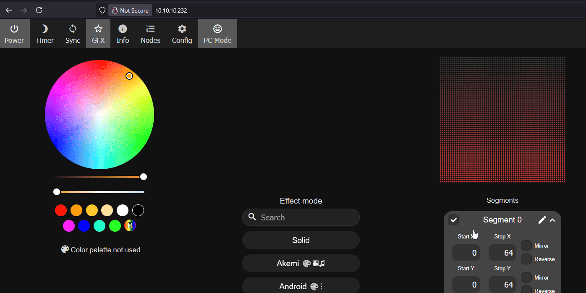

# M-1 LED Matrix Settings for WLED

!!! note "Below we will go through the WLED settings needed for your device to work properly with the HUB75 LED Matrix attached to the M-1"

    This guide is needed if you reflashed your M-1 LED Matrix <a href="https://wiki.apolloautomation.com/products/m1/troubleshooting/m1-reflash/" target="_blank" rel="noreferrer nofollow noopener">following our flashing guide</a>.

###### Friendly Name

Click on **Config**, then **User Interface**. In the **Server description** field, enter the name you want your M-1 device to display as in the WLED interface—e.g., **Apollo LED Matrix**.

###### Hostname

Click on **Config**, then **WiFi Setup**. In the **mDNS address** field, enter the hostname you want your M-1 to use on your network such as **apollo-led-matrix**. Now your device will be accessible via its IP address or the hostname you just made with ".local" added to the end such as <a href="http://apollo-led-matrix.local" target="_blank" rel="noreferrer nofollow noopener">http://apollo-led-matrix.local</a>

!!! tip "Hostnames can only have numbers, letters, and dashes"

    Make sure not to use invalid characters for your hostname!

    **Length**

    * The **entire hostname** (including dots) must be ≤ **253 characters**.
    * Each **label** (the part between dots) must be **1–63 characters**.

    **Characters**

    Allowed characters are:

    * Lowercase **a–z**
    * Digits **0–9**
    * Hyphen **`-`**

    **No Special Characters**

    * No underscores (`_`), spaces, punctuation, or other symbols.

    **Start and End Restrictions**

    * Each label must **start and end** with a **letter or digit**.
    * Labels **cannot begin or end** with a **hyphen**.

    **Case-Insensitive**

    * Hostnames are **not case sensitive** (`HostName` = `hostname`).

###### LED Settings

Click on **Config**, then **LED Preferences**. Select **Hub75Matrix 64x64** and set **Chain Length** to **1** then uncheck the "enable automatic brightness limiter and click **Save**.

###### 2D Settings

Click on **Config**, then **2D Configuration**. Select **2D Matrix**, click the circle next to **Basic**, change the **Panel Dimensions** to **64 x 64** and click **Save**.

###### AudioReactive Settings

!!! success "The Audioreactive is only available on a rev6 PCB with the optional microphone addon"

    The original Rev4 PCB does not have a microphone on the board and will not work. Only Rev6 or newer PCBs with the optional microphone addon will be able to use AudioReactive.

Click on **Config**, then **AudioReactive**. Check **Enabled** then select **Generic I2S** for the Type.

For the pins, select **10 digitalmic** for Pin I2s SD, select **12 digitalmic A5** for Pin I2S WS, and select **11 digitalmic** for Pin I2S SCK and click **Save**.

Scroll to the bottom of the **AudioReactive** settings and set the **Mode** to **Off** and click **Save**.

&nbsp;