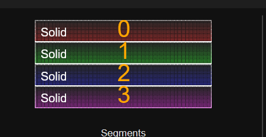
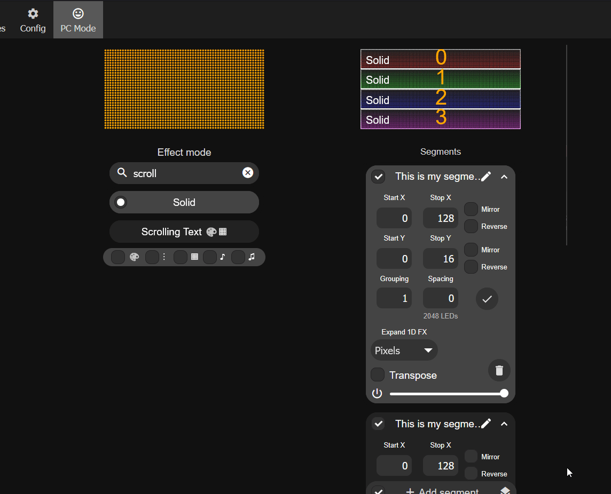

# M-1 LED Matrix - Multiple Panels

!!! info "Prerequisites needed for multiple panels"

    To use multiple panels you will need one M-1 LED Matrix Controller, at least two M-1 Matrix panels with a maximum of four, at least one of the data cables with a max of three, and at least one of the Power Modules (with a max of three). You will also need up to four usb-c cables to power each panel including the usb-c of the m-1 led matrix which will power the panel it is connected to.

Choose the number of panels you are using below to get started!

###### Hardware Setup

=== "Two Panels"

    1\. Set both of your M-1 panels face down - the M-1 controller panel should be on the far left. Start by connecting the data cable (ribbon cable) to the "JOUT" port on the far left panel into the "JIN" port on the second panel.

    

    2\. Gently press the Matrix Power Module over the 4 pin header on the second panel as shown below. Make sure the USB-C port is facing to the right!

    

    3\. Plug in the USB-C cable into the M-1 LED Controller and the second Panel.

    

=== "Three Panels"

    1\. Set all three of your M-1 panels face down - the M-1 controller panel should be on the far left. Start by connecting the data cable (ribbon cable) to the "JOUT" port on the far left panel into the "JIN" port on the second panel. Repeat for connecting the third panel.

    

    2\. Gently press the Matrix Power Module over the 4 pin header on the second panel as shown below. Make sure the USB-C port is facing to the right! Repeat for connecting the third panel.

    

    3\. Plug in the USB-C cable into the M-1 LED Controller, the second panel power module, and the third panel power module.

    

=== "Four Panels"

    1\. Set all four of your M-1 panels face down - the M-1 controller panel should be on the far left. Start by connecting the data cable (ribbon cable) to the "JOUT" port on the far left panel into the "JIN" port on the second panel. Repeat for connecting the third and fourth panel.

    

    2\. Gently press the Matrix Power Module over the 4 pin header on the second panel as shown below. Make sure the USB-C port is facing to the right! Repeat for connecting the third and fourth panels.

    

    3\. Plug in the USB-C cable into the M-1 LED Controller and all three additional panels via the power module USB-C port.

    

###### Software Setup

=== "Two Panels"

    1\. Navigate to your WLED instance in a browser or using the WLED-native app on your phone. You can use http://your-hostname-here.local or its IP address. <a href="https://wiki.apolloautomation.com/products/m1/troubleshooting/m1-find-ip-address-and-hostname/" target="_blank" rel="noreferrer nofollow noopener">Click here if you need to find your IP or hostname</a>.

    2\. Click on **Config**, then **LED Preferences**. set **Chain Length** to **2** then **Save**.

    

    3\. Click on **Config**, then **2D Configuration** and change the **Panel Dimensions** to **128 x 64** and click **Save**.

    

    4\. Reboot WLED before proceeding. Tap **Info** at the top, scroll down, and select **Reboot WLED**. When prompted, tap again to confirm the reboot.

    

=== "Three Panels"

    1\. Navigate to your WLED instance in a browser or using the WLED-native app on your phone. You can use http://your-hostname-here.local or its IP address. <a href="https://wiki.apolloautomation.com/products/m1/troubleshooting/m1-find-ip-address-and-hostname/" target="_blank" rel="noreferrer nofollow noopener">Click here if you need to find your IP or hostname</a>.

    2\. Click on **Config**, then **LED Preferences**. set **Chain Length** to **3** then **Save**.

    

    3\. Click on **Config**, then **2D Configuration** and change the **Panel Dimensions** to **192 x 64** and click **Save**.

    

    4\. Reboot WLED before proceeding. Tap **Info** at the top, scroll down, and select **Reboot WLED**. When prompted, tap again to confirm the reboot.

    

=== "Four Panels"

    1\. Navigate to your WLED instance in a browser or using the WLED-native app on your phone. You can use http://your-hostname-here.local or its IP address. <a href="https://wiki.apolloautomation.com/products/m1/troubleshooting/m1-find-ip-address-and-hostname/" target="_blank" rel="noreferrer nofollow noopener">Click here if you need to find your IP or hostname</a>.

    2\. Click on **Config**, then **LED Preferences**. set **Chain Length** to **4** then **Save**.

    

    3\. Click on **Config**, then **2D Configuration** and change the **Panel Dimensions** to **256 x 64** and click **Save**.

    

    4\. Reboot WLED before proceeding. Tap **Info** at the top, scroll down, and select **Reboot WLED**. When prompted, tap again to confirm the reboot.

    

###### Segment Setup

!!! success "WLED works using segments and your device now has different stop and end pixels for each segment since you have added more LEDs with each additional panel"

    Below we will create multiple Segments in WLED which we will then edit until they are setup to show the correct number of pixels for your number of panels.

    Think of segments like taking one big set of leds and cutting them into smaller chunks to then individually control. Segment 1 will control the top 1/4 of the display, Segment 2 will control the second 1/4, Segment 3 will control the third 1/4 and Segment 4 will control the bottom 1/4 of the matrix.

    You can go back later and change these to your own layout - for example maybe you want to control all of the first led matrix with Segment 0 and the second matrix with Segment 1 you can definitely do that!

=== "Two Panels"

    1\. Navigate to the main page of your wled instance in a browser or using the WLED-native app and focus on the Segments section.

    2\. Since we are using two panels, we will begin by editing Segment 0 and setting the Stop X to "128" and the Stop Y to "16"

    

    3\. Click on Add segment, give it a name (such as Segment 1) then set the Start Y to "16" and the Stop Y to "32".

    

    4\. Click on Add segment, give it a name (such as Segment 2) then set the Start Y to "32" and the Stop Y to "48".

    

    5\. Click on Add segment, give it a name (such as Segment 3) then set the Start Y to "48" and the Stop Y to "64".

    

    6\. You should see four equal segments 0-3 at the top of the screen.

    

    7\. Test it by changing the effect to "Scrolling Text" and editing the name of each segment to be any text you want!

    

    !!! warning "Your segments need to be saved to a Preset or they will disappear when you reboot or run other presets."

        You must save your segments as a preset or they will get wiped away after a reboot or when another preset with different segments is used.

    8\. Save your segments by creating a new preset. Click on the + Preset button and typing in a name then clicking Save at the bottom.

    

=== "Three Panels"

    1\. Navigate to the main page of your wled instance in a browser or using the WLED-native app and focus on the Segments section.

    2\. Since we are using three panels, we will begin by editing Segment 0 and setting the Stop X to "192" and the Stop Y to "16".

    

    3\. Click on Add segment, give it a name (such as Segment 1) then set the Start Y to "16" and the Stop Y to "32".

    

    4\. Click on Add segment, give it a name (such as Segment 2) then set the Start Y to "32" and the Stop Y to "48".

    

    5\. Click on Add segment, give it a name (such as Segment 3) then set the Start Y to "48" and the Stop Y to "64".

    

    6\. You should see four equal segments 0-3 at the top of the screen.

    

    7\. Test it by changing the effect to "Scrolling Text" and editing the name of each segment to be any text you want! 32 Character maximum limit in WLED.

    

    !!! warning "Your segments need to be saved to a Preset or they will disappear when you reboot or run other presets."

        You must save your segments as a preset or they will get wiped away after a reboot or when another preset with different segments is used.

    8\. Save your segments by creating a new preset. Click on the + Preset button and typing in a name then clicking Save at the bottom.

    

=== "Four Panels"

    1\. Navigate to the main page of your wled instance in a browser or using the WLED-native app and focus on the Segments section.

    2\. Since we are using four panels, we will begin by editing Segment 0 and setting the Stop X to "256" and the Stop Y to "16".

    

    3\. Click on Add segment, give it a name (such as Segment 1) then set the Start Y to "16" and the Stop Y to "32".

    

    4\. Click on Add segment, give it a name (such as Segment 2) then set the Start Y to "32" and the Stop Y to "48".

    

    5\. Click on Add segment, give it a name (such as Segment 3) then set the Start Y to "48" and the Stop Y to "64".

    

    6\. You should see four equal segments 0-3 at the top of the screen.

    

    7\. Test it by changing the effect to "Scrolling Text" and editing the name of each segment to be any text you want! 32 Character maximum limit in WLED.

    

    !!! warning "Your segments need to be saved to a Preset or they will disappear when you reboot or run other presets."

        You must save your segments as a preset or they will get wiped away after a reboot or when another preset with different segments is used.

    8\. Save your segments by creating a new preset. Click on the + Preset button and typing in a name then clicking Save at the bottom.

    