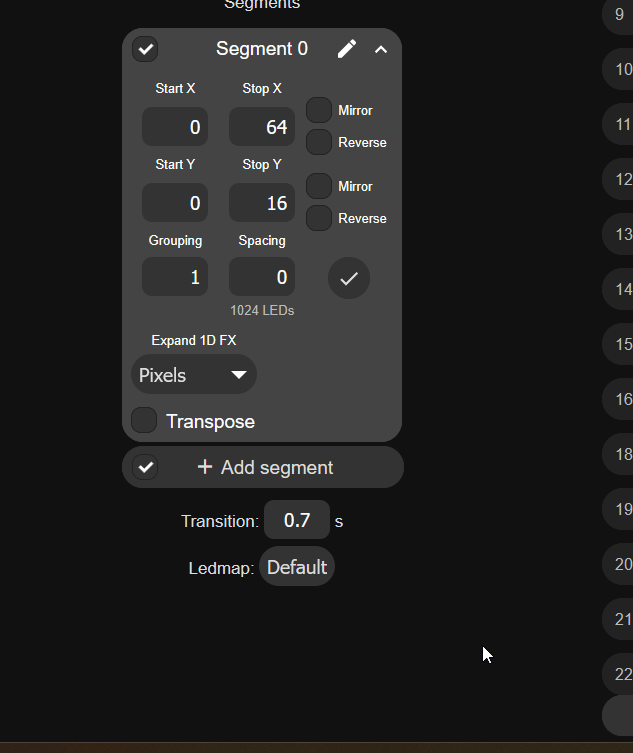
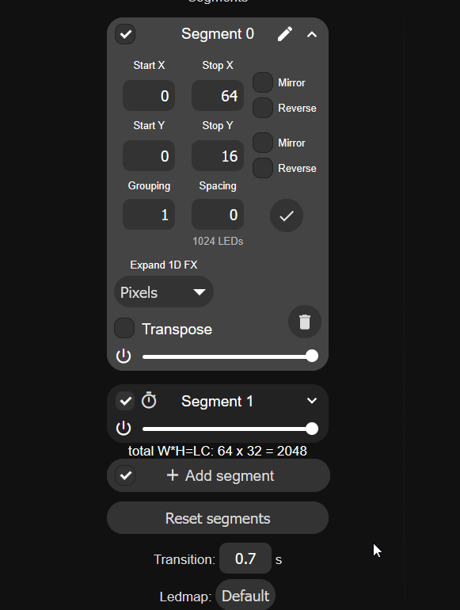
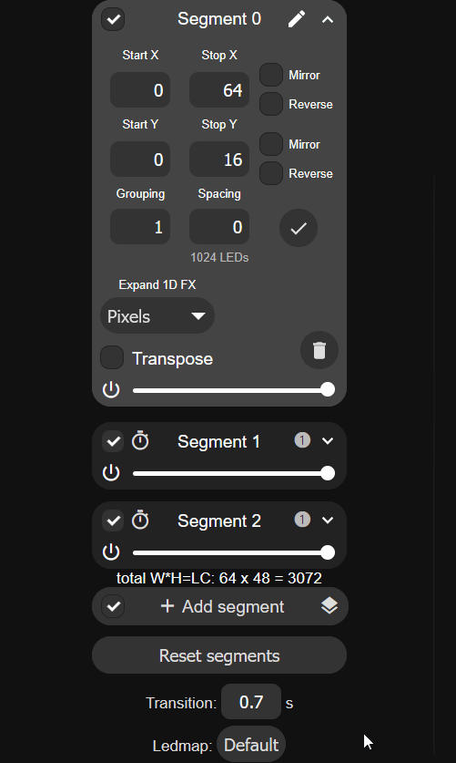
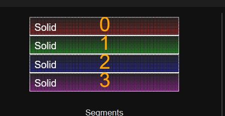
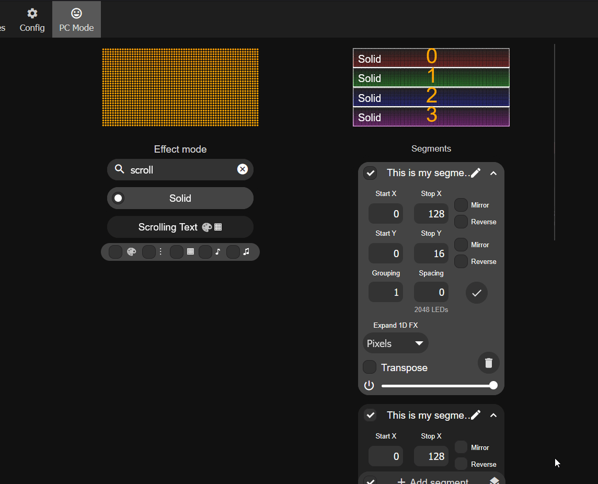
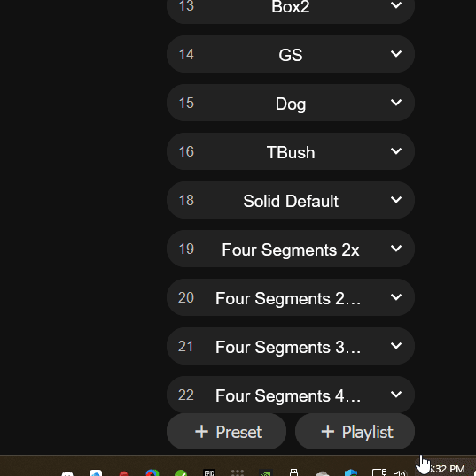

# Segments with M-1 LED Matrix

!!! tip "Splitting your M-1 Matrix into multiple segments to display more information."

    The WLED firmware on your device will allow you to split your M-1 LED Matrix (or multiple) into segments to display four or more lines of text on your matrix!

    Think of segments like taking one big set of LEDs and cutting them into smaller chunks to then individually control. Segment 1 will control the top 1/4 of the display, Segment 2 will control the second 1/4, Segment 3 will control the third 1/4 and Segment 4 will control the bottom 1/4 of the matrix.

1\. Navigate to the main page of your WLED instance in a browser or using the WLED-native app and focus on the Segments section.

2\. Since we are only using *one panel*, we will begin by editing **Segment 0** and setting the **Stop Y** to "16".

3\. Click on Add segment, give it a name (such as Segment 1) then set the Start Y to "16" and the Stop Y to "32".

4\. Click on Add segment, give it a name (such as Segment 2) then set the Start Y to "32" and the Stop Y to "48".

5\. Click on Add segment, give it a name (such as Segment 3) then set the Start Y to "48" and the Stop Y to "64".

6\. You should see four equal segments 0-3 at the top of the screen.

7\. Test it by changing the effect to "Scrolling Text" and editing the name of each segment to be any text you want!

!!! warning "Your segments need to be saved to a Preset or they will disappear when you reboot or run other presets."

    You must save your segments as a preset or they will get wiped away after a reboot or when another preset with different segments is used.

8\. Save your segments by creating a new preset. Click on the + Preset button and typing in a name then clicking Save at the bottom.

