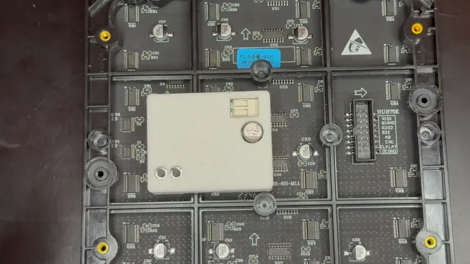
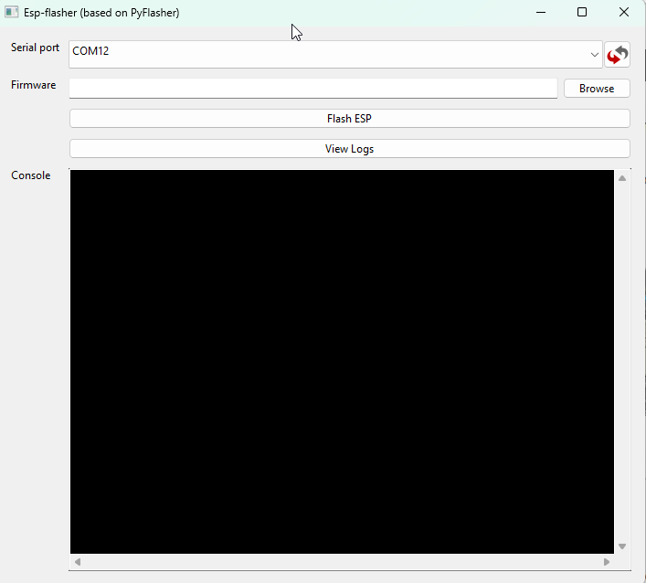
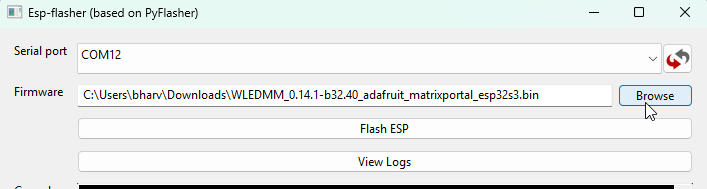
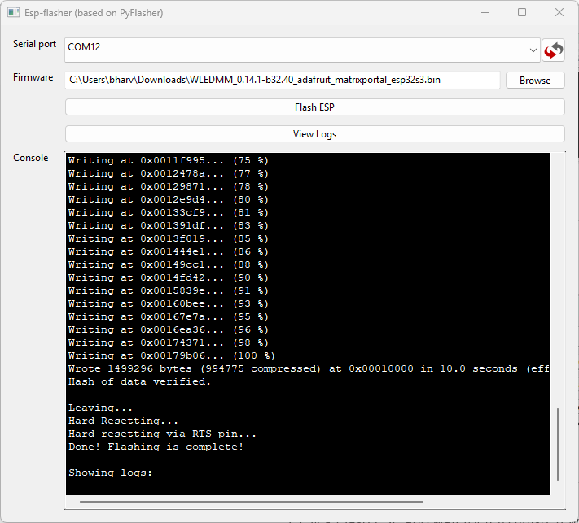

# Factory Re-Flash M-1

1\. Plug in a USB cable that supports power and data into your computer.

2\. Push and hold the boot button (the right button). While still holding the button down, plug in a USB-C cable into the USB-C port of your M-1 LED Matrix then let go of the button.

3\. Download the firmware <a href="https://github.com/MoonModules/WLED/releases/download/v0.14.1-beta.32/WLEDMM_0.14.1-b32.40_adafruit_matrixportal_esp32s3.bin" target="_blank" rel="noreferrer nofollow noopener">.bin file from here</a>.

4\. Download <a href="https://wiki.apolloautomation.com/static/ESP-Flasher.exe" title="Click here to download the ESP-Flasher Tool" target="_blank" rel="noreferrer nofollow noopener">ESP Flasher (Windows EXE)</a> and open it.

5\. Click the Serial port dropdown and select the open COM port.

6\. Select Firmware you downloaded.

7\. Click Flash ESP and wait for it to finish. It will look like the image below once it finishes.

8\. The device is still in "boot mode" and needs to be power cycled. Either unplug the power cable or click the reset button (the right button) to force the device to reboot.

[Head to the Getting Started article to setup your M-1 as a new device!](https://wiki.apolloautomation.com/products/m1/setup/getting-started-m1/){  .md-button .md-button--primary }