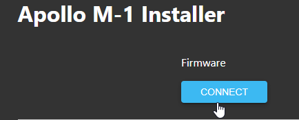
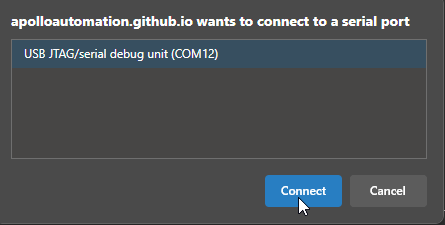
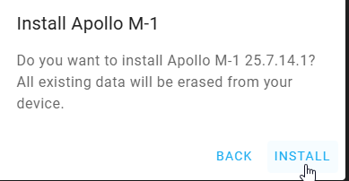

# Factory Re-Flash M-1

!!! info "If your device becomes unresponsive and you've exhausted the other troubleshooting methods you can reflash the factory firmware by following the steps below."

    This factory re-flash needs to be done in Chrome, Edge, or another Chromium based browser.

1\. Plug in a USB cable that supports power and data into your computer.

2\. Push and hold the boot button (the right button). While still holding the button down, plug in a USB-C cable into the USB-C port of your M-1 LED Matrix then let go of the button.

3\. Navigate to our installer page and click connect under <a href="https://apolloautomation.github.io/WLED-MM-M1/" target="_blank" rel="noreferrer nofollow noopener">Apollo M-1 Installer</a>.

4\. Select the open com port then click Connect.

5\. Click Install M-1.

5\. Click Install.

6\. Once you see "Installation complete!" you are finished. Click Next then close out of the browser window.

!!! warning "Power cycle your device before doing anything else!"

    Your device is still in boot mode and needs to be power cycled aka power removed to make it boot in a normal mode!

[Head to the Getting Started article to setup your M-1 as a new device!](https://wiki.apolloautomation.com/products/m1/setup/getting-started-m1/){      .md-button .md-button--primary }