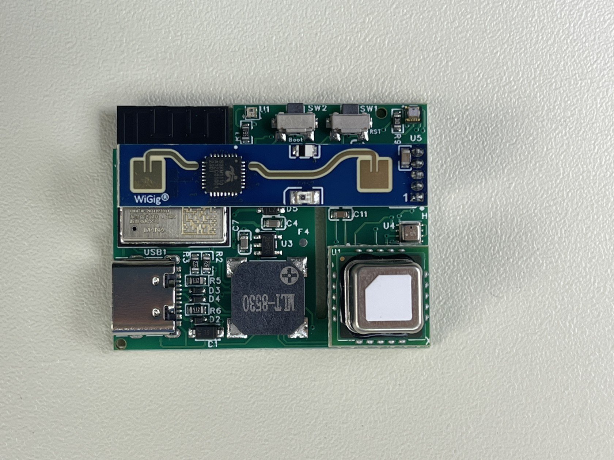

# Adding CO2 To MSR-1

1\. Unplug your MSR-1 from power and remove the back

2\. Remove the board from the case and orientate it like the below image. In the bottom right there is a black connector. There is a x in the lower right corner of the connector

3\. Orientate the CO2 module so the white x on the module is also in the lower right and the gold dot is in the upper left as seen below

4\. Align the connector on the back of the CO2 module with the connector on the MSR-1. Once aligned, push down so the CO2 module fully seats itself

5\. Put your MSR-1 back in the case and slide the back cover on. Please refer to our [CO2 calibration guide](https://wiki.apolloautomation.com/products/general/calibrating-and-updating/co2-calibration/ "CO2 Calibration") to calibrate the CO2 module.