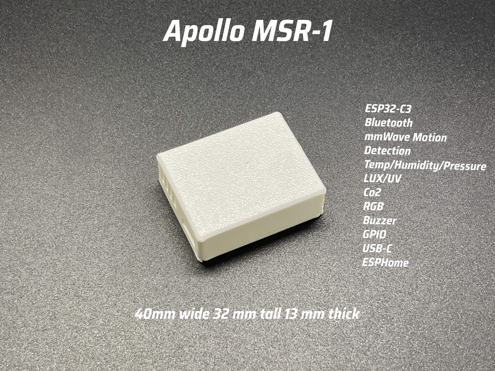

The Apollo MSR-1 is a compact, community-driven multisensor designed for Home Assistant via ESPHome. Measuring just 40.5mm x 32mm, it features mmWave radar for motion detection, LUX/UV sensors, temperature/humidity monitoring, and optional CO2 sensing. Powered by USB-C, the MSR-1 allows for customizable alerts through RGB LEDs and a piezo buzzer.