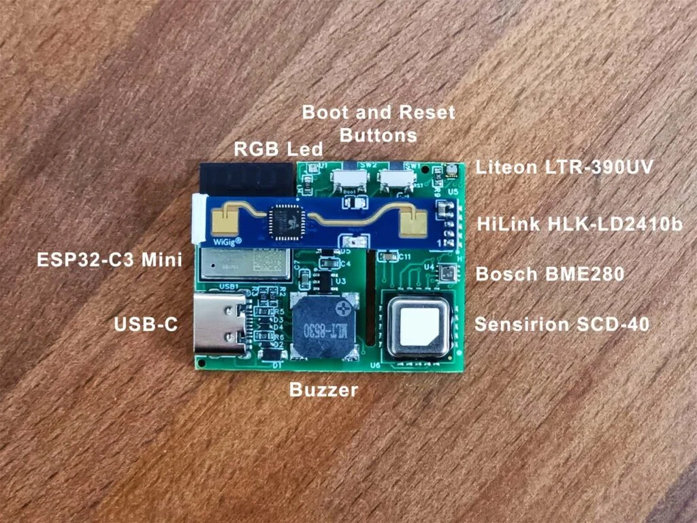
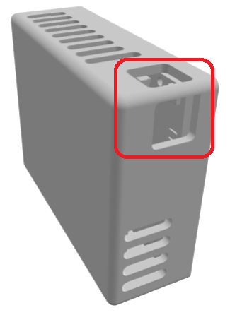
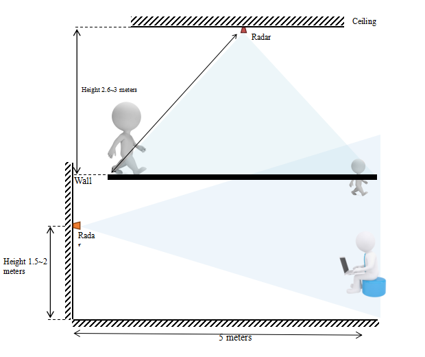
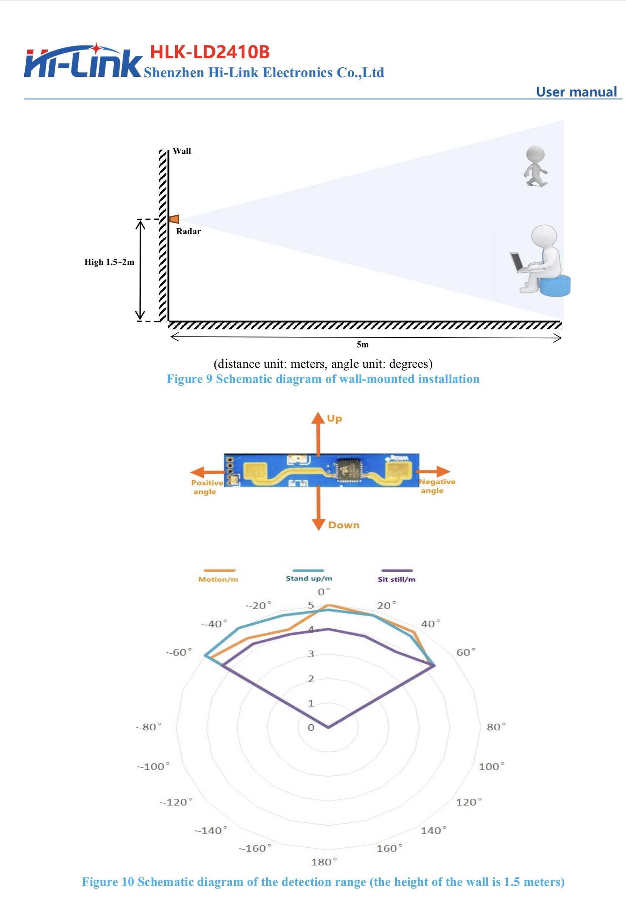
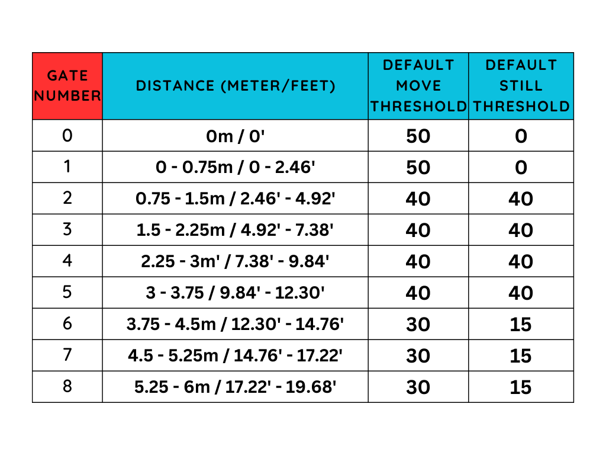
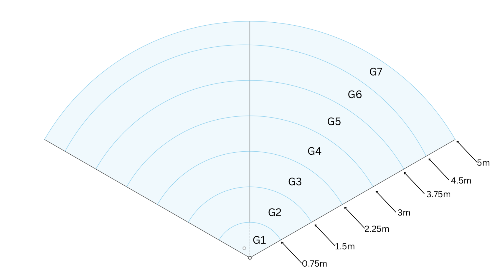
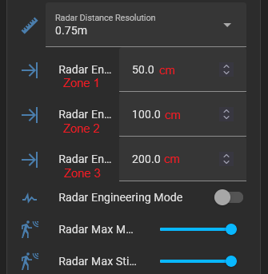

# General Tips

##### **MSR-1**

##### **Light Sensor (LTR-390UV)**

When mounting the MSR-1 be sure to position the device so that the two large holes are not covered. This allows more light to enter and will ensure better accuracy.

!!! warning "The RGB LED will trigger the Light sensor!"

    Make sure that your automations do not interfere with each other. This includes being aware that your onboard LED can trigger the lux reading but not the uv reading of the LTR390 in your device.

##### **Mounting**

##### **Gate and FOV Visualization**

****

* FOV angle -60 to 60
* Gate images above are using a Radar Distance Resolution of 0.75m
* ##### **Gates are pre-defined by the radar module and are in meters (m)**
* ##### **Zones are user-configurable and are in centimeters (cm) **