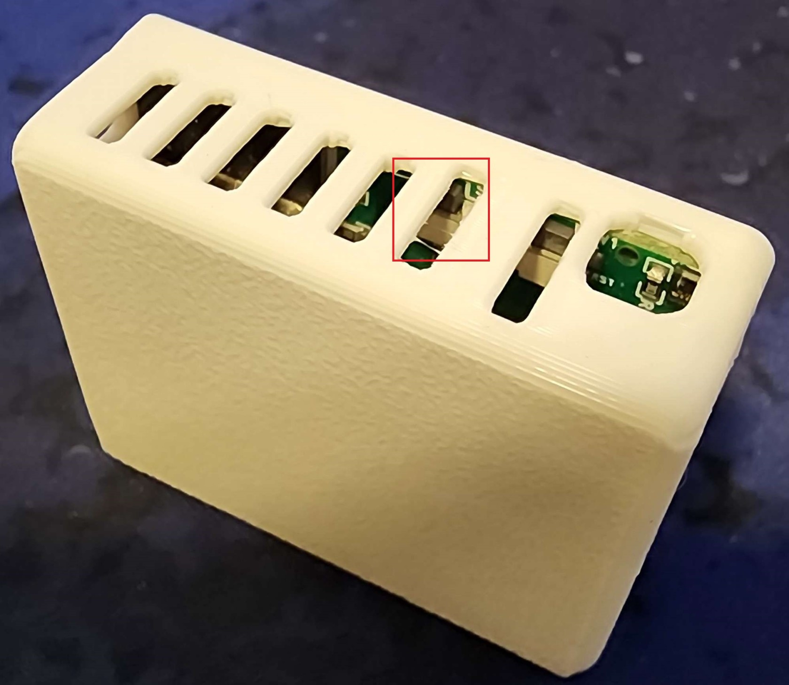

# Reset Wi-Fi Credentials

1\. Plug in the device

2\. Long press the Boot button for 10 seconds

3\. The Wi-Fi credentials should be reset and it will broadcast its hotspot again

4\. Connect to the hotspot titled "Apollo MSR-1 Hotspot" and enter your new Wi-Fi details!