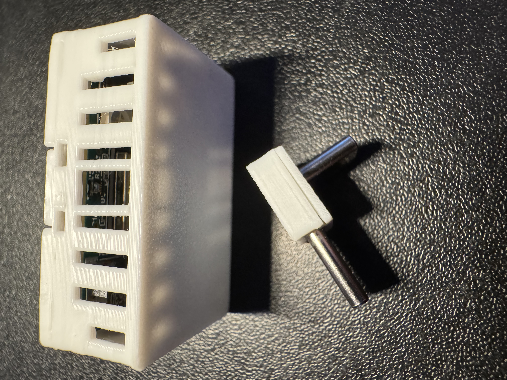
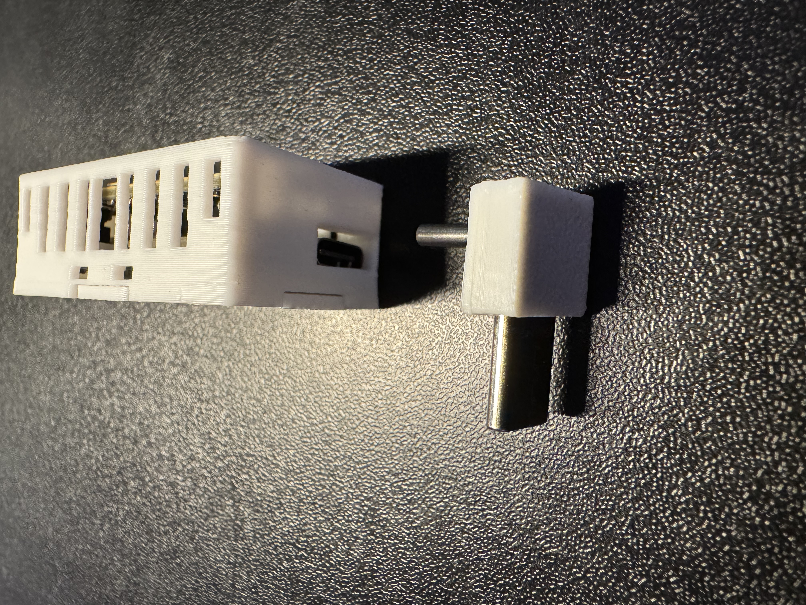
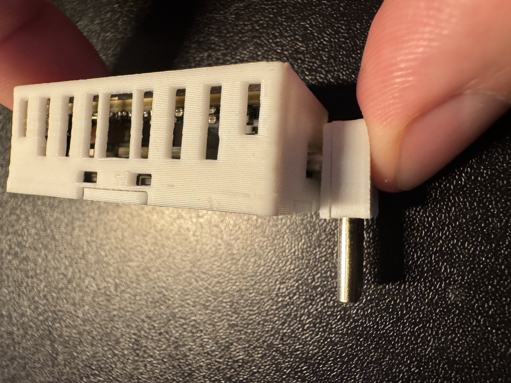
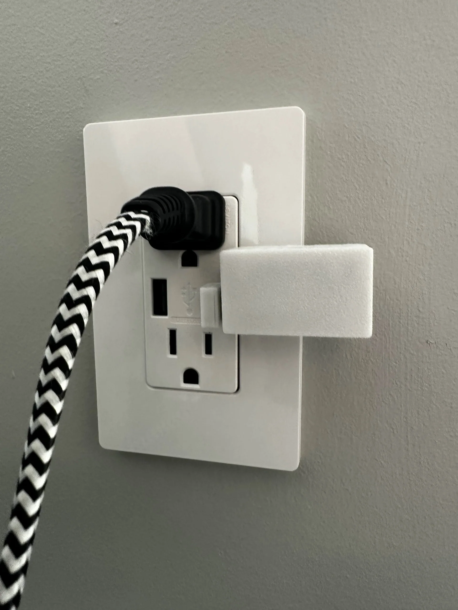

# Adding 90 degree USB-C to MSR-2

1\. Gather the MSR-2 and 90 degree addon.

2\. Align the MSR-2 with the USB-C port facing you and align the 90 degree addon with the shorter end facing the MSR-2 USB-C port.

3\. Gently push the short end of the 90 degree addon into the MSR-2 side USB-C port.

4\. Gently push the longer end of the 90 degree addon into a USB-C outlet.

!!! success "You're ready to begin using your device!"

    Make sure to head to our <a href="https://wiki.apolloautomation.com/products/general/setup/getting-started-msr2/" target="_blank" rel="noreferrer nofollow noopener">getting started guide</a> to get your MSR-2 up and running!