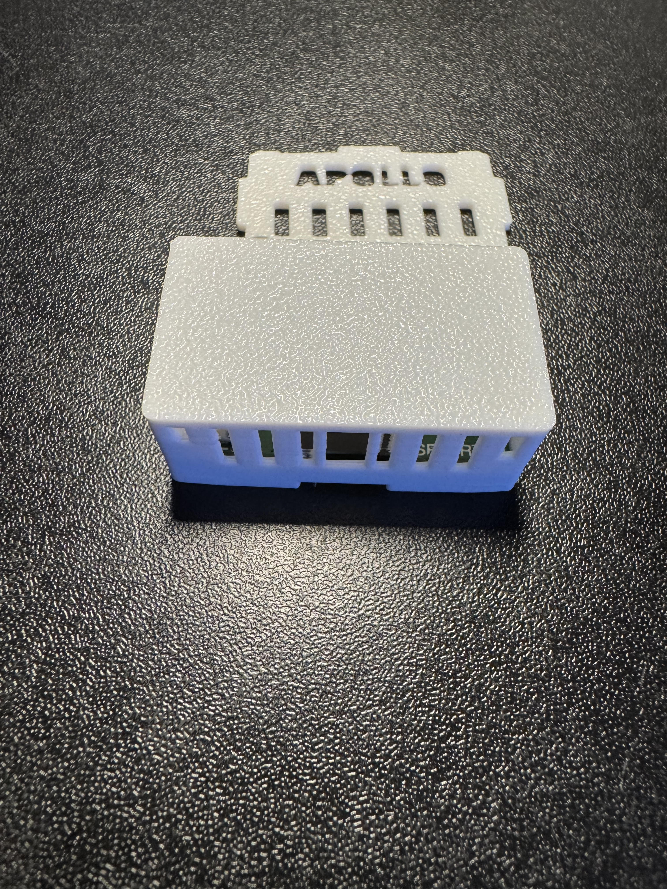
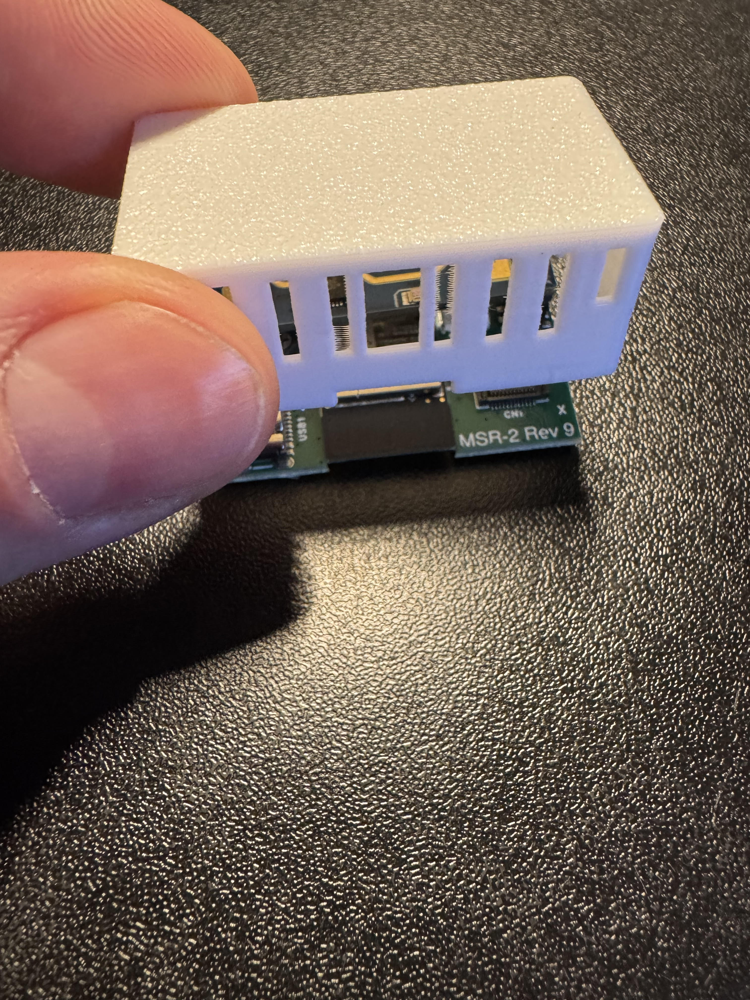
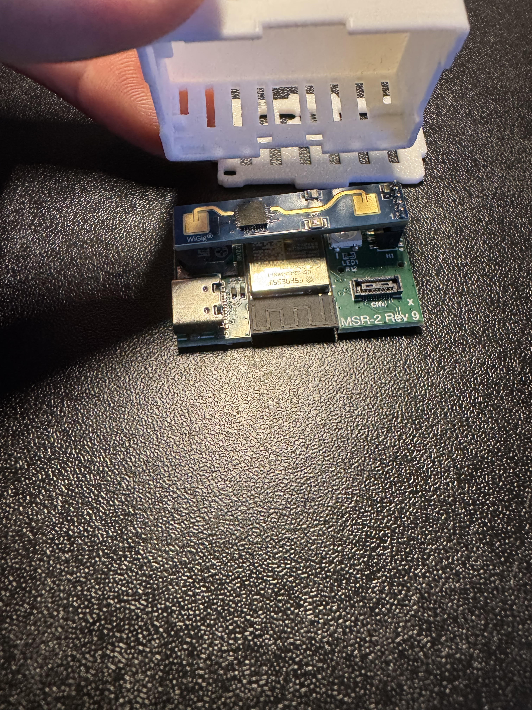
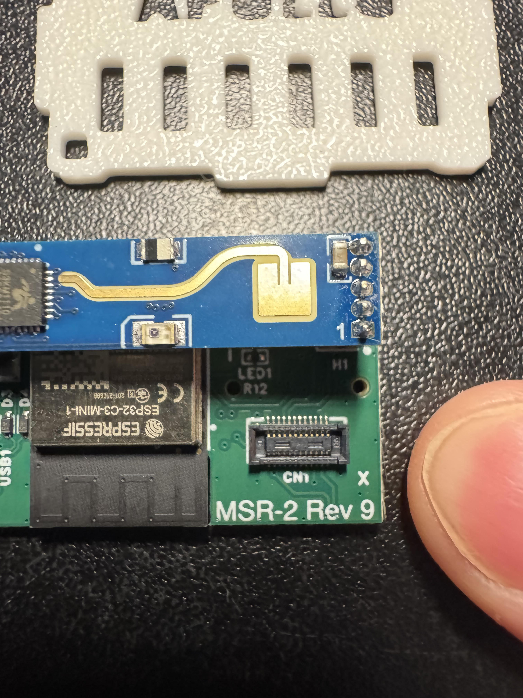
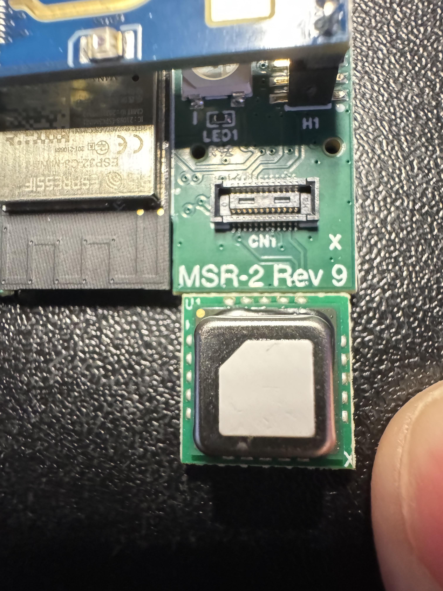
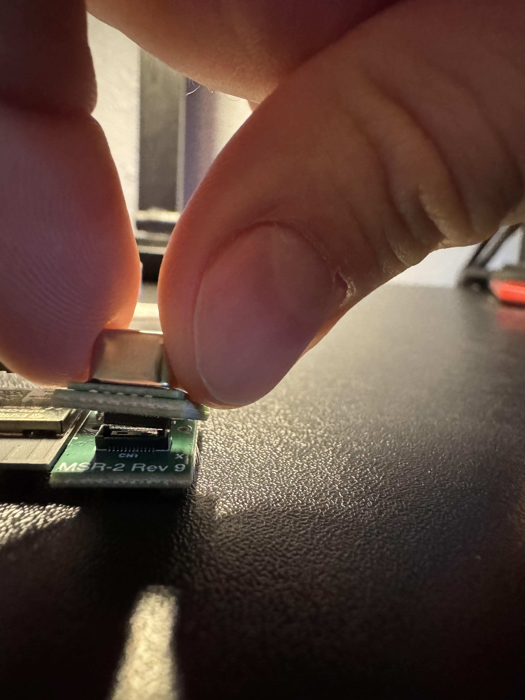
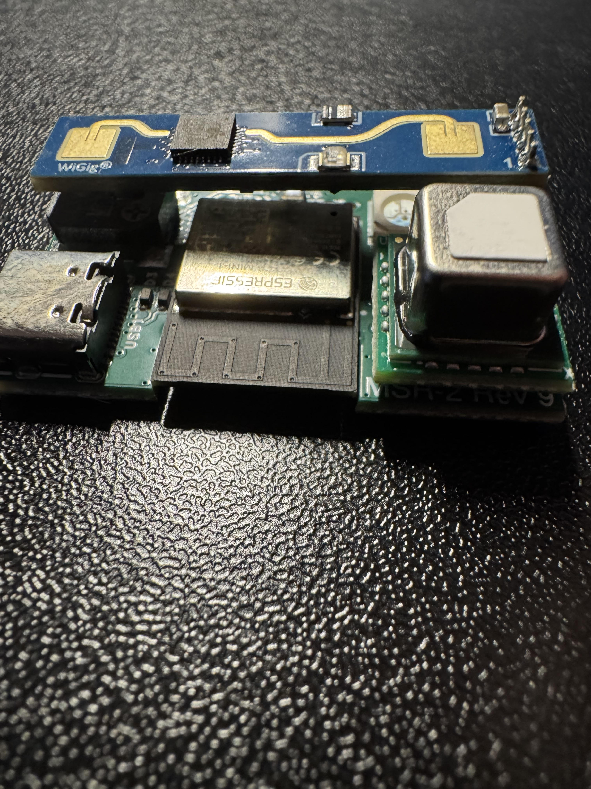
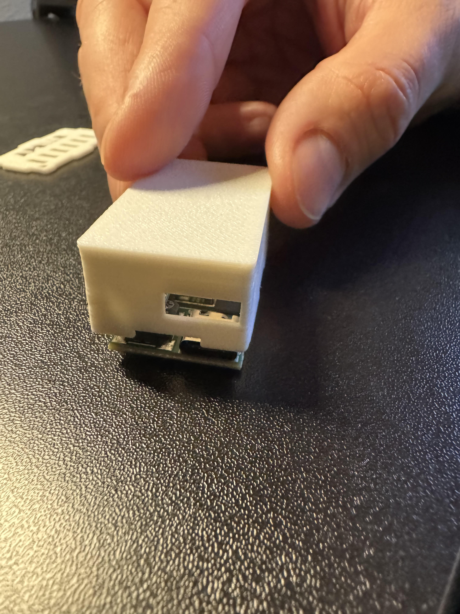
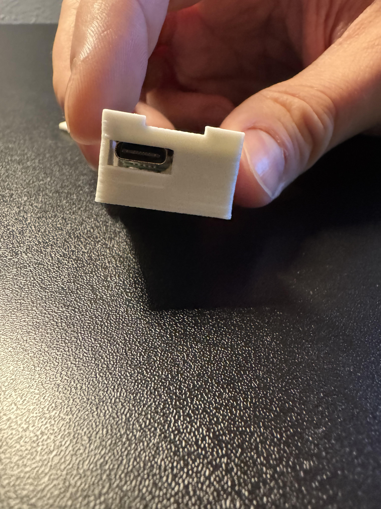

# Adding CO2 To MSR-2

1\. Unplug your MSR-2 from power and remove the back

2\. Flip the MSR-2 upside down and gently tap the case on the table and your MSR-2 should slide out of the case.

3\. With the case removed, identify the bottom right corner where the small black mezzanine connector lives. You will see an "X" indicating which corner needs to be lined up with the SCD40 CO2 sensor. There is an X on the SCD40 sensor's PCB as well, you can see it in the image below but it is slightly cut off on the PCB itself.

4\. Gently push the SCD40 CO2 module onto the black mezzanine connector.

5\. Slide the case back over the MSR-2, making sure that the case has the hole for the USB-C port facing the right direction.

6\. Gently press the backplate of the MSR-2 case onto the MSR-2 until it lightly snaps into place. Please do not force it, if necessary please repeat steps above until it seats in the case without any force required.

7\. Please refer to our [CO2 calibration guide](https://wiki.apolloautomation.com/products/general/calibrating-and-updating/co2-calibration/ "CO2 Calibration") to calibrate the CO2 module after installation. This is required for all CO2 addons purchased from us separately from a product (such as buying it to addon to an existing Apollo device).