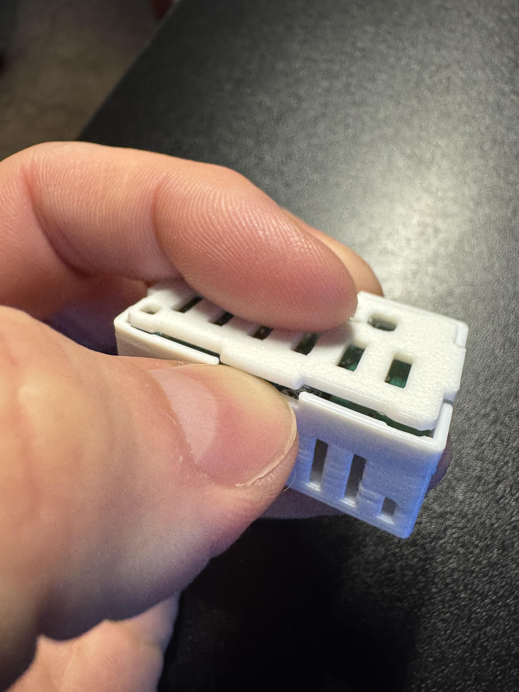

# Adding Rear Female USB-C To MSR-2

1\. Unplug your MSR-2 from power and remove the back

2\. Identify the "X" on the PCB on the back of your MSR-2 and the "X" on the top left corner of the GPIO Header addon.

3\. Keep the "X" aligned on both sides and gently push down until it securely seats in the small mezzanine connector.

4\. Align the new back for your MSR-2 that came with the GPIO Header addon. Push down on the corners closest to the USB-C addon first, and then push the back on securely on the other two corners.

!!! failure "Known issues with the rear usb-c addons"

    There are sadly limitations regarding the rear usb-c addons from Apollo. We have found that some USB-C power delivery circuits and anker plugs seem to have issues. Any non USB-C-PD circuit at 5volts should work fine!