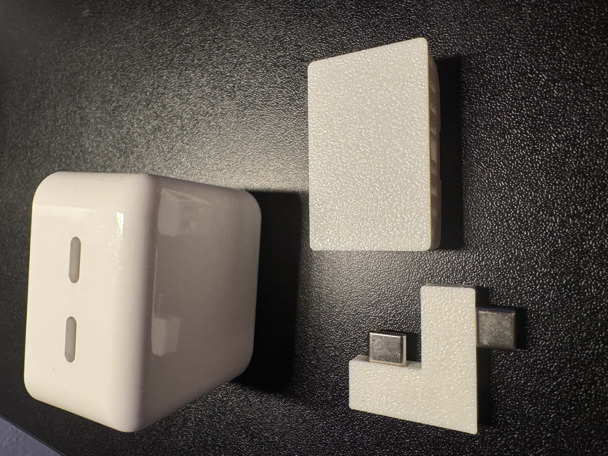
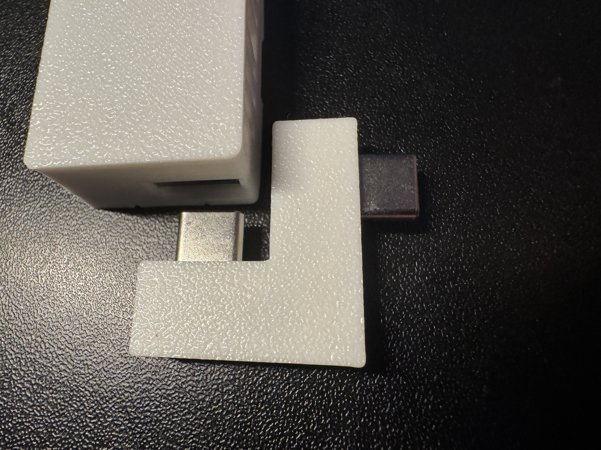
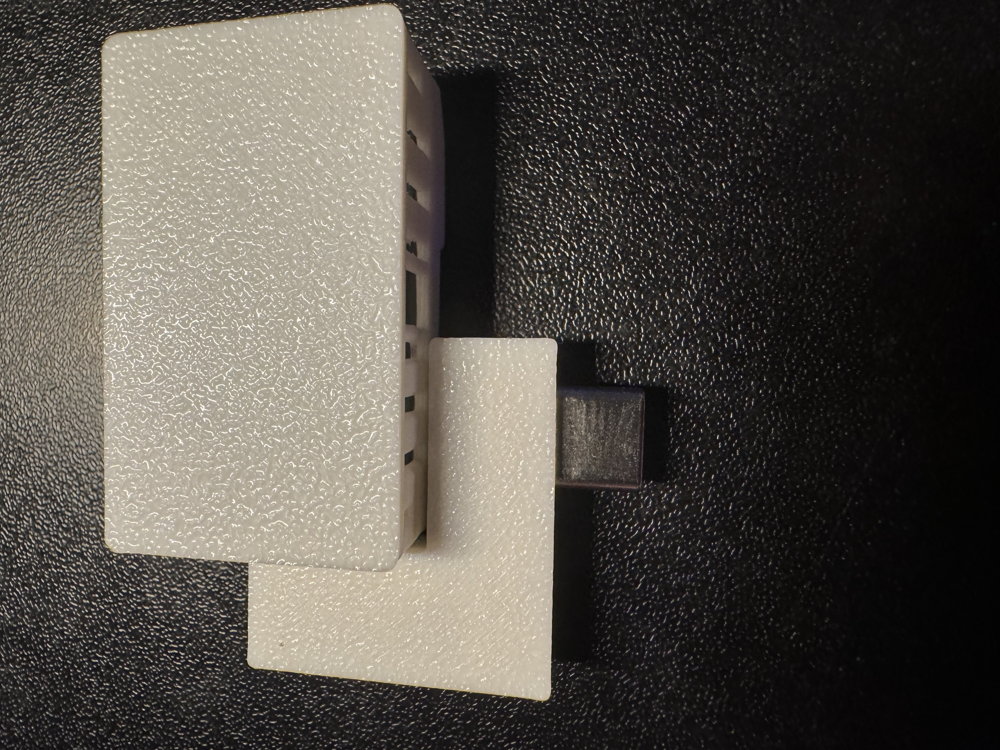
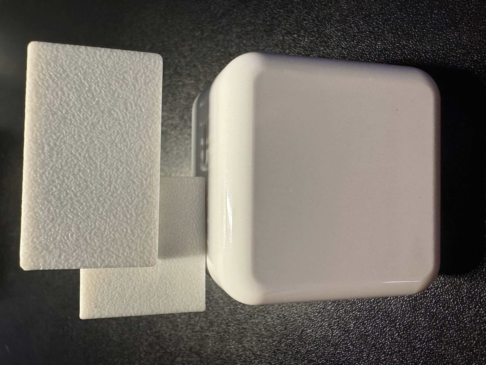

# MSR-2 Outlet Mount

1\. Gather a top facing usb-c plug, an MSR-2, and our MSR-2 Outlet Mount.

2\. Align the MSR-2 with the USB-C port facing the left side and align the MSR-2 Outlet Mount as shown in the image below.

3\. Push the MSR-2 Outlet Mount into the usb-c port until it's fully seated. Do not push hard, it will go in very smoothly.

4\. Gently push the other USB-C port of the MSR-2 Outlet Mount into the top of the USB-C top facing plug.

!!! success "You're ready to plug it in and begin using your device!"

    Make sure to head to our <a href="https://wiki.apolloautomation.com/products/general/setup/getting-started-msr2/" target="_blank" rel="noreferrer nofollow noopener">getting started guide</a> to get your MSR-2 up and running!