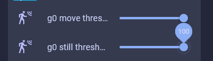

# How To Tune the MSR-2 Using Home Assistant

!!! tip "Radar Engineering Mode (REM)"

    If you're experiencing false triggers, we recommend using Radar Engineering Mode (REM) to monitor the gate energy and adjust the gate threshold to eliminate them.

Quick introduction video of the LD2410B gates and zones.

  <iframe width="560" height="315" src="https://www.youtube.com/embed/6VrTfaFyMPk?si=KI9gcbJB0EgAT3uW" title="YouTube video player" frameborder="0" allow="accelerometer; autoplay; clipboard-write; encrypted-media; gyroscope; picture-in-picture; web-share" referrerpolicy="strict-origin-when-cross-origin" allowfullscreen="">
  </iframe>

How to tune the mmWave sensor using radar engineering mode.

  <iframe width="560" height="315" src="https://www.youtube.com/embed/w_Gq62Edsnc?si=IxNE-pt-3u2FHMzT" title="YouTube video player" frameborder="0" allow="accelerometer; autoplay; clipboard-write; encrypted-media; gyroscope; picture-in-picture; web-share" referrerpolicy="strict-origin-when-cross-origin" allowfullscreen="">
  </iframe>

1\. Head to the <a href="http://homeassistant.local:8123/config/integrations/integration/esphome" title="Click me to go to the ESPHome integrations page" target="_blank" rel="noreferrer nofollow noopener">ESPHome Integrations page</a> and select your MSR-2.

2\. Scroll down to the Configuration section and turn on "Radar Engineering Mode".

3\. Scroll down to the Diagnostic section and you will see that when REM is enabled, the move and still energy for gates 0-8 are shown.

The gates are 0.75meter increments from the sensor - allowing you to "tune" each 0.75 meter section until your sensor works as intended!

Moving the gate still and move threshold slider to the right increases the amount of energy needed to trigger the sensor. Do this if you want the gate to be less sensitive.

Moving the gate still and move threshold slider to the left decreases the amount of energy needed to trigger the sensor. Do this if you want the gate to be more sensitive.

