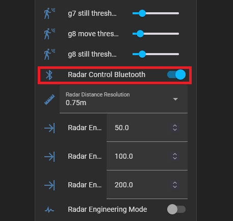
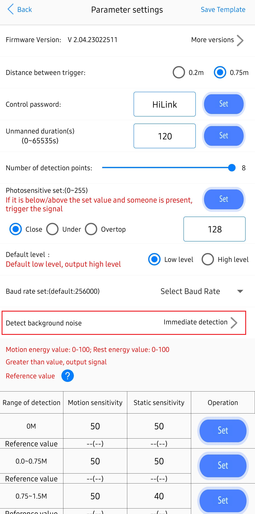
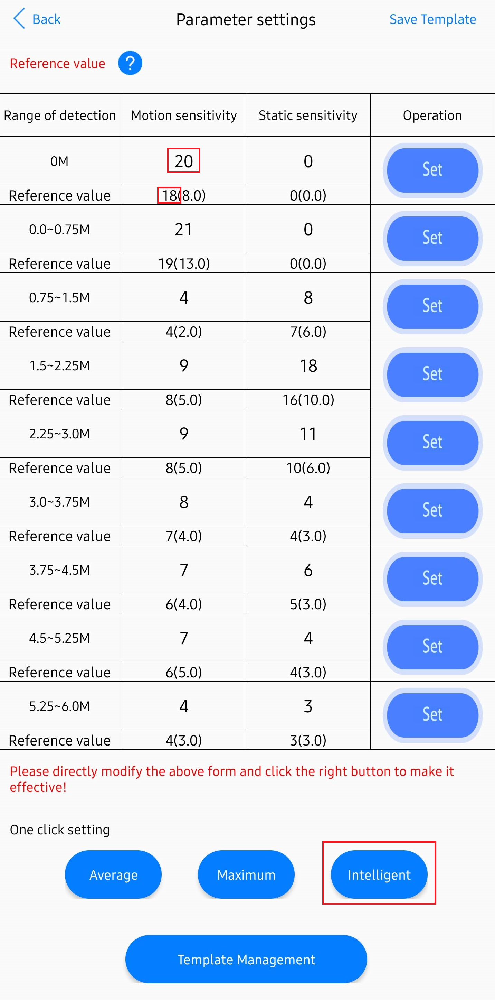

# How To Tune mmWave Using HLKRadarTool

**Auto-Calibration (Average, Maximum, and Intelligent)**

1\. Download the HLKRadarTool app for either [Android](https://play.google.com/store/apps/details?id=com.hlk.hlkradartool&amp;hl=en_US%E2%89%B7=US)or [Apple](https://apps.apple.com/us/app/hlkradartool/id1638651152)

The default password to connect to the HLKRadarTool is "HiLink"

2\. Ensure the mmWave radar you want to tune has Radar Control Bluetooth turned on. Home Assistant &gt; Settings &gt; Devices & services &gt; ESPHome Devices &gt; Select Device &gt; Scroll down and toggle on Radar Control Bluetooth

3\. Open the app and select your device

4\. Turn on Engineering Mode

5\. Select More and then select Parameter settings

6\. Select Detect background noise

7\. Insert Delay detection and Detection time values. (For iPhone users Delay detection cannot be 0). Then select Start. This will give us our reference values so we can auto-calibrate the mmWave sensor.

8\. Select Back to navigate to the Parameter settings. Then select one of the auto-calibration buttons.

**Average** - Sets the gate sensitivity to the average move and still energy

**Maximum** - Sets the gate sensitivity to the maximum move and still energy

**Intelligent** - Sets the gate sensitivity equal to or just above the maximum move and still energy

****

**Manual Calibration**

1\. Repeat steps 1-5 above.

2\. Select Motion or Static sensitivity, change it to your desired value, and select Set.

3\. Now your MSR-2 should be tuned to your environment!