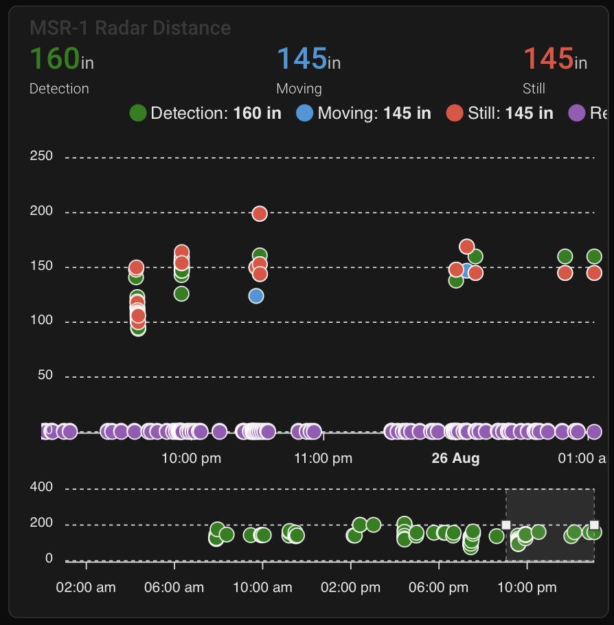

# MSR-2 Home Assistant Dashboard Examples

**Radar Scatter Plot With Apex Charts For **[**MSR-2**](https://shop.apolloautomation.cloud/products/multisensor-mk1)

  


```plaintext
type: custom:apexcharts-card
header:
  show: true
  title: MSR-1 Radar Distance
  show_states: true
  colorize_states: true
apex_config:
  legend:
    position: top
    horizontalAlign: center
    offsetX: -80
    offsetY: 0
experimental:
  brush: true
brush:
  selection_span: 4h
graph_span: 24hr
chart_type: scatter
series:
  - entity: sensor.apollo_msr_1_a79e14_radar_detection_distance
    name: Detection
    stroke_width: 1
    color: green
    show:
      in_brush: true
      extremas: true
  - entity: sensor.apollo_msr_1_a79e14_radar_moving_distance
    name: Moving
    stroke_width: 1
  - entity: sensor.apollo_msr_1_a79e14_radar_still_distance
    name: Still
    stroke_width: 1
```

**CO2 Charts**
Home Assistant Sensor


```plaintext
graph: line
type: sensor
entity: sensor.apollo_msr_1_a79e38_co2
detail: 2
name: Bedroom CO2
hours_to_show: 24
```

Custom: Plotly Graph Card


```plaintext
type: custom:plotly-graph
entities:
  - entity: sensor.apollo_msr_1_a79e38_co2
hours_to_show: 24
refresh_interval: 10
title: Bedroom CO2
```

Home Assistant Guage


```plaintext
type: gauge
entity: sensor.apollo_msr_1_a79e38_co2
needle: true
unit: ppm
min: 0
max: 3000
severity:
  green: 0
  yellow: 1000
  red: 2000
```