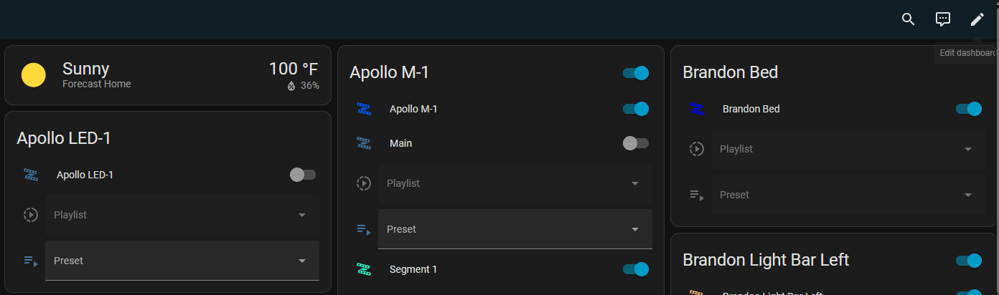
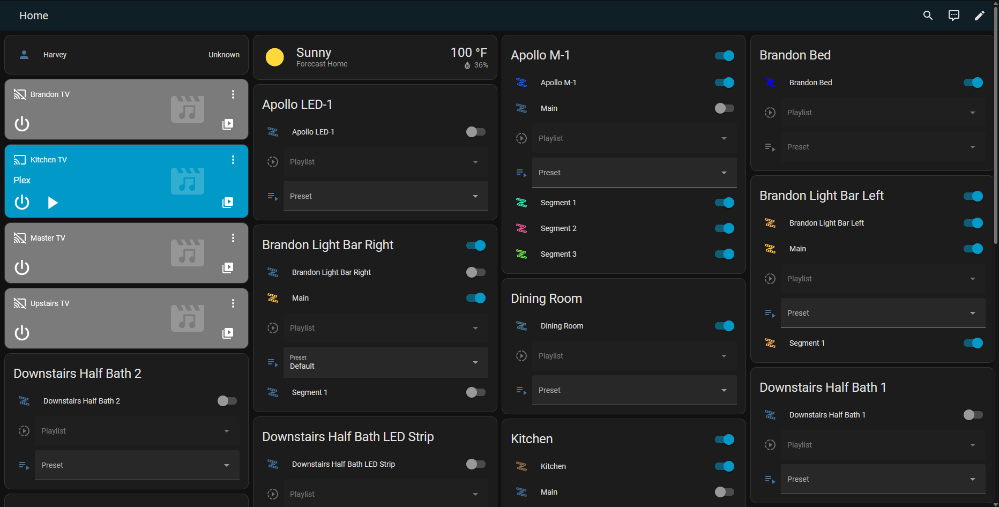
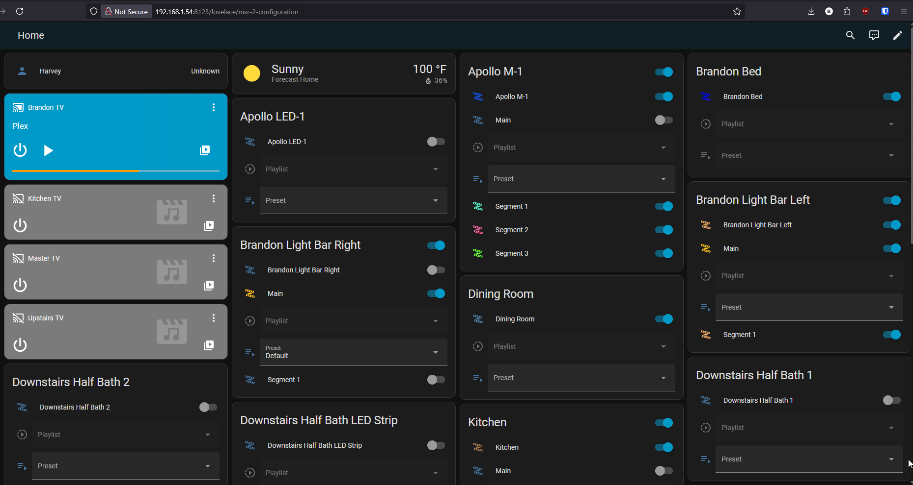
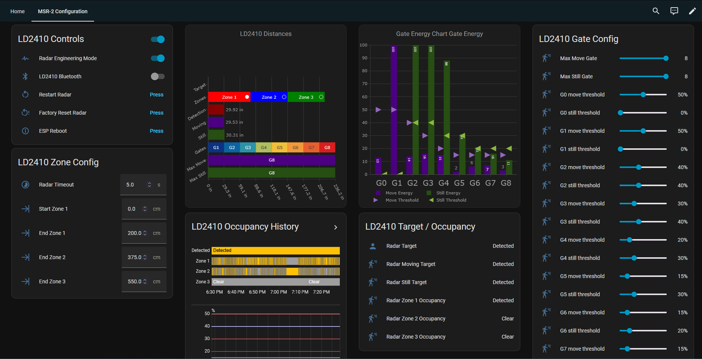

# MSR-2 Tuning Dashboard

!!! note "Huge shoutout to discurd user MirkoP for creating this!"

    We all owe a huge thanks to MirkoP from discord/github for creating and sharing this with everyone! <a href="https://github.com/mirkop/apollo-home-assistant/blob/master/streamline_cards/ld2410/README.md" target="_blank" rel="noreferrer nofollow noopener">Source here</a>.

This guide will create a beautiful and helpful dashboard to simplify configuration of your MSR-2 sensor. You can easily view the current gate and zone thresholds which will help tune your sensor for your environment!

1\. First make sure you have HACS installed - if not, <a href="https://hacs.xyz/docs/use/download/download/" target="_blank" rel="noreferrer nofollow noopener">download it here</a> and install it.

2\. Install the Streamline Card in HACS <a href="https://github.com/brunosabot/streamline-card/?tab=readme-ov-file#with-hacs-recommended" target="_blank" rel="noreferrer nofollow noopener">here</a> which is required for the steps below.

3\. Install the Plotly Graph Card in HACS <a href="https://github.com/dbuezas/lovelace-plotly-graph-card" target="_blank" rel="noreferrer nofollow noopener">here</a> which is also required for the steps below.

4\. Head to your <a href="http://homeassistant.local:8123" target="_blank" rel="noreferrer nofollow noopener">Home Assistant dashboard</a> and <a href="https://www.home-assistant.io/getting-started/onboarding_dashboard/#creating-a-new-dashboard-and-edit-cards" target="_blank" rel="noreferrer nofollow noopener"><strong>Take control</strong> of your dashboard</a> by clicking **Edit Dashboard** in the top right then the 3 dots from the **Edit Dashboard** menu and click **Take control**. (this step is only necessary for new Home Assistant users).

5\. Use the YAML generator below and enter in your device name such as apollo\_msr\_2\_m4c4dd and then click **Generate YAML**. It will copy the YAML for you to use in the next step!

<iframe id="msr2" src="/snippets/msr-2-dashboard-yaml-generator.html" width="100%" height="760" style="border:0;" loading="lazy">
</iframe>

6\. Click **Edit dashboard** in the top right then click the 3 dots from the **Edit Dashboard** menu and click **Raw configuration editor**. Navigate to the end of the document and paste the code from the YAML generator at the very bottom of the **Raw configuration editor**. Click **Save** in the top right.

!!! danger "This file is used by Home Assistant and must be carefully edited."

    Home Assistant depends on this file to function correctly. Only make the changes exactly as outlined below. Do not add extra spaces or modify anything beyond what is specified in the instructions.

7\. You should now have a new <a href="https://www.home-assistant.io/dashboards/views/" target="_blank" rel="noreferrer nofollow noopener">dashboard view</a> called **MSR-2 Configuration** and you should be ready to configure your sensor!

