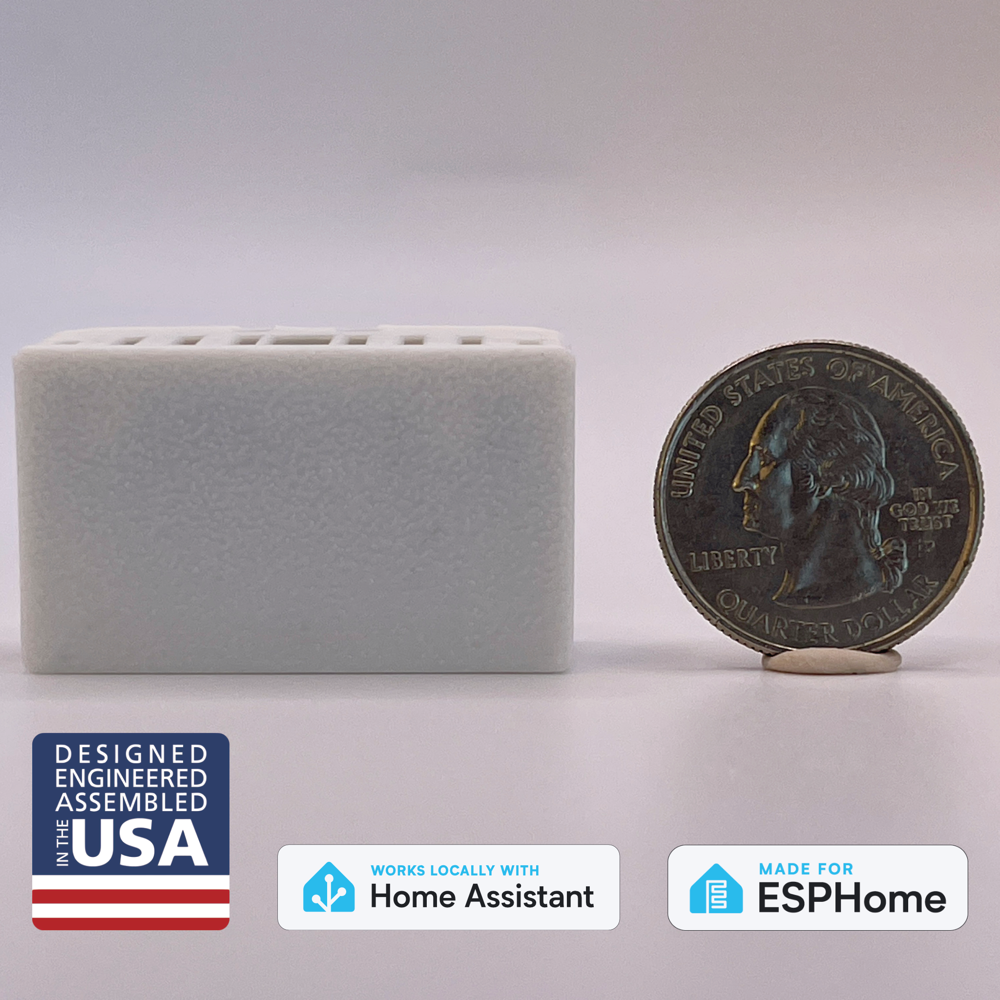

The Apollo MSR-2 is a compact, versatile mmWave multisensor for Home Assistant, designed for precise motion detection and smart home automation. It builds on the MSR-1 with a smaller form factor, an additional expansion slot, and improved sensors for temperature and pressure. The sensor includes LUX and UV detection, an optional CO2 sensor, RGB LED, and piezo buzzer for customizable notifications. Fully open-source and expandable, the MSR-2 offers seamless integration with Home Assistant, making it ideal for automating lighting, air quality monitoring, and more. Access to support and customization resources is available via our Discord and GitHub.