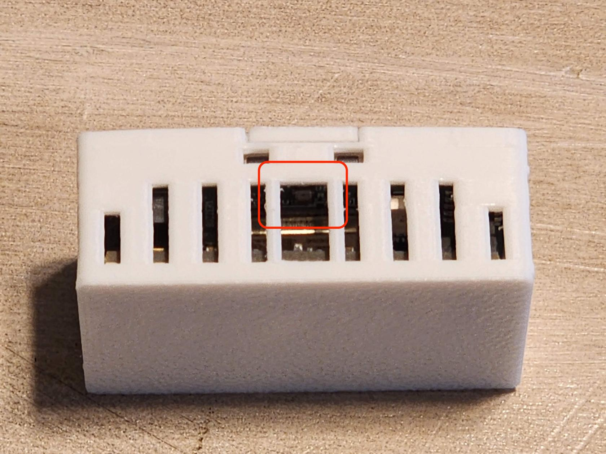
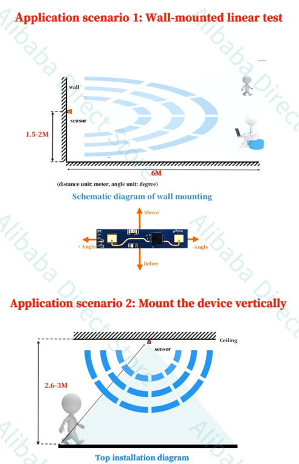
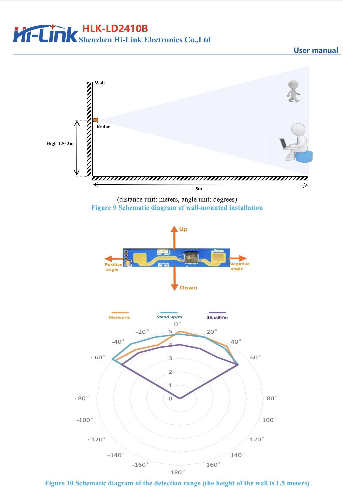
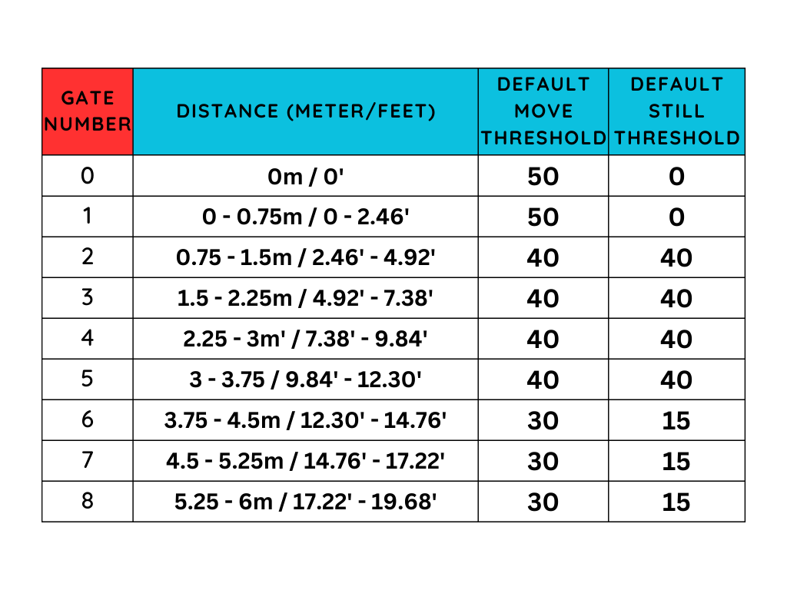
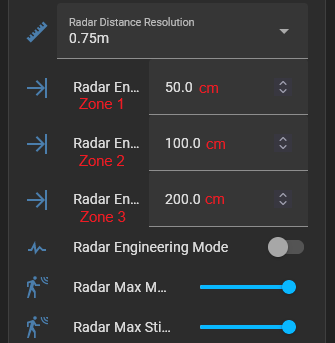
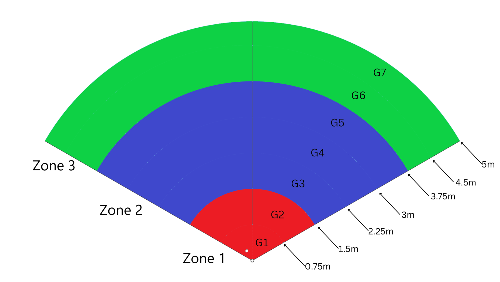

# General Tips

##### **Light Sensor (LTR-390UV)**

When mounting the MSR-2 be sure to position the device so that the two large holes are not covered. This allows more light to enter and will ensure better accuracy

!!! warning "The RGB LED will trigger the Light sensor!"

    Make sure that your automations do not interfere with each other. This includes being aware that your onboard LED can trigger the lux reading but not the uv reading of the LTR390 in your device.

##### **Mounting**

The MSR-2 should be mounted 1.5-2 meters off the ground which will then provide a nice even 120degree FOV of the mmWave radar.

##### **Gate and FOV Visualization**

****

!!! tip "These are some useful hints!"

    * The FOV angle is -60 to 60 degrees - 120 degrees total.
    * Gates are pre-defined by the radar module and are in 0.75 meter increments.
    * Zones are user-configurable and are in cm.

#####