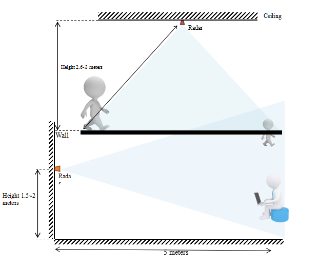
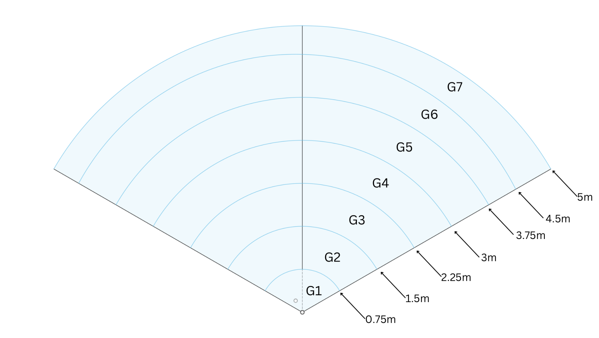

# General Tips

##### MSR-2

    

##### **Light Sensor (LTR-390UV)**

* When mounting the MSR-2 be sure to position the device so that the two large holes are not covered
  * This allows more light to enter and will ensure better accuracy
* The onboard RGB LED will trigger the light sensor
  * Be cognizant of this when making automations based on light/LUX

##### **Mounting**

##### **Gate and FOV Visualization**

****

* FOV angle -60 to 60
* Gate images above are using a Radar Distance Resolution of 0.75m
* ##### **Gates are pre-defined by the radar module and are in meters (m)**
* ##### **Zones are user-configurable and are in centimeters (cm) **

  &nbsp;